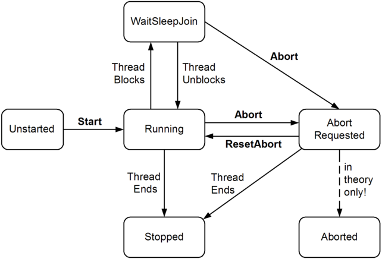
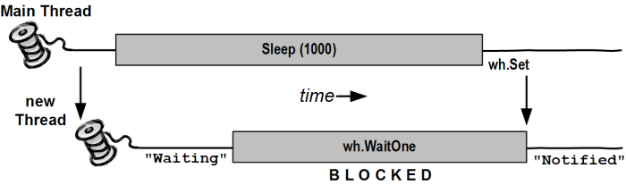
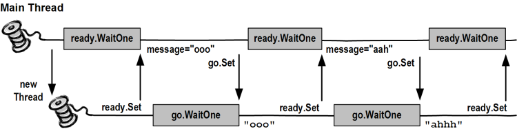

## 同步概要

同步构造可以分为以下四类：

- **简单的阻塞方法**

  这些方法会使当前线程等待另一个线程结束或是自己等待一段时间。`Sleep`、`Join`与`Task.Wait`都是简单的阻塞方法。

- **锁构造**

  锁构造能够限制每次可以执行某些动作或是执行某段代码的线程数量。排它锁构造是最常见的，它每次只允许一个线程执行，从而可以使得参与竞争的线程在访问公共数据时不会彼此干扰。标准的排它锁构造是`lock`（`Monitor.Enter`/`Monitor.Exit`）、`Mutex`与 `SpinLock`。非排它锁构造是`Semaphore`、`SemaphoreSlim`以及读写锁。

- **信号构造**

  信号构造可以使一个线程暂停，直到接收到另一个线程的通知，避免了低效的轮询 。有两种经常使用的信号设施：事件等待句柄（event wait handle ）和`Monitor`类的`Wait` / `Pluse`方法。Framework 4.0 加入了`CountdownEvent`与`Barrier`类。

- **非阻塞同步构造**

  非阻塞同步构造通过调用处理器指令来保护对公共字段的访问。CLR 与 C# 提供了下列非阻塞构造：`Thread.MemoryBarrier` 、`Thread.VolatileRead`、`Thread.VolatileWrite`、`volatile`关键字以及`Interlocked`类。

阻塞这个概念对于前三类来说都非常重要，接下来我们简要的剖析下它。

### 阻塞

当线程的执行由于某些原因被暂停，比如调用`Sleep`等待一段时间，或者通过`Join`或`EndInvoke`方法等待其它线程结束时，则认为此线程被阻塞（blocked）。被阻塞的线程会立即出让（yields）其处理器时间片，之后不再消耗处理器时间，直到阻塞条件被满足。可以通过线程的`ThreadState`属性来检查一个线程是否被阻塞：

```c#
bool blocked = (someThread.ThreadState & ThreadState.WaitSleepJoin) != 0;
```

（上面例子中线程状态可能在进行状态判断和依据状态进行操作之间发生改变，因此这段代码仅可用于调试诊断的场景。）

当一个线程被阻塞或是解除阻塞时，操作系统会进行上下文切换（context switch），这会带来几微秒的额外时间开销。

阻塞会在以下 4 种情况下解除（电源按钮可不能算`╮(╯▽╰)╭`）：

- 阻塞条件被满足
- 操作超时（如果指定了超时时间）
- 通过`Thread.Interrupt`中断
- 通过`Thread.Abort`中止

通过`Suspend`方法（已过时，不应该再使用）暂停线程的执行不被认为是阻塞。

### 阻塞 vs 自旋

有时线程必须暂停，直到特定条件被满足。信号构造和锁构造可以通过在条件被满足前阻塞线程来实现。但是还有一种更为简单的方法：线程可以通过自旋（spinning）来等待条件被满足。例如：

```c#
while (!proceed);
// 或者：
while (DateTime.Now < nextStartTime);
```

一般来说，这会非常浪费处理器时间：因为对 CLR 和操作系统来说，这个线程正在执行重要的计算，就给它分配了相应的资源。

有时会组合使用阻塞与自旋：

```c#
while (!proceed) 
    Thread.Sleep (10);
```

尽管并不优雅，但是这比仅使用自旋更高效（一般来说）。然而这样也可能会出现问题，这是由`proceed`标识上的并发问题引起的。正确的使用和锁构造和信号构造可以避免这个问题。

自旋在等待的条件很快（大致几微秒）就能被满足的情况下更高效，因为它避免了上下文切换带来的额外开销。.NET Framework 提供了专门的方法和类型来辅助实现自旋。

### 线程状态

可以通过线程的`ThreadState`属性来查询线程状态，它会返回一个`ThreadState`类型的按位方式组合的枚举值，其中包含了三“层”信息。然而大多数值都是冗余的、无用的或者过时不建议使用的。下图是其中一“层”信息：



下面的代码可以提取线程状态中最有用的 4 个值: `Unstarted`、`Running`、`WaitSleepJoin`和`Stopped`：

```c#
public static ThreadState SimpleThreadState (ThreadState ts)
{
    return ts & (ThreadState.Unstarted | ThreadState.WaitSleepJoin | ThreadState.Stopped);
}
```

`ThreadState`属性在进行调试诊断时有用，但不适合用来进行同步，因为线程状态可能在判断状态和依据状态进行操作之间发生改变。

## 锁

排它锁用于确保同一时间只允许一个线程执行指定的代码段。主要的两个排它锁构造是`lock`和`Mutex`（互斥体）。其中`lock`更快，使用也更方便。而`Mutex`的优势是它可以跨进程的使用。

在这一节里，我们从介绍`lock`构造开始，然后介绍`Mutex`和信号量（semaphore）（用于非排它场景）。稍后会介绍读写锁（reader / writer lock）。Framework 4.0 加入了`SpinLock`结构体，可以用于高并发场景。

让我们从下边这个类开始：

```c#
class ThreadUnsafe
{
    static int _val1 = 1, _val2 = 1;
    
    static void Go()
    {
        if (_val2 != 0)
            Console.WriteLine (_val1 / _val2);
        _val2 = 0;
    }
}
```

这个类不是线程安全的：如果`Go`方法同时被两个线程调用，可能会产生除数为零错误，因为可能在一个线程刚好执行完`if`的判断语句但还没执行`Console.WriteLine`语句时，`_val2`就被另一个线程设置为零。

下边使用`lock`解决这个问题：

```c#
class ThreadSafe
{
    static readonly object _locker = new object();
    static int _val1, _val2;
    
    static void Go()
    {
        lock (_locker)
        {
            if (_val2 != 0)
                Console.WriteLine (_val1 / _val2);
            _val2 = 0;
        }
    }
}
```

同一时间只有一个线程可以锁定同步对象（这里指`_locker`），并且其它竞争锁的线程会被阻塞，直到锁被释放。如果有多个线程在竞争锁，它们会在一个“就绪队列（ready queue）”中排队，并且遵循先到先得的规则（需要说明的是，Windows 系统和 CLR 的差别可能导致这个队列在有时会不遵循这个规则）。因为一个线程的访问不能与另一个线程相重叠，排它锁有时也被这样描述：它强制对锁保护的内容进行顺序（serialized）访问。在这个例子中，我们保护的是`Go`方法的内部逻辑，还有`_val1`与`_val2`字段。

在竞争锁时被阻塞的线程，它的线程状态是`WaitSleepJoin`。在中断与中止中，我们会描述如何通过其它线程强制释放被阻塞的线程，这是一种可以用于结束线程的重型技术（译者注：这里指它们应该被作为在没有其它更为优雅的办法时的最后手段）。

#### 锁构造比较

| 构造                                         | 用途                                               | 跨进程 | 开销* |
| -------------------------------------------- | -------------------------------------------------- | ------ | ----- |
| lock（`Monitor.Enter`/`Monitor.Exit`）       | 确保同一时间只有一个线程可以访问资源或代码         | -      | 20ns  |
| Mutex                                        |                                                    | 1000ns |       |
| SemaphoreSlim（Framework 4.0 中加入）        | 确保只有不超过指定数量的线程可以并发访问资源或代码 | -      | 200ns |
| Semaphore                                    |                                                    | 1000ns |       |
| ReaderWriterLockSlim（Framework 3.5 中加入） | 允许多个读线程和一个写线程共存                     | -      | 40ns  |
| ReaderWriterLock（已过时）                   | -                                                  | 100ns  |       |

\* 时间代表在同一线程上一次进行加锁和释放锁（假设没有阻塞）的开销，在 Intel Core i7 860 上测得。

### Monitor.Enter 与 Monitor.Exit

C# 的`lock`语句是一个语法糖，它其实就是使用了`try / finally`来调用`Monitor.Enter`与`Monitor.Exit`方法。下面是在之前示例中的`Go`方法内部所发生的事情（简化的版本）：

```c#
Monitor.Enter (_locker);
try
{
    if (_val2 != 0)
        Console.WriteLine (_val1 / _val2);
    _val2 = 0;
}
finally
{ 
    Monitor.Exit (_locker); 
}
```

如果在同一个对象上没有先调用`Monitor.Enter`就调用`Monitor.Exit`会抛出一个异常。

#### lockTaken 重载

刚刚所描述的就是 C# 1.0、2.0 和 3.0 的编译器翻译`lock`语句产生的代码。

然而它有一个潜在的缺陷。考虑这样的情况：在`Monitor.Enter`的实现内部或者在`Monitor.Enter`与`try`中间有异常被抛出（可能是因为在线程上调用了`Abort`，或者有`OutOfMemoryException`异常被抛出），这时不一定能够获得锁。如果获得了锁，那么该锁就不会被释放，因为不可能执行到`try / finally`内，这会导致锁泄漏。

为了避免这种危险，CLR 4.0 的设计者为`Monitor.Enter`添加了下面的重载：

```c#
public static void Enter (object obj, ref bool lockTaken);
```

当（且仅当）`Enter`方法抛出异常，锁没有能够获得时，`lockTaken`为`false`。

下边是正确的使用方式（这就是 C# 4.0 对于`lock`语句的翻译）：

```c#
bool lockTaken = false;
try
{
    Monitor.Enter (_locker, ref lockTaken);
    // 你的代码...
}
finally
{ 
    if (lockTaken) 
        Monitor.Exit (_locker);
}
```

#### TryEnter

`Monitor`还提供了一个`TryEnter`方法，允许以毫秒或是`TimeSpan`方式指定超时时间。如果获得了锁，该方法会返回`true`，而如果由于超时没有获得锁，则会返回`false`。`TryEnter`也可以以无参数的形式进行调用，这是对锁进行“测试”，如果不能立即获得锁就会立即返回`false`。

类似于`Enter`方法，该方法在 CLR 4.0 中也被重载来接受`lockTaken`参数。

### 选择同步对象

对所有参与同步的线程可见的任何对象都可以被当作同步对象使用，但有一个硬性规定：同步对象必须为引用类型。同步对象一般是私有的（因为这有助于封装锁逻辑），并且一般是一个实例或静态字段。同步对象也可以就是其要保护的对象，如下面例子中的`_list`字段：

```c#
class ThreadSafe
{
    List <string> _list = new List <string>();
    
    void Test()
    {
        lock (_list)
        {
            _list.Add ("Item 1");
            // ...
```

一个只被用来加锁的字段（例如前面例子中的`_locker`）可以精确控制锁的作用域与粒度。对象自己（`this`），甚至是其类型都可以被当作同步对象来使用：

```c#
lock (this) { ... }
// 或者：
lock (typeof (Widget)) { ... }    // 保护对静态资源的访问
```

这种方式的缺点在于并没有对锁逻辑进行封装，从而很难避免[死锁](https://blog.gkarch.com/threading/part2.html#deadlocks)与过多的[阻塞](https://blog.gkarch.com/threading/part2.html#blocking)。同时类型上的锁也可能会跨越应用程序域（application domain）边界（在同一进程内）。

你也可以在被 lambda 表达式或匿名方法所捕获的局部变量上加锁。

锁在任何情况下都不会限制对同步对象本身的访问。换句话说，`x.ToString()`不会因为其它线程调用`lock(x)`而阻塞，两个线程都要调用`lock(x)`才能使阻塞发生。

### 何时加锁

简单的原则是，需要在访问任意可写的共享字段（any writable shared field）时加锁。即使是最简单的操作，例如对一个字段的赋值操作，都必须考虑同步。在下面的类中，`Increment`与`Assign`方法都不是线程安全的：

```c#
class ThreadUnsafe
{
  static int _x;
  static void Increment() { _x++; }
  static void Assign()    { _x = 123; }
}
```

以下是线程安全的版本：

```c#
class ThreadSafe
{
  static readonly object _locker = new object();
  static int _x;

  static void Increment() { lock (_locker) _x++; }
  static void Assign()    { lock (_locker) _x = 123; }
}
```

在[非阻塞同步（nonblocking synchronization）](https://blog.gkarch.com/threading/part4.html#nonblocking-synchronization)中，我们会解释这种需求是如何产生的，以及在这些场景下内存屏障（memory barrier，内存栅栏，内存栅障）和[`Interlocked`](https://blog.gkarch.com/threading/part4.html#interlocked)类如何提供替代方法进行锁定。

### 锁与原子性

如果一组变量总是在相同的锁内进行读写，就可以称为原子的（atomically）读写。假定字段`x`与`y`总是在对`locker`对象的`lock`内进行读取与赋值：

```c#
lock (locker) { if (x != 0) y /= x; }
```

可以说`x`和`y`是被原子的访问的，因为上面的代码块无法被其它的线程分割或抢占。如果被其它线程分割或抢占，`x`和`y`就可能被别的线程修改导致计算结果无效。而现在 `x`和`y`总是在相同的排它锁中进行访问，因此不会出现除数为零的错误。

在`lock`锁内抛出异常将打破锁的原子性，考虑如下代码：

```c#
decimal _savingsBalance, _checkBalance;

void Transfer (decimal amount)
{
  lock (_locker)
  {
    _savingsBalance += amount;
    _checkBalance -= amount + GetBankFee();
  }
}
```

如果`GetBankFee()`方法内抛出异常，银行可能就要损失钱财了。在这个例子中，我们可以通过更早的调用`GetBankFee()`来避免这个问题。对于更复杂情况，解决方案是在`catch`或`finally`中实现“回滚（rollback）”逻辑。

指令原子性是一个相似但不同的概念： 如果一条指令可以在 CPU 上不可分割地执行，那么它就是原子的。（见[非阻塞同步](https://blog.gkarch.com/threading/part4.html#nonblocking-synchronization)）

### 嵌套锁

线程可以用嵌套（重入）的方式重对相同的对象进行加锁：

```c#
lock (locker)
  lock (locker)
    lock (locker)
    {
       // ...
    }
```

或者：

```c#
Monitor.Enter (locker); Monitor.Enter (locker);  Monitor.Enter (locker);
// ...
Monitor.Exit (locker);  Monitor.Exit (locker);   Monitor.Exit (locker);
```

在这样的场景中，只有当最外层的`lock`语句退出或是执行了匹配数目的`Monitor.Exit`语句时，对象才会被解锁。

嵌套锁可以用于在锁中调用另一个方法（也使用了同一对象来锁定）：

```c#
static readonly object _locker = new object();

static void Main()
{
  lock (_locker)
  {
     AnotherMethod();
     //  这里依然拥有锁，因为锁是可重入的
  }
}

static void AnotherMethod()
{
  lock (_locker) { Console.WriteLine ("Another method"); }
}
```

线程只会在第一个（最外层）`lock`处[阻塞](https://blog.gkarch.com/threading/part2.html#blocking)。

### 死锁

当两个线程等待的资源都被对方占用时，它们都无法执行，这就产生了死锁。演示死锁最简单的方法就是使用两个锁：

```c#
object locker1 = new object();
object locker2 = new object();

new Thread (() => {
                    lock (locker1)
                    {
                      Thread.Sleep (1000);
                      lock (locker2);      // 死锁
                    }
                  }).Start();
lock (locker2)
{
  Thread.Sleep (1000);
  lock (locker1);                          // 死锁
}
```

更复杂的死锁链可能由三个或更多的线程创建。

在标准环境下，CLR 不会像`SQL Server`一样自动检测和解决死锁。除非你指定了锁定的超时时间，否则死锁会造成参与的线程无限[阻塞](https://blog.gkarch.com/threading/part2.html#blocking)。（在SQL CLR 集成宿主环境中，死锁能够被自动检测，并在其中一个线程上抛出可捕获的异常。）

死锁是多线程中最难解决的问题之一，尤其是在有很多关联对象的时候。这个困难在根本上在于无法确定调用方（caller）已经拥有了哪些锁。

你可能会锁定类`x`中的私有字段`a`，而并不知道调用方（或者调用方的调用方）已经锁住了类`y`中的字段`b`。同时，另一个线程正在执行顺序相反的操作，这样就创建了死锁。讽刺的是，这个问题会由于（良好的）面向对象的设计模式而加剧，因为这类模式建立的调用链直到运行时才能确定。

流行的建议：“以一致的顺序对对象加锁以避免死锁”，尽管它对于我们最初的例子有帮助，但是很难应用到刚才所描述的场景。更好的策略是：如果发现在锁区域中的对其它类的方法调用最终会引用回当前对象，就应该小心，同时考虑是否真的需要对其它类的方法调用加锁（往往是需要的，但是有时也会有其它选择）。更多的依靠[声明方式（declarative）](https://blog.gkarch.com/threading/part5.html#plinq)与[数据并行（data parallelism）](https://blog.gkarch.com/threading/part5.html#the-parallel-class)、[不可变类型（immutable types）](https://blog.gkarch.com/threading/part2.html#immutable-objects)与[非阻塞同步构造（ nonblocking synchronization constructs）](https://blog.gkarch.com/threading/part4.html#nonblocking-synchronization)，可以减少对锁的需要。

有另一种思路来帮助理解这个问题：当你在拥有锁的情况下访问其它类的代码，对于锁的封装就存在潜在的泄露。这不是 CLR 或 .NET Framework 的问题，而是因为锁本身的局限性。锁的问题在许多研究项目中被分析，包括软件事务内存（Software Transactional Memory）。

另一个死锁的场景是：如果已拥有一个锁，在调用`Dispatcher.Invoke`（在 WPF 程序中）或是`Control.Invoke`（在 Windows Forms 程序中）时，如果 UI 恰好要运行等待同一个锁的另一个方法，就会在这里发生死锁。这通常可以通过调用`BeginInvoke`而不是`Invoke`来简单的修复。或者，可以在调用`Invoke`之前释放锁，但是如果是调用方获得的锁，那么这种方法可能并不会起作用。我们在[富客户端应用与线程亲和](https://blog.gkarch.com/threading/part2.html#rich-client-applications-and-thread-affinity)中来解释`Invoke`和`BeginInvoke`。

### 性能

锁是非常快的，在一个 2010 时代的计算机上，没有竞争的情况下获取并释放锁一般只需 20 纳秒。如果存在竞争，产生的上下文切换会把开销增加到微秒的级别，并且线程被重新调度前可能还会等待更久的时间。如果需要锁定的时间很短，那么可以使用[自旋锁（`SpinLock`）](https://blog.gkarch.com/threading/part5.html#spinlock-and-spinwait)来避免上下文切换的开销。

如果获取锁后保持的时间太长而不释放，就会降低并发度，同时也会加大[死锁](https://blog.gkarch.com/threading/part2.html#deadlocks)的风险。

### 互斥体（Mutex）

互斥体类似于 C# 的`lock`，不同在于它是可以跨越多个进程工作。换句话说，`Mutex`可以是机器范围（computer-wide）的，也可以是程序范围（application-wide）的。

没有竞争的情况下，获取并释放`Mutex`需要几微秒的时间，大约比`lock`慢 50 倍。

使用`Mutex`类时，可以调用`WaitOne`方法来加锁，调用`ReleaseMutex`方法来解锁。关闭或销毁`Mutex`会自动释放锁。与`lock`语句一样，`Mutex`只能被获得该锁的线程释放。

跨进程`Mutex`的一种常见的应用就是确保只运行一个程序实例。下面演示了这是如何实现的：

```c#
class OneAtATimePlease
{
  static void Main()
  {
    // 命名的 Mutex 是机器范围的，它的名称需要是唯一的
    // 比如使用公司名+程序名，或者也可以用 URL
    using (var mutex = new Mutex (false, "oreilly.com OneAtATimeDemo"))
    {
      // 可能其它程序实例正在关闭，所以可以等待几秒来让其它实例完成关闭

      if (!mutex.WaitOne (TimeSpan.FromSeconds (3), false))
      {
        Console.WriteLine ("Another app instance is running. Bye!");
        return;
      }
      RunProgram();
    }
  }

  static void RunProgram()
  {
    Console.WriteLine ("Running. Press Enter to exit");
    Console.ReadLine();
  }
}
```

如果在终端服务（Terminal Services）下运行，机器范围的`Mutex`默认仅对于运行在相同终端服务器会话的应用程序可见。要使其对所有终端服务器会话可见，需要在其名字前加上`Global\`。

### 信号量（Semaphore）

信号量类似于一个夜总会：它具有一定的容量，并且有保安把守。一旦满员，就不允许其他人进入，这些人将在外面排队。当有一个人离开时，排在最前头的人便可以进入。这种构造最少需要两个参数：夜总会中当前的空位数以及夜总会的总容量。

容量为 1 的信号量与`Mutex`和`lock`类似，所不同的是信号量没有“所有者”，它是线程无关（thread-agnostic）的。任何线程都可以在调用`Semaphore`上的`Release`方法，而对于`Mutex`和`lock`，只有获得锁的线程才可以释放。

`SemaphoreSlim`是 Framework 4.0 加入的轻量级的信号量，功能与`Semaphore`相似，不同之处是它对于[并行编程](https://blog.gkarch.com/threading/part5.html)的低延迟需求做了优化。在传统的多线程方式中也有用，因为它支持在等待时指定[取消标记 （cancellation token）](https://blog.gkarch.com/threading/part3.html#cancellation-tokens)。但它不能跨进程使用。

在`Semaphore`上调用`WaitOne`或`Release`会产生大概 1 微秒的开销，而`SemaphoreSlim`产生的开销约是其四分之一。

信号量在有限并发的需求中有用，它可以阻止过多的线程同时执行特定的代码段。在下面的例子中，五个线程尝试进入一个只允许三个线程进入的夜总会：

```c#
class TheClub
{
  static SemaphoreSlim _sem = new SemaphoreSlim (3);    // 容量为 3

  static void Main()
  {
    for (int i = 1; i <= 5; i++) new Thread (Enter).Start (i);
  }

  static void Enter (object id)
  {
    Console.WriteLine (id + " wants to enter");
    _sem.Wait();
    Console.WriteLine (id + " is in!");           // 同时只能有
    Thread.Sleep (1000 * (int) id);               // 3个线程
    Console.WriteLine (id + " is leaving");       // 执行这里
    _sem.Release();
  }
}
```

输出结果：

```
1 wants to enter
1 is in!
2 wants to enter
2 is in!
3 wants to enter
3 is in!
4 wants to enter
5 wants to enter
1 is leaving
4 is in!
2 is leaving
5 is in!
```

如果`Sleep`语句被替换为密集的磁盘 I/O 操作，由于`Semaphore`限制了过多的并发硬盘活动，就可能改善整体性能。

类似于`Mutex`，命名的`Semaphore`也可以跨进程使用。

## 线程安全

说一个程序或方法是线程安全（ thread-safe）的，是指它在任意的多线程场景中都不存在不确定性。线程安全主要是通过锁以及减少线程交互来实现。

一般的类型很少有完全线程安全的，原因如下：

- 完全线程安全的开发负担很重，特别是如果一个类型有很多字段的情况（在任意多线程并发的情况下每个字段都有交互的潜在可能）。
- 线程安全可能会损失性能（某种程度上，无论类型是否实际被用于多线程都会增加损耗）。
- 线程安全的类型并不能确保使用该类型的程序也是线程安全的，为了实现程序线程安全所涉及的工作经常会使得类型线程安全成为多余。

因此线程安全通常只会在需要时再实现，只为了处理特定的多线程场景。

然而，有些方法可以用来“作弊” ，使庞大和复杂的类在多线程环境中安全运行。一种方法是牺牲粒度，将大段代码甚至是访问的整个对象封装在一个[排它锁](https://blog.gkarch.com/threading/part2.html#locking)内，从而保证在高层上能进行顺序访问。事实上，如果我们希望在多线程环境中使用线程不安全的第三方代码（或大多数 Framework 的类型）时，这种策略是十分有用的。它仅仅是简单的使用了相同的排它锁，来保护对非线程安全对象上所有属性、方法和字段的访问。这种解决方案适用于对象的方法都能够快速执行的场景（否则会导致大量的[阻塞](https://blog.gkarch.com/threading/part2.html#blocking)）。

除基本类型外，很少有 .NET Framework 的类型能在比并发读取更高的需求下保证其实例成员是线程安全的。实现线程安全的责任就落在了开发人员身上，一般就是使用排它锁。（命名空间`System.Collections.Concurrent`中的类型是个例外，它们是线程安全的数据结构。）

另一种“作弊”的方法是通过最小化共享数据来减少线程交互。这是一种优秀的方法，隐式的用于“ 无状态（stateless）”的中间层程序和网页服务器中。由于多个客户端请求可以同时到达，服务端方法就必须是线程安全的。无状态设计（因可伸缩性（scalability）好而流行）在本质上限制了交互的可能性，因为类并不需要持久化请求之间的数据。线程交互仅限于静态字段，比如在内存中缓存通用数据，或者提供认证和审计这样的基础服务时需要考虑。

实现线程安全的最后一种方式是使用[自动锁机制（automatic locking regime）](https://blog.gkarch.com/threading/part2.html#synchronization-contexts)。如果[继承 `ContextBoundObject` 类并使用 `Synchronization` 特性](https://blog.gkarch.com/threading/part2.html#synchronization-contexts)，.NET Framework 就可以实现这种机制。当该对象上的方法或属性被调用时，一个对象范围（object-wide）的锁就会自动作用于整个方法或属性的调用。尽管这样降低了实现线程安全的负担，但是也有它的问题：它很可能造成[死锁](https://blog.gkarch.com/threading/part2.html#deadlocks)、降低并发度并引起并非有意的重入。正是由于这些原因，手动加锁通常是更好的选择（直到有更好用的自动锁机制出现）。

### 线程安全与 .NET Framework 类型

锁可以用来将线程不安全的代码转换为线程安全的代码。.NET Framework 就是一个好例子：几乎所有的非基本类型的实例成员都不是线程安全的（对于比只读访问更高的需求），然而如果对指定对象的所有访问都通过[锁](https://blog.gkarch.com/threading/part2.html#locking)进行保护，它们就可以被用于多线程代码中。例如，两个线程同时向同一个`List`中添加对象，然后枚举它：

```c#
class ThreadSafe
{
  static List <string> _list = new List <string>();

  static void Main()
  {
    new Thread (AddItem).Start();
    new Thread (AddItem).Start();
  }

  static void AddItem()
  {
    lock (_list) _list.Add ("Item " + _list.Count);

    string[] items;
    lock (_list) items = _list.ToArray();
    foreach (string s in items) Console.WriteLine (s);
  }
}
```

在这个例子中，我们使用`_list`对象本身来加锁。如果有两个关联的`List`，就需要选择一个公共对象来加锁（可以使用其中一个`List`对象，然而更好的方式是使用一个独立的字段）。

枚举 .NET 的集合也不是线程安全的，因为如果在枚举的过程中集合被修改则会抛出异常。在这个例子中，我们并没有将整个枚举过程加锁，而是首先将其中的对象复制到一个数组中。如果我们要进行的枚举可能很耗时，那么可以通过上述方式避免过长时间锁定。（另一种解决方案是使用[读写锁（reader / writer lock）](https://blog.gkarch.com/threading/part4.html#reader-writer-locks)）

#### 对线程安全的对象加锁

有时也需要对线程安全的对象加锁，为了举例说明，假设 Framework 的`List`类是线程安全的，我们要给它添加一个条目：

```c#
if (!_list.Contains (newItem)) _list.Add (newItem);
```

无论`List`本身是否线程安全，上面的语句都不是线程安全的！为了防止`if`条件判断执行后，在实际添加条目之前，被其它线程抢占修改了`_list`，整个`if`所包含的代码都需要封装在一个锁中。并且在所有要修改`_list`的地方都要使用这个锁。例如，下面的语句也需要封装在相同的锁中：

```c#
_list.Clear();
```

这也是为了确保了它不会在前面语句的执行过程中抢先执行。换句话说，我们不得不像对于非线程安全的集合一样锁定线程安全的集合（这使得对于`List`类是线程安全的假设变得多余）。

在高并发的环境下，对集合的访问加锁可能会产生大量[阻塞](https://blog.gkarch.com/threading/part2.html#blocking)，为此 Framework 4.0 提供了[线程安全的队列、栈和字典](https://blog.gkarch.com/threading/part5.html#concurrent-collections)。

#### 静态成员

将对对象的访问封装在一个自定义锁中的方式，只有当所有参与并发的线程都知道并使用这个锁时才能起作用。然而如果需要加锁的逻辑有更大范围那就不是这么简单了。最糟糕的情况就是`public`类型中的静态成员。比如，我们假设`DateTime`结构体上的静态属性`DateTime.Now`不是线程安全的，即两个并发线程调用会导致错误的输出或是异常。使用外部加锁进行修正的唯一方法就是在调用`DateTime.Now`之前对类型本身加锁：`lock(typeof(DateTime))`。这仅适用于所有的程序员都接受这样做（这不太可能）。此外，对类型加锁也有其自身的问题。

因此，`DateTime`结构体的静态成员都经过细致的处理，来保证它是线程安全的。这在 .NET Framework 中是一个通用模式：静态成员是线程安全的，而实例成员则不是。编写类型让别人使用时，遵守这种模式就不会令别人感到困惑和遇到难以解决的线程安全问题。换句话说，保证静态成员的线程安全，就不会妨碍你的类型的使用者实现线程安全。

静态方法的线程安全是必须由明确的编码实现的，不是说把方法写成静态的就能自动实现线程安全！

#### 只读线程安全

使类型对于并发只读访问是线程安全的会很有益，这意味着使用者可以避免使用排它锁。许多 .NET Framework 类型都遵循这一原则：例如集合对于并发读是线程安全的。

自己遵循这一愿则也很简单：如果我们希望一个类型对于并发只读访问是线程安全的，那么不要在使用者期望是只读的方法内修改字段（也不要加锁后修改）。例如，在集合的`ToArray()`方法的实现中，也许会从压紧（compacting）集合的内部结构开始。然而，这会导致使用者认为是只读的操作并非线程安全。

只读线程安全也是枚举器与可枚举类型分离的原因之一：两个线程可以在一个集合上同时进行枚举，因为它们会分别获得单独的枚举器。

如果缺乏文档，在认为一个方法是只读前一定要谨慎。一个很好的例子是`Random`类：当调用`Random.Next()`时，它会更新私有的种子（seed）值。因此，或者对`Random`类的使用加锁，或者每个线程使用单独的实例。

### 应用服务器中的线程安全

应用服务器需要使用多线程来处理多个客户端的同时请求。WCF、ASP.NET 以及 Web Services 应用都是隐式多线程的。使用 TCP 或 HTTP 之类网络通道的远程（Remoting）服务应用程序也是如此。这意味着服务端编程必须考虑线程安全，考虑在处理客户端请求的线程间是否存在交互的可能。幸运的是，这种交互的可能性不大，一般服务端类要不然是无状态的（无字段），要不然就有为每个客户端或每个请求创建单独对象实例的激活模型。交互通常仅在静态字段上出现，有时是用于在内存中缓存数据库数据来提高性能。

例如，有一个查询数据库的`RetrieveUser`方法：

```c#
// User 是一个自定义类型，包含用户数据的字段
internal User RetrieveUser (int id) { ... }
```

如果对这个方法的调用很频繁，可以通过在一个静态`Dictionary`中缓存查询结果来提高性能。下边是一个考虑了线程安全的方案：

```c#
static class UserCache
{
  static Dictionary <int, User> _users = new Dictionary <int, User>();

  internal static User GetUser (int id)
  {
    User u = null;

    lock (_users)
      if (_users.TryGetValue (id, out u))
        return u;

    u = RetrieveUser (id);   // 从数据库获取数据
    lock (_users) _users [id] = u;
    return u;
  }
}
```

至少必须要在读取和更新字典时加锁来保证线程安全。在这个例子中，在加锁的便捷和性能之间进行了平衡。我们的设计略有一些效率问题：如果两个线程同时使用未缓存过数据的`id`调用这个方法，`RetrieveUser`就可能被调用两次，并且其中一次对字典的更新是不必要的。对整个方法加锁可以避免这一问题，但会导致更糟的效率：整个缓存在调用`RetrieveUser`的期间都会被加锁，在这段时间内，其它需要这样获取用户信息的线程都会被[阻塞](https://blog.gkarch.com/threading/part2.html#blocking)。

### 富客户端应用与线程亲和

（译者注：这里的 *thread affinity* 译为线程亲和，是指 UI 控件与线程的一种“绑定”关系，而不是通常理解中的线程与 CPU 核心的绑定关系。）

WPF 与 Windows Forms 库都遵循基于线程亲和的模型。尽管它们有各自的实现，但是原理非常相似。

富客户端的构成主要基于`DependencyObject`（WPF 中）或是`Control`（Windows Forms 中）。这些对象具有线程亲和性（thread affinity），意思是只有创建它们的线程才能访问其成员。违反这一原则会引起不可预料的行为，或是抛出异常。

这样的好处是访问 UI 对象时并不需要加锁。而坏处是，如果希望调用在另一线程 Y 上创建的对象 X 的成员，就必须将请求封送（marshal）到线程 Y 。通过下列方法显式实现：

- WPF 中：在其`Dispatcher`对象上调用`Invoke`或`BeginInvoke`。
- Windows Forms 中：调用`Control`对象上的`Invoke`或`BeginInvoke`。

`Invoke`和`BeginInvoke`都接受一个委托，代表我们希望在目标控件上运行的的方法。`Invoke`是同步工作的：调用方在封送的委托执行完成前会被[阻塞](https://blog.gkarch.com/threading/part2.html#blocking)；`BeginInvoke`是异步工作的：调用方立即返回，封送请求被加入队列（使用与处理键盘、鼠标、定时器事件相同的消息队列）。

假定窗体包含一个名为`txtMessage`的文本框，我们希望使用一个工作线程更新其内容，下面是 WPF 的示例：

```c#
public partial class MyWindow : Window
{
  public MyWindow()
  {
    InitializeComponent();
    new Thread (Work).Start();
  }

  void Work()
  {
    Thread.Sleep (5000);           // 模拟耗时任务
    UpdateMessage ("The answer");
  }

  void UpdateMessage (string message)
  {
    Action action = () => txtMessage.Text = message;
    Dispatcher.Invoke (action);
  }
}
```

Windows Forms 的代码类似，所不同的是我们调用`Form`的`Invoke`方法：

```c#
void UpdateMessage (string message)
{
  Action action = () => txtMessage.Text = message;
  this.Invoke (action);
}
```

Framework 提供了两个构造来简化这个过程：

- [`BackgroundWorker`](https://blog.gkarch.com/threading/part3.html#backgroundworker)
- [任务延续（Task continuations）](https://blog.gkarch.com/threading/part5.html#continuations)

#### 工作线程 vs UI 线程

我们可以认为富客户端应用程序中有两种不同的线程类别：UI 线程和工作线程。UI 线程创建（并“占有”） UI 元素，工作线程则不会；工作线程通常执行长时间任务，例如获取数据。

大多数的富客户端应用只有一个 UI 线程（它也是应用程序的主线程），它再去根据需要创建工作线程，可以直接创建或者使用[`BackgroundWorker`](https://blog.gkarch.com/threading/part3.html#backgroundworker)。这些工作线程可以将代码封送回主 UI 线程来更新控件或报告工作进度。

那么，应用程序何时会需要多个 UI 线程呢？主要的应用场景是：如果应用具有多个顶级窗口，每个顶级窗口都是被称为单文档界面（Single Document Interface，SDI）的程序，例如 Microsoft Word。每个 SDI 窗口通常会在任务栏上显示为独立的应用程序，并且与其它的 SDI 窗口在功能上基本隔离。通过为每一个这样的窗口设置独立的 UI 线程，可以使应用程序有更好的响应。

### 不可变对象

不可变对象的状态不能被修改，无论通过外部还是内部。不可变对象的字段通常被声明为只读的，并且在构造过程中就会被初始化好。

不变性（immutability ）是函数式编程的一个标志：不是修改对象，而是使用不同的属性创建一个新的对象。LINQ 就遵循这种模式。不变性在多线程中也很有价值，它可以通过消除（或是最小化）写入的可能来避免共享可写状态的问题。

使用不可变对象的一个模式是：封装一组相关的字段来最小化锁定的时长。下面的例子中，假设有两个字段：

```
int _percentComplete;
string _statusMessage;
```

我们希望对其进行原子的读 / 写操作。除了加[锁](https://blog.gkarch.com/threading/part2.html#locking)之外，也可以定义如下的不可变类：

```c#
class ProgressStatus    // 代表某活动进度
{
  public readonly int PercentComplete;
  public readonly string StatusMessage;

  // 这个类可能还有其它很多字段...

  public ProgressStatus (int percentComplete, string statusMessage)
  {
    PercentComplete = percentComplete;
    StatusMessage = statusMessage;
  }
}
```

然后，我们可以定义一个该类型的字段，以及一个用于加锁的对象：

```c#
readonly object _statusLocker = new object();
ProgressStatus _status;
```

现在，我们就可以读 / 写该类型的值，而仅需要为一次赋值加锁：

```c#
var status = new ProgressStatus (50, "Working on it");
// 想象一下我们曾经在这要处理多少个字段 ...
// ...
lock (_statusLocker) _status = status;    // 非常短暂的锁
```

要读取该对象，首先获取该对象的一个副本（在锁内），然后就可以读取其值而不需要继续占有锁：

```c#
ProgressStatus statusCopy;
lock (_locker ProgressStatus) statusCopy = _status;   // 也是一个短暂的锁
int pc = statusCopy.PercentComplete;
string msg = statusCopy.StatusMessage;
// ...
```

（译者注：上面代码有误，`lock`中应该是`_statusLocker`。这里的`statusCopy`也不是真正的副本，而仅仅相当于`_status`的别名，这么做是为了通过刷新处理器缓存，获取`_status`当前的一致状态。）

技术上讲，最后两行代码的线程安全，是因为之前的`lock`进行了隐式的[内存屏障（memory barrier）](https://blog.gkarch.com/threading/part4.html#memory-barriers-and-volatility)。

需要注意的是，这种无锁（译者注：这里不是说完全没有用到锁，而是指锁非常短暂）的方法可以避免一组相关字段出现不一致的情况。但它无法阻止后续的操作修改数据，因此，通常需要使用锁。在第 5 部分中，将会看到使用不变性来简化多线程的更多示例，包括[PLINQ](https://blog.gkarch.com/threading/part5.html#plinq)。

可以根据先前的值安全的创建一个新的`ProgressStatus`对象（例如：在其上可以“增加”`PercentComplete`的值），而仅需锁定一行代码。实际上不使用锁都可以，我们可以显式使用内存屏障、`Interlocked.CompareExchange`还有自旋等待。这种高级技术将在稍后的[并行编程](https://blog.gkarch.com/threading/part5.html#spinlock-and-spinwait)中讲解。

## 使用事件等待句柄进行信号同步

（译者注：*signal / signalling* 直译是信号 / 发信号，一般在通讯领域用于控制的信号称为信令，但是计算机领域一般还是称之为信号。这里的 signaling 指使用信号进行线程同步，翻译成信号或者信号同步。）

事件等待句柄（event wait handle）用于信号同步。信号同步就是一个线程进行等待，直到它收到其它线程的通知的过程。事件等待句柄是最简单的信号构造，与 C# 的事件（译者注：指基于`event`关键字的事件模式）无关。它们有三个成员：[`AutoResetEvent`](https://blog.gkarch.com/threading/part2.html#autoresetevent)、[`ManualResetEvent`](https://blog.gkarch.com/threading/part2.html#manualresetevent)以及[`CountdownEvent`](https://blog.gkarch.com/threading/part2.html#countdownevent)( Framework 4.0 中加入)。前两个的功能基本都是在它们的基类`EventWaitHandle`上实现的。

#### 信号构造比较

| 构造                                                         | 用途                                                         | 跨进程 | 开销*             |
| ------------------------------------------------------------ | ------------------------------------------------------------ | ------ | ----------------- |
| [AutoResetEvent](https://blog.gkarch.com/threading/part2.html#autoresetevent) | 使线程在收到其它线程信号时解除阻塞一次                       |        | 1000ns            |
| [ManualResetEvent](https://blog.gkarch.com/threading/part2.html#manualresetevent) | 使线程在收到其它线程信号时解除阻塞，并且不继续阻塞直到被复位 |        | 1000ns            |
| [ManualResetEventSlim](https://blog.gkarch.com/threading/part2.html#manualresetevent) （Framework 4.0 中加入） | -                                                            | 40ns   |                   |
| [CountdownEvent](https://blog.gkarch.com/threading/part2.html#countdownevent) （Framework 4.0 中加入） | 使线程在收到预定数量的信号时解除阻塞                         | -      | 40ns              |
| [Barrier](https://blog.gkarch.com/threading/part4.html#the-barrier-class) （Framework 4.0 中加入） | 实现线程执行屏障                                             | -      | 80ns              |
| [Wait 和 Pulse](https://blog.gkarch.com/threading/part4.html#signaling-with-wait-and-pulse) | 使线程阻塞，直到自定义条件被满足                             | -      | 120ns 每个`Pulse` |

\* 时间代表在同一线程上进行发信号并等待（假设没有阻塞）的开销，在 Intel Core i7 860 上测得。

### AutoResetEvent

`AutoResetEvent`就像验票闸机：插入一张票，就只允许一个人通过。类名字里的 “ auto “ 是指打开的闸门可以自动关闭，或着说在有人通过后 “reset （复位）”。在闸机处调用`WaitOne`方法（等待这 “one（一个）” 闸机打开），线程就会进入等待或者说[阻塞](https://blog.gkarch.com/threading/part2.html#blocking)。票的插入则通过调用`Set`方法。如果有多个线程调用`WaitOne`，便会在闸机前排队（与锁同样，由于操作系统的差异，这个等待队列的先入先出顺序有时可能被破坏）。票可以来自任意线程，换句话说，任何能够访问这个`AutoResetEvent`对象的（非阻塞）线程都可以调用`Set`方法来放行一个被阻塞的线程。

有两种方式可以创建`AutoResetEvent`对象，第一种是通过构造方法：

```
var auto = new AutoResetEvent (false);
```

（如果传递`ture`给构造方法则相当于在创建后立即调用`Set`方法。）

第二种方式是像下边的代码这样创建`AutoResetEvent`：

```
var auto = new EventWaitHandle (false, EventResetMode.AutoReset);
```

在接下来的例子中，一个线程开始等待直到收到另一个线程的信号。

```c#
class BasicWaitHandle
{
  static EventWaitHandle _waitHandle = new AutoResetEvent (false);

  static void Main()
  {
    new Thread (Waiter).Start();
    Thread.Sleep (1000);                  // 暂停 1 秒
    _waitHandle.Set();                    // 唤醒 Waiter
  }

  static void Waiter()
  {
    Console.WriteLine ("Waiting...");
    _waitHandle.WaitOne();                // 等待通知
    Console.WriteLine ("Notified");
  }
```

输出结果：

```
Waiting... (pause) Notified.
```



如果在没有线程等待的时候调用`Set`，该事件等待句柄会保持“打开”状态直到有线程调用`WaitOne`。这个行为可以帮助避免一个前往闸机的线程和一个正在插入票的线程之间的配合问题（“糟糕，票早插入了 1 微秒，真不幸，你要永远等下去了！”）。然而，在一个没有任何线程在等待的闸机上反复调用`Set`并不会允许一堆线程通过：仅仅允许下一个通过，多出来的票被“浪费”了。

在`AutoResetEvent`上调用`Reset`可以关闭闸机（应该是开启状态的），这个调用不会等待或[阻塞](https://blog.gkarch.com/threading/part2.html#blocking)。

`WaitOne`接受一个可选的`timeout`参数，如果等待不是由于收到了信号，而是超时结束则返回`false`。

调用`WaitOne`并给定一个为 0 的超时时间，可以用来测试等待句柄是否是“打开”的，并且不会阻塞调用方。但是要记住，如果`AutoResetEvent`是打开的则会复位（关闭）它。

#### 销毁等待句柄

（译者注：这里把 dispose 翻译为销毁。）

一旦等待句柄使用完成，可以调用它的`Close`方法来释放操作系统资源。或者，也可以简单地丢弃所有对等待句柄的引用，让垃圾回收器在稍后处理它（等待句柄实现了销毁模式，会在析构方法中调用`Close`）。这是少数几个能被接受的（有争论）依赖这种备用机制的场景之一，因为等待句柄对操作系统而言是轻量级资源（[异步委托（asynchronous delegates）](https://blog.gkarch.com/threading/part1.html#asynchronous-delegates)就是这样来释放其`IAsyncResult`的等待句柄的 ）。

等待句柄在应用程序域被卸载时会自动地释放。

#### 双向信号

我们设定一种场景：主线程需要连续向工作线程发 3 次信号。如果主线程只是在等待句柄上快速的多次调用`Set`，第 2 个和第 3 个信号可能会丢失，这是由于工作线程可能要花时间去处理每个信号。

解决方案是：主线程需要在发信号前等待工作线程就绪。这可以再用一个`AutoResetEvent`做到，例如：

```c#
class TwoWaySignaling
{
  static EventWaitHandle _ready = new AutoResetEvent (false);
  static EventWaitHandle _go = new AutoResetEvent (false);
  static readonly object _locker = new object();
  static string _message;

  static void Main()
  {
    new Thread (Work).Start();

    _ready.WaitOne();                  // 首先等待工作线程就绪
    lock (_locker) _message = "ooo";
    _go.Set();                         // 通知工作线程执行

    _ready.WaitOne();
    lock (_locker) _message = "ahhh";  // 给工作线程其它信息
    _go.Set();
    _ready.WaitOne();
    lock (_locker) _message = null;    // 发信号通知工作线程退出
    _go.Set();
  }

  static void Work()
  {
    while (true)
    {
      _ready.Set();                          // 表示我们准备好了
      _go.WaitOne();                         // 等待开始
      lock (_locker)
      {
        if (_message == null) return;        // 优雅地退出
        Console.WriteLine (_message);
      }
    }
  }
}
```

输出结果：

```
ooo
ahhh
```



这里我们使用了一个为`null`的消息来指示工作线程结束。对于无限运行（译者注：指类似这里的`while (true)`方式无限循环）的线程，退出机制是非常重要的！

#### 生产者 / 消费者队列

生产者 / 消费者队列是一个在多线程中常见的需求，它是这样工作的：

- 建立一个队列，用于描述需要执行的工作项，或需要处理的数据。
- 当有任务需要执行时，把它加入队列中，这样调用方就可以继续处理其它事情。
- 一个或多个工作线程在后台工作，它们从队列中取出工作项并执行。

这种模型的好处是，可以精确控制工作线程的数量，使你能够限制 CPU 和其它资源的消耗。比如，如果任务执行密集的磁盘 I/O 操作，可以仅使用一个工作线程来执行工作，这样能够避免操作系统和其它应用出现饥饿。其它类型的应用也许就可以使用 20 个工作线程。也可以在队列生命周期内动态添加和移除工作线程。CLR 的线程池本身就是一种生产者 / 消费者队列。

生产者 / 消费者队列一般只是存放需要任务处理的数据项，例如数据项可能是文件名，而任务是加密这些文件。

下边的例子，使用一个`AutoResetEvent`发信号给工作线程，工作线程在所有任务都已完成时（或者说队列为空时）会处于等待状态。通过加入`null`任务来通知工作线程结束：

```c#
using System;
using System.Threading;
using System.Collections.Generic;

class ProducerConsumerQueue : IDisposable
{
  EventWaitHandle _wh = new AutoResetEvent (false);
  Thread _worker;
  readonly object _locker = new object();
  Queue<string> _tasks = new Queue<string>();

  public ProducerConsumerQueue()
  {
    _worker = new Thread (Work);
    _worker.Start();
  }

  public void EnqueueTask (string task)
  {
    lock (_locker) _tasks.Enqueue (task);
    _wh.Set();
  }

  public void Dispose()
  {
    EnqueueTask (null);     // 通知消费者退出
    _worker.Join();         // 等待消费者线程完成执行
    _wh.Close();            // 释放所有系统资源
  }

  void Work()
  {
    while (true)
    {
      string task = null;
      lock (_locker)
        if (_tasks.Count > 0)
        {
          task = _tasks.Dequeue();
          if (task == null) return;
        }
      if (task != null)
      {
        Console.WriteLine ("Performing task: " + task);
        Thread.Sleep (1000);  // 模拟执行工作...
      }
      else
        _wh.WaitOne();         // 没有任务了，等待信号
    }
  }
}
```

为保证线程安全，我们使用了一个锁来保护对`Queue<string>`的访问。在`Dispose`方法中，我们也显式关闭了等待句柄，因为在程序生命周期中，有可能会创建和销毁许多这个类的实例。

下边是测试这个队列的主方法：

```c#
static void Main()
{
  using (ProducerConsumerQueue q = new ProducerConsumerQueue())
  {
    q.EnqueueTask ("Hello");
    for (int i = 0; i < 10; i++) q.EnqueueTask ("Say " + i);
    q.EnqueueTask ("Goodbye!");
  }

  // 使用 using 语句结束时会调用 q 的 Dispose 方法
  // 该方法向队列中插入一个 null 的任务，并等待消费者完成退出。
}
```

输出结果：

```
Performing task: Hello
Performing task: Say 1
Performing task: Say 2
Performing task: Say 3
...
...
Performing task: Say 9
Goodbye!
```

Framework 4.0 提供了一个新的类型[`BlockingCollection`](https://blog.gkarch.com/threading/part5.html#blockingcollectiont)，它实现了生产者 / 消费者队列的功能。

前面我们自己写的生产者 / 消费者队列还是有价值的，它不仅仅为了举例说明`AutoResetEvent `和[线程安全](https://blog.gkarch.com/threading/part2.html#thread-safety)，也是更多其它复杂构造的基础。例如，如果想要实现有界阻塞队列（bounded blocking queue）（可以限制队列中任务的个数），并且希望支持取消（和移除）队列中工作项，我们的代码就是一个很好的起点。之后在讨论[`Wait` 和 `Pulse`](https://blog.gkarch.com/threading/part4.html#producer-consumer-queue)时会让这个的生产者 / 消费者队列的例子更进一步。

### ManualResetEvent

`ManualResetEvent`就像一个普通的门。调用`Set`方法打开门，允许任意数量的线程调用`WaitOne`方法来通过。调用`Reset`方法关闭门。如果线程在一个关闭的门上调用`WaitOne`方法将会被[阻塞](https://blog.gkarch.com/threading/part2.html#blocking)，当门下次打开时，会被立即放行。除这些不同以外，`ManualResetEvent`就和`AutoResetEvent`差不多了。

与`AutoResetEvent`类似，可以使用两种方式构造`ManualResetEvent`:

```
var manual1 = new ManualResetEvent (false);
var manual2 = new EventWaitHandle (false, EventResetMode.ManualReset);
```

从 Framework 4.0 开始，提供了另一个版本的`ManualResetEvent`，名为`ManualResetEventSlim`。后者为短等待时间做了优化，它提供了进行一定次数迭代[自旋](https://blog.gkarch.com/threading/part2.html#blocking-versus-spinning)的能力，也实现了一种更有效的管理机制，允许通过[`CancellationToken`](https://blog.gkarch.com/threading/part3.html#cancellation-tokens)取消`Wait`等待。但它不能用于跨进程的信号同步。`ManualResetEventSlim`不是`WaitHandle`的子类，但它提供一个`WaitHandle`的属性，会返回一个基于`WaitHandle`的对象（使用它的性能和一般的等待句柄相同）。

#### 信号构造与性能

对于`AutoResetEvent`和`ManualResetEvent`，使用它们等待或者发信号需要大概 1 微秒时间（假设没有阻塞）。

`ManualResetEventSlim`和[`CountdownEvent`](https://blog.gkarch.com/threading/part2.html#countdownevent)在等待时间很短的情况下可以比上面两个快 50 倍。这是因为它们不依赖操作系统，并能择机使用[自旋构造](https://blog.gkarch.com/threading/part5.html#spinlock-and-spinwait)。

然而大多数情况下，信号构造自身的开销并不会造成瓶颈，所以很少需要去考虑。高度并发的场景是个例外，我们将在[第 5 部分](https://blog.gkarch.com/threading/part5.html)进行讨论。

`ManualResetEvent`在需要让一个线程解除其它多个线程的阻塞时有用。如果是相反的需求，可以使用`CountdownEvent`。

### CountdownEvent

`CountdownEvent` 可以让你等待 1 个以上的线程。这个类型是 Framework 4.0 加入的，并且是一个高效的纯托管实现。

如果在使用较早版本的 .NET Framework，也不是没有办法。稍后我们会介绍如何使用[`Wait` 和 `Pulse`](https://blog.gkarch.com/threading/part4.html#writing-a-countdownevent)来实现`CountdownEvent`。

使用`CountdownEvent`时，需要指定一个计数器数值，也就是你希望等待的线程数量：

```
var countdown = new CountdownEvent (3);  // 初始计数为 3
```

调用`Signal`方法会将计数减 1，调用`Wait`会[阻塞](https://blog.gkarch.com/threading/part2.html#blocking)直到计数为 0。例如：

```c#
static CountdownEvent _countdown = new CountdownEvent (3);

static void Main()
{
  new Thread (SaySomething).Start ("I am thread 1");
  new Thread (SaySomething).Start ("I am thread 2");
  new Thread (SaySomething).Start ("I am thread 3");

  _countdown.Wait();   // 阻塞直到收到 3 次信号
  Console.WriteLine ("All threads have finished speaking!");
}

static void SaySomething (object thing)
{
  Thread.Sleep (1000);
  Console.WriteLine (thing);
  _countdown.Signal();
}
```

有时通过使用结构化并行（structured parallelism）构造会比`CountdownEvent`更容易解决问题。我们将在第 5 部分来说明（[PLINQ](https://blog.gkarch.com/threading/part5.html#plinq) 和 [`Parallel`](https://blog.gkarch.com/threading/part5.html#the-parallel-class)类）。

调用`AddCount`，可以增加`CountdownEvent`的计数。然而，如果计数已经为 0，就会抛出一个异常：是无法通过调用`AddCount`来复位（unsignal）的。为避免异常，可以用`TryAddCount`替代，它在当前计数为 0 时会返回`false`。

想要复位，可以调用`Reset`：把构造复位到初始状态，计数恢复原值。

像`ManualResetEventSlim`一样，`CountdownEvent`也提供`WaitHandle`属性，可以在其它类或方法希望得到一个基于`WaitHandle`的对象时使用。

### 创建跨进程的 EventWaitHandle

`EventWaitHandle`的构造方法允许以命名的方式进行创建，这样它就可以跨进程使用。名称就是一个字符串，可以随意起名，但是注意不要和别人的命名冲突！如果名字在计算机上已存在，你就会获取一个它对应的`EventWaitHandle`的引用，否则操作系统会创建一个新的。例如：

```
EventWaitHandle wh = new EventWaitHandle (false, EventResetMode.AutoReset,
    "MyCompany.MyApp.SomeName");
```

如果两个应用程序分别执行这个代码，它们就可以进行信号同步：这个等待句柄可以在跨这两个进程内的所有线程中使用。

### 等待句柄和线程池

如果你的应用有很多线程，这些线程大部分时间都在阻塞，那么可以通过调用`ThreadPool.RegisterWaitForSingleObject`来减少资源消耗。这个方法接受一个委托，它会在向等待句柄发信号时执行。当处于等待状态时，它不会浪费线程资源：

```c#
static ManualResetEvent _starter = new ManualResetEvent (false);

public static void Main()
{
  RegisteredWaitHandle reg = ThreadPool.RegisterWaitForSingleObject
                             (_starter, Go, "Some Data", -1, true);
  Thread.Sleep (5000);
  Console.WriteLine ("Signaling worker...");
  _starter.Set();
  Console.ReadLine();
  reg.Unregister (_starter);    // 完成后的清理
}

public static void Go (object data, bool timedOut)
{
  Console.WriteLine ("Started - " + data);
  // 执行任务 ....
}
```

输出结果：

```
(5 second delay)
Signaling worker...
Started - Some Data
```

当向等待句柄发信号时（或者已超时），委托会在一个线程池线程运行。

除等待句柄和委托外，`RegisterWaitForSingleObject`还接受一个“黑盒”对象，它会被传递给委托的目标方法（像`ParameterizedThreadStart`一样）；还有一个以毫秒为单位的超时时间（-1 代表没有超时时间）；和一个布尔值用来设置请求是一次性的还是可重复的。

`RegisterWaitForSingleObject`在需要处理很多并发请求的应用服务器中非常有用。假如你需要在[`ManualResetEvent`](https://blog.gkarch.com/threading/part2.html#manualresetevent)上阻塞，调用`WaitOne`就可以了：

```c#
void AppServerMethod()
{
  _wh.WaitOne();
  // ... 继续执行
}
```

如果 100 个客户端调用这个方法，就会有 100 个服务端线程被浪费在阻塞上。把`_wh.WaitOne`换成`RegisterWaitForSingleObject`可以让方法立即返回，就不会浪费线程资源：

```c#
void AppServerMethod
{
  RegisteredWaitHandle reg = ThreadPool.RegisterWaitForSingleObject
   (_wh, Resume, null, -1, true);
  // ...
}

static void Resume (object data, bool timedOut)
{
  // ... 继续执行
}
```

传递给`Resume`的`data`对象可以用来传递和暂存一些瞬态数据。

### WaitAny、WaitAll 和 SignalAndWait

除了`Set`、`WaitOne`和`Reset`方法外，在`WaitHandle`类上还有一些静态方法用来解决更复杂的同步问题。

`WaitAny`、`WaitAll`和`SignalAndWait`方法可以向多个等待句柄发信号和进行等待操作。等待句柄可以是不同的类型（包括[`Mutex`](https://blog.gkarch.com/threading/part2.html#mutex)和[`Semaphore`](https://blog.gkarch.com/threading/part2.html#semaphore)，因为它们都派生自抽象类`WaitHandle`）。对于[`ManualResetEventSlim`](https://blog.gkarch.com/threading/part2.html#manualresetevent)和[`CountdownEvent`](https://blog.gkarch.com/threading/part2.html#countdownevent)，也可以通过它们的`WaitHandle`属性来让这些方法使用。

`WaitAll`和`SignalAndWait`与旧有的 COM 架构有古怪的联系：这些方法要求调用方必须在多线程套间（multithreaded apartment）中，这个模式最不适合交互操作。比如 WPF 或 Windows 应用程序的主线程就不能在这种模式下操作剪贴板。我们稍后会讨论到它们的替代方案。

`WaitHandle.WaitAny`等待一组等待句柄中任意一个，
`WaitHandle.WaitAll`等待给定的所有等待句柄。这个等待是原子的，就是说如果在等待两个`AutoResetEvent`：

- `WaitAny`当任意一个事件处于“打开”状态时就能结束等待。
- `WaitAll`当两个事件同时处于“打开”状态时才能结束等待。

（译者注：见前文，`AutoResetEvent`在被`Set`时，如果没有线程在等待，会保持“打开”状态，直到有线程等待它，会放行一个线程，并“关闭”或者说“复位”。这里用`WaitAny`等待两个`AutoResetEvent`，那么它只会触发其中一个的复位，另一个如果也被`Set`，会继续保持“打开”；而如果是`WaitAll`，则必须两个都处于“打开”状态才能结束等待，同时触发两个事件的复位。）

`SignalAndWait`会调用一个`WaitHandle`的`Set`方法，然后调用另一个`WaitHandle`的`WaitOne`方法。在向第一个句柄发信号后，会（让当前线程）跳到第二个句柄的等待队列的最前位置。你可以把它看作是“交换”两个信号，在一对`EventWaitHandle`上调用这个方法来设定两个线程的会合点（rendezvous），或者说是让它们在某一个时间点“相遇”。不管是`AutoResetEvent`还是`ManualResetEvent`都可以用来实现这个技巧。第一个线程执行：

```
WaitHandle.SignalAndWait (wh1, wh2);
```

而第二个线程相反：

```
WaitHandle.SignalAndWait (wh2, wh1);
```

#### WaitAll 和 SignalAndWait 的替代方案

`WaitAll`和`SignalAndWait`不能运行在单线程套间（single-threaded apartment）中。幸运的是，还有替代方案。对于`SignalAndWait`，其实很少需要它的插队机制：例如在上边的会合例子中，如果等待句柄完全只是为了会合使用，那么就可以在第一个句柄上调用`Set`，然后在第二个句柄上调用`WaitOne`。在[Barrier](https://blog.gkarch.com/threading/part4.html#the-barrier-class)类中，我们将探索实现线程会合的另外一个方法。

对于`WaitAll`，有时可以使用[`Parallel` 类的 `Invoke` 方法](https://blog.gkarch.com/threading/part5.html#parallel-invoke)来替代，这个我们将在第 5 部分讨论。（我们也会讨论[`Task`](https://blog.gkarch.com/threading/part5.html#task-parallelism)和[任务延续（continuations）](https://blog.gkarch.com/threading/part5.html#continuations)，以及如何使用`TaskFactory`的[`ContinueWhenAny`](https://blog.gkarch.com/threading/part5.html#continuations-with-multiple-antecedents)作为`WaitAny`的替代。）

对于其它情况，答案是使用底层的方法来解决所有信号同步问题：见[`Wait` 和 `Pulse`](https://blog.gkarch.com/threading/part4.html#signaling-with-wait-and-pulse)。

## 同步上下文

（译者注：这里的同步上下文（synchronization context）并不是指`System.Threading.SynchronizationContext`类。而是指 CLR 的自动锁机制中的同步域或者说加锁的范围。）

对于[手动锁定](https://blog.gkarch.com/threading/part2.html#locking)，另一种实现方案是使用声明方式（declaratively）来锁定。通过从`ContextBoundObject`类派生并添加`Synchronization`特性，可以指示 CLR 自动加锁。例如：

```c#
using System;
using System.Threading;
using System.Runtime.Remoting.Contexts;

[Synchronization]
public class AutoLock : ContextBoundObject
{
  public void Demo()
  {
    Console.Write ("Start...");
    Thread.Sleep (1000);           // 这里我们无法抢占
    Console.WriteLine ("end");     // 感谢自动锁
  }
}

public class Test
{
  public static void Main()
  {
    AutoLock safeInstance = new AutoLock();
    new Thread (safeInstance.Demo).Start();
    new Thread (safeInstance.Demo).Start();
    safeInstance.Demo();                        //并发调用 Demo 3 次
  }
}
```

输出结果：

```
Start... end
Start... end
Start... end
```

CLR 确保了同一时刻只有一个线程可以执行 `safeInstance`中的代码。它通过创建了一个同步对象，并在每次调用`safeInstance`的方法和属性时进行锁定来实现。锁的作用范围，在这里是指`safeInstance`对象，被称为同步上下文（synchronization context）。

那么，它是如何工作的呢？一个线索是`Synchronization`特性的命名空间：`System.Runtime.Remoting.Contexts`。`ContextBoundObject`可以被认为是一个“远程（remote）”对象，这意味着所有方法的调用都是会被拦截。为了实现这种拦截，当我们实例化`AutoLock`时，CLR 自动返回了一个具有相同方法和属性的`AutoLock`的代理对象，它扮演着中间人角色。自动锁定就是在中间人上进行的。总的来说，这种拦截会在每次方法调用时增加大概 1 微秒的开销。

自动同步不能用于保护静态成员，也不能用于非派生自 `ContextBoundObject`的类。（例如：Windows Forms 窗体）

锁在内部以相同的方式运作，可以期待下面的例子与之前的有一样的结果：

```c#
[Synchronization]
public class AutoLock : ContextBoundObject
{
  public void Demo()
  {
    Console.Write ("Start...");
    Thread.Sleep (1000);
    Console.WriteLine ("end");
  }

  public void Test()
  {
    new Thread (Demo).Start();
    new Thread (Demo).Start();
    new Thread (Demo).Start();
    Console.ReadLine();
  }

  public static void Main()
  {
    new AutoLock().Test();
  }
}
```

（注意我们偷偷加了`Console.ReadLine`语句。）因为这个类的对象在同一时间只有一个线程可以执行代码，三个新线程将[阻塞](https://blog.gkarch.com/threading/part2.html#blocking)在`Demo`方法处，直到`Test` 方法完成，也就是要等待`ReadLine`完成。因此只有在按了回车键之后，才会得到和之前一样的结果。这种线程安全的重型武器足以阻碍所有类内部的多线程！

此外，我们仍未解决之前描述的一个问题：如果`AutoLock`是一个集合类，如果在其它类中执行下面的代码，那么仍然需要加锁：

```
if (safeInstance.Count > 0) safeInstance.RemoveAt (0);
```

除非执行这段代码的类本身也是一个同步的`ContextBoundObject`！

同步上下文的作用域可以扩展到超过单一对象的范围。默认情况下，如果一个同步对象在另一个类中被实例化，它们会共享同一个同步上下文（换言之，就是一个巨大的锁！）。这个行为可以通过在`Synchronization`特性构造方法中使用一个整型标识来改变，可以使用下列`SynchronizationAttribute`类中定义的常量之一：

| 常量                | 作用                                                         |
| :------------------ | :----------------------------------------------------------- |
| NOT_SUPPORTED       | 相当于不使用`Synchronized`特性                               |
| SUPPORTED           | 如果在另一个同步对象中被实例化，则加入已存在的同步上下文，否则保持非同步状态 |
| REQUIRED （默认值） | 如果在另一个同步对象中被实例化，则加入已存在的同步上下文，否则创建新的同步上下文 |
| REQUIRES_NEW        | 始终创建新的同步上下文                                       |

所以如果`SynchronizedA`在`SynchronizedB`中被实例化，而`SynchronizedB`使用下面这种声明的话，它们就有各自的同步上下文：

```
[Synchronization (SynchronizationAttribute.REQUIRES_NEW)]
public class SynchronizedB : ContextBoundObject { // ...
```

越大的同步上下文越容易管理，但是并发的可能性就越低。另一方面，分离的同步上下文则容易造成[死锁](https://blog.gkarch.com/threading/part2.html#deadlocks)，例如：

```c#
[Synchronization]
public class Deadlock : ContextBoundObject
{
  public Deadlock Other;
  public void Demo() { Thread.Sleep (1000); Other.Hello(); }
  void Hello()       { Console.WriteLine ("hello");        }
}

public class Test
{
  static void Main()
  {
    Deadlock dead1 = new Deadlock();
    Deadlock dead2 = new Deadlock();
    dead1.Other = dead2;
    dead2.Other = dead1;
    new Thread (dead1.Demo).Start();
    dead2.Demo();
  }
}
```

因为两个`Deadlock`的实例都是在`Test`中创建的，而`Test`是非同步类，所以这两个实例会拥有它自己的同步上下文，因此有它自己的锁。当它们互相调用的时候，用不了多久就会死锁（确切的说是一秒！）。如果`Deadlock`和 `Test`是由不同的开发团队写的，这个问题会藏的很深。别指望负责`Test`的团队能意识到他们犯了什么错，更别指望能知道如何解决了。而对于显式的加锁，死锁的原因通常更容易被发现。

### 重入

（译者注：在单线程场景下，方法没有退出前自身再被调用也是重入，比如显式的递归调用，或者隐式的通过消息队列机制等等，这种重入和作者讨论的多线程场景下的重入并不是完全相同的概念。）

线程安全方法有时也被称为可重入的（reentrant），因为它可能在执行中途被抢占，然后在另外的线程再被调用也不会有问题。在一般意义上，线程安全和可重入是同义词或者是密切相关的。

然而，在自动锁机制下，重入有另一个更危险的潜在问题。如果`Synchronization`特性的`reentrant`参数为`true`：

```c#
[Synchronization(true)]
```

那么在执行离开上下文时，同步上下文的锁会被临时释放。在之前的例子中，这可以防止死锁的发生，当然是符合我们期望的。但是，一个副作用是，在过渡期间，任何线程都可以自由的调用原对象上的任何方法（重新进入（re-entering）同步上下文），这会导致多线程编程异常复杂，应该极力避免它。这就是可重入的问题。

因为`[Synchronization(true)]`作用于类上，就导致了类中所有会离开同步上下文的方法调用都会带来可重入的副作用问题。

虽然可重入可能是危险的，但有些时候几乎没有其它选择。例如，在一个同步类内部实现了多线程，方法是通过委托把逻辑交给运行在其它同步上下文中的工作线程。如果没有重入，那么工作线程就可能会导致彼此之间或是原线程的阻塞。

这凸显了自动同步的一个基本缺点：范围过大的锁定作用域将制造出巨大的麻烦：死锁、可重入以及降低并发度。这使得手动锁定在任何场景都显得更为合适，而并不仅仅只在简单的场景下。