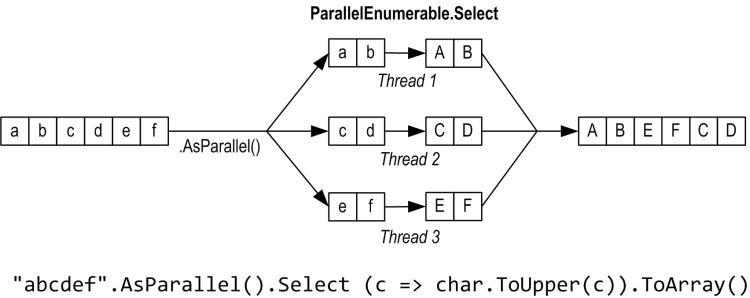
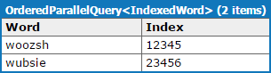
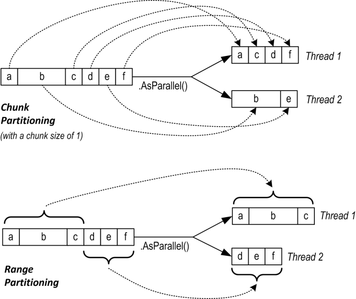
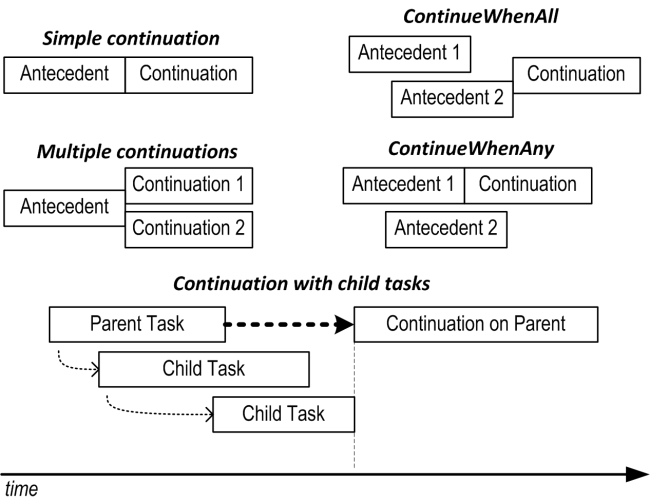

并行编程

在这一部分，我们讨论 Framework 4.0 加入的多线程 API，它们可以充分利用多核处理器。

- 并行 LINQ（Parallel LINQ）或称为 [PLINQ](https://blog.gkarch.com/threading/part5.html#plinq)
- [`Parallel`](https://blog.gkarch.com/threading/part5.html#the-parallel-class)类
- [任务并行（task parallelism）](https://blog.gkarch.com/threading/part5.html#task-parallelism)构造
- [`SpinLock` 和 `SpinWait`](https://blog.gkarch.com/threading/part5.html#spinlock-and-spinwait)

这些 API 可以统称为 PFX（Parallel Framework，并行框架）。[`Parallel`](https://blog.gkarch.com/threading/part5.html#the-parallel-class)类与[任务并行构造](https://blog.gkarch.com/threading/part5.html#task-parallelism)一起被称为 TPL（Task Parallel Library，任务并行库）。

Framework 4.0 也增加了一些更底层的线程构造，它们针对传统的多线程。我们之前讲过的：

- 低延迟信号构造 （[`SemaphoreSlim`](https://blog.gkarch.com/threading/part2.html#semaphore)、[`ManualResetEventSlim`](https://blog.gkarch.com/threading/part2.html#manualresetevent)、[`CountdownEvent`](https://blog.gkarch.com/threading/part2.html#countdownevent) 以及[`Barrier`](https://blog.gkarch.com/threading/part4.html#the-barrier-class)）
- [取消标记（cancellation token）](https://blog.gkarch.com/threading/part3.html#cancellation-tokens)，以便于协作取消
- [延迟初始化](https://blog.gkarch.com/threading/part3.html#lazy-initialization)
- [`ThreadLocal`](https://blog.gkarch.com/threading/part3.html#threadlocalt)

在继续阅读前，你需要了解第 1 部分 - 第 4 部分中的基本原理，特别是[锁](https://blog.gkarch.com/threading/part2.html#locking)和[线程安全](https://blog.gkarch.com/threading/part2.html#thread-safety)。

并行编程这一部分提供的所有代码都可以在[LINQPad](http://www.linqpad.net/)中试验。LINQPad 是一个 C# 代码草稿板，可以用来测试代码段，而无需创建类、项目或解决方案。想要获取这些示例代码，可以在 LINQPad 左下方的 Samples 标签页中点击 **Download More Samples**，并且选择 **C# 4.0 in a Nutshell: More Chapters**。（译者注：现在应该是 C# 5.0 in a Nutshell 和 C# 6.0 in a Nutshell 了）

## 为何需要 PFX？

近年来，CPU 时钟频率发展陷于停滞，制造商已经将重心转移至增加核心数量。这对我们程序员来说是个问题，因为标准的单线程代码无法自动利用那些增加的核心来提升程序运行速度。

利用多个核心对大多数服务端应用程序来说很容易，每个线程可以独立处理单独的客户端请求，但在桌面环境下就不那么容易了，因为通常这需要你优化计算密集型代码，按如下步骤进行：

1. 将工作分解成块。
2. 多线程并行处理这些工作块。
3. 以线程安全和高效的方式整理结果。

尽管你可以使用传统的多线程构造，但那比较笨拙，尤其是在分解工作和整理结果的步骤。并且，为确保[线程安全](https://blog.gkarch.com/threading/part2.html#thread-safety)，通常的策略是使用[锁](https://blog.gkarch.com/threading/part2.html#locking)，而它在很多线程同时访问一份数据时会导致大量竞争。

PFX 库就是专门被设计用来为这些场景提供帮助的。

利用多核心或多处理器的编程被称为并行编程（parallel programming）。它是多线程这个更宽泛概念的子集。

### PFX 概念

有两种分解工作的策略：数据并行（data parallelism）和任务并行（task parallelism）。

当一系列任务需要处理很多数据时，可以让每个线程都执行这一系列（相同的）任务来处理一部分数据（即所有数据的一个子集）。这样实现的并行化称为数据并行，因为我们是为线程分解了数据。与此相对，任务并行是指对任务进行分解，换句话说就是让每个线程执行不同的任务。

通常，对高度并行的硬件来说，数据并行更简单，可伸缩性也更好，因为它减少或消除了共享数据（也就减少了竞争和线程安全问题）。并且，事实上一般都是数据比任务要多，所以数据并行可以增加并发的可能。

数据并行也有利于结构化并行（structured parallelism），意思是说并行工作单元的启动和完成是在程序中的同一位置。相对的，任务并行趋向于非结构化，就是说并行工作单元的启动和完成可能分散在程序各处。结构化并行比较简单，并且不易出错，也让你可以把工作分解和线程协调（甚至包括结果整理）这些复杂的任务交给 PFX 库来完成。

### PFX 组件

PFX 包含两层功能。上层是由结构化数据并行 API：[PLINQ](https://blog.gkarch.com/threading/part5.html#plinq)和[`Parallel`](https://blog.gkarch.com/threading/part5.html#the-parallel-class)类组成。下层包含任务并行的类，以及一组额外的构造，来帮助你实现并行编程。


PLINQ 提供了最丰富的功能：它能够自动化并行的所有步骤，包括分解工作、多线程执行、最后把结果整理成一个输出序列。它被称为声明式（declarative）的，因为你只是声明希望并行化你的工作（构造一个 LINQ 查询），然后让 Framework 来处理实现细节。相对的，另一种方式是指令式（imperative）的，这种方式是需要你显式编写代码来处理工作分解和结果整理。例如使用`Parallel`类时，你必须自己整理结果，而如果使用任务并行构造，你还必须自己分解工作。

|                                                              | 分解工作 | 整理结果 |
| :----------------------------------------------------------- | :------- | :------- |
| [PLINQ](https://blog.gkarch.com/threading/part5.html#plinq)  |          |          |
| [Parallel](https://blog.gkarch.com/threading/part5.html#the-parallel-class)类 |          | -        |
| PFX 的[任务并行](https://blog.gkarch.com/threading/part5.html#task-parallelism) | -        | -        |

[并发集合](https://blog.gkarch.com/threading/part5.html#concurrent-collections)和[自旋基元](https://blog.gkarch.com/threading/part5.html#spinlock-and-spinwait)可以帮助你实现低层次的并行编程。这很重要，因为 PFX 不仅被设计适用于当今的硬件，也适用于未来更多核心的处理器。如果你希望搬运一堆木块，并且有 32 个工人，最麻烦的是如何让工人们搬运木块时不互相挡道。这与把算法分解运行在 32 个核心上类似：如果普通的锁被用于保护公共资源，所产生的[阻塞](https://blog.gkarch.com/threading/part2.html#blocking)可能意味着同时只有一小部分核心真正在工作。并发集合专门针对于高并发访问，致力于最小化或消除阻塞。PLINQ 和 `Parallel`类就依赖于并发集合和自旋基元来实现高效的工作管理。

#### PFX 与传统的多线程

传统多线程的场景是，即使在单核的机器上，使用多线程也有好处，而此时并没有真正的并行发生。就像我们之前讨论过的：保持用户界面的响应以及同时下载两个网页。

这一部分将要讲到的一些构造有时对于传统多线程也有用。特别是：

- [PLINQ](https://blog.gkarch.com/threading/part5.html#plinq)和 [`Parallel`](https://blog.gkarch.com/threading/part5.html#the-parallel-class)类在你并行执行操作以及等待它们完成（结构化并行）时有用。这包括非计算密集型任务，例如调用 web 服务。
- [任务并行构造](https://blog.gkarch.com/threading/part5.html#task-parallelism)适用于将操作运行在[线程池线程](https://blog.gkarch.com/threading/part1.html#thread-pooling)上，以及通过[任务延续（continuations）](https://blog.gkarch.com/threading/part5.html#continuations)和[父 / 子任务](https://blog.gkarch.com/threading/part5.html#child-tasks)来管理任务的工作流。
- [并发集合](https://blog.gkarch.com/threading/part5.html#concurrent-collections)有时在你需要线程安全队列、栈或字典时有用。
- [`BlockingCollection`](https://blog.gkarch.com/threading/part5.html#blockingcollectiont)提供了一个简单的工具来实现[生产者 / 消费者](https://blog.gkarch.com/threading/part5.html#wait-pulse-producer-consumer-queue)结构。

### 何时使用 PFX

PFX 主要用于并行编程：充分利用多核处理器来加速执行计算密集型代码。

充分利用多个核心的挑战在于阿姆达尔定律（Amdahl’s law），它指出通过并行化产生的最大性能提升，取决于有多少必须顺序执行的代码段。例如，如果一个算法只有三分之二的执行时间可以并行，即使有无数核心，也无法获得超过三倍的性能提升。

因此，在使用 PFX 前，有必要先检查可并行代码中的瓶颈。还需要考虑下，你的代码是否有必要是计算密集的，优化这里往往是最简单有效的方法。然而，这也需要平衡，因为一些优化技术会使代码难以并行化。

最容易获益的是“不好意思不并行的问题（embarrassingly parallel problems）”：工作可以很容易地被分解为多个任务，每个任务自己可以高效执行（结构化并行非常适合这种问题）。例如：很多图片处理任务、光线跟踪算法、数学和密码学方面的暴力计算和破解。而相反的例子是：实现快速排序算法的优化版本，想把它实现得好需要一定思考，并且可能需要非结构化并行。

## PLINQ

PLINQ 会自动并行化本地的 LINQ 查询。其优势在于使用简单，因为将工作分解和结果整理的负担交给了 Framework。

使用 PLINQ 时，只要在输入序列上调用`AsParallel()`，然后像平常一样继续 LINQ 查询就可以了。下边的查询计算 3 到 100,000 内的素数，这会充分利用目标机器上的所有核心。

```
// 使用一个简单的（未优化）算法计算素数。
//
// 注意：这一部分提供的所有代码都可以在 LINQPad 中试验。

IEnumerable<int> numbers = Enumerable.Range (3, 100000-3);

var parallelQuery =
  from n in numbers.AsParallel()
  where Enumerable.Range (2, (int) Math.Sqrt (n)).All (i => n % i > 0)
  select n;

int[] primes = parallelQuery.ToArray();
```

`AsParallel`是`System.Linq.ParallelEnumerable`中的一个扩展方法。它使用`ParallelQuery<TSource>`来封装输入，就会将你随后调用的 LINQ 查询操作符绑定在`ParallelEnumerable`中定义的另外一组扩展方法上。它们提供了所有标准查询操作符的并行化实现。本质上，它们就是将输入序列进行分区，形成工作块，并在不同的线程上执行，之后再将结果整理成一个输出序列：



调用`AsSequential()`可以拆封`ParallelQuery`，使随后的查询操作符绑定到标准查询操作符来顺序执行。在调用有副作用或非线程安全的方法前，有必要这样做。

对于那些接受两个输入序列的查询操作符（`Join`、`GroupJoin`、`Contact`、`Union`、`Intersect`和`Zip`）来说，必须在这两个输入序列上都使用`AsParallel()`（否则将抛出异常）。然而，不需要为中间过程的查询使用`AsParallel`，因为 PLINQ 的查询操作符会输出另一个`ParallelQuery`序列。实际上，在这个输出序列上再次调用`AsParallel`会降低效率，它会强制对序列进行合并和重新分区。

```
mySequence.AsParallel()           // 使用 ParallelQuery<int> 封装序列
          .Where (n => n > 100)   // 输出另一个 ParallelQuery<int>
          .AsParallel()           // 不需要，会降低效率！
          .Select (n => n * n)
```

并非所有的查询操作符都可以被有效地并行化。对于那些[不能的](https://blog.gkarch.com/threading/part5.html#plinq-limitations)，PLINQ 使用了顺序的实现。如果 PLINQ 认为并行化的开销实际会使查询变慢，它也会顺序执行。

PLINQ 仅适用于本地集合：它无法在 LINQ to SQL 或 Entity Framework 中使用，因为在那些场景中，LINQ 会被翻译成 SQL 语句，然后在数据库服务器上执行。然而，你可以使用 PLINQ 对从数据库查询获得的结果执行进一步的本地查询。

如果 PLINQ 查询抛出异常，它会被封装进`AggregateException`重新抛出，其`InnerExceptions`属性包含真正的异常。详见[使用 `AggregateException`](https://blog.gkarch.com/threading/part5.html#working-with-aggregateexception)。

#### 为什么 AsParallel 不是默认的？

我们知道`AsParallel`可以透明的并行化 LINQ 查询，那么问题来了，“微软为什么不直接并行化标准查询操作符，使 PLINQ 成为默认的？”

有很多原因使其成为这种选择使用（opt-in）的方式。首先，要使 PLINQ 有用，必须要有一定数量的计算密集型任务，它们可以被分配到多个工作线程。大多数 LINQ to Objects 的查询执行非常快，根本不需要并行化，并行化过程中的任务分区、结果整理以及线程协调反而会使程序变慢。

其次：

- PLINQ 查询的输出（默认情况下）在元素排序方面[不同于 LINQ 查询](https://blog.gkarch.com/threading/part5.html#plinq-and-ordering)。
- PLINQ 将异常封装在[`AggregateException`](https://blog.gkarch.com/threading/part5.html#working-with-aggregateexception)中（能够处理抛出的多个异常）。
- 如果查询引用了非线程安全的方法，PLINQ 会给出不可靠的结果。

最后，PLINQ 为了进行微调提供了一些钩子（hook）。把这些累赘加入标准的 LINQ to Objects 的 API 会增加使用障碍。

### 并行执行的特征

与普通的 LINQ 查询一样，PLINQ 查询也是延迟估值的。这意味着只有当结果开始被使用时，查询才会被触发执行。通常结果是通过一个`foreach`循环被使用（通过转换操作符也会触发，例如`ToArray`，还有返回单个元素或值的操作符）。

当枚举结果时，执行过程与普通的顺序查询略有不同。顺序查询完全由使用方通过“拉”的方式驱动：每个元素都在使用方需要时从输入序列中被提取。并行查询通常使用独立的线程从输入序列中提取元素，这可能比使用方的需要稍微提前了一些（很像一个给播报员使用的提词机，或者 CD 机中的防震缓冲区）。然后通过查询链并行处理这些元素，将结果保存在一个小缓冲区中，以准备在需要的时候提供给使用方。如果使用方在枚举过程中暂停或中断，查询也会暂停或停止，这样可以不浪费 CPU 时间或内存。

你可以通过在`AsParallel`之后调用`WithMergeOptions`来调整 PLINQ 的缓冲行为。默认值`AutoBuffered`通常能产生最佳的整体效果；`NotBuffered`禁用缓冲，如果你希望尽快看到结果可以使用这个；`FullyBuffered`在呈现给使用方前缓存整个查询的输出（`OrderBy`和`Reverse`操作符天生以这种方式工作，取元素、聚合和转换操作符也是一样）。

### PLINQ 与排序

并行化查询操作符的一个副作用是：当整理结果时，不一定能与它们提交时的顺序保持一致，就如同之前图中所示的那样。换句话说，就是无法像普通的 LINQ 那样能保证序列的正常顺序。

如果你需要保持序列顺序，可以通过在`AsParallel`后调用`AsOrdered()`来强制它保证：

```
myCollection.AsParallel().AsOrdered()...
```

在大量元素的情况下调用`AsOrdered`会造成一定性能损失，因为 PLINQ 必须跟踪每个元素原始位置。

之后你可以通过调用`AsUnordered`来取消`AsOrdered`的效果：这会引入一个“随机洗牌点（random shuffle point）”，允许查询从这个点开始更高效的执行。因此，如果你希望仅为前两个查询操作保持输入序列的顺序，可以这样做：

```
inputSequence.AsParallel().AsOrdered()
  .QueryOperator1()
  .QueryOperator2()
  .AsUnordered()       // 从这开始顺序无关紧要
  .QueryOperator3()
  // ...
```

`AsOrdered`不是默认的，因为对于大多数查询来说，原始的输入顺序无关紧要。换句话说，如果`AsOrdered`是默认的，你就不得不为大多数并行查询使用`AsUnordered`来获得最好的性能，这会成为负担。

### PLINQ 的限制

目前，PLINQ 在能够并行化的操作上有些实用性限制。这些限制可能会在之后的更新包或 Framework 版本中解决。

下列查询操作符会阻止查询的并行化，除非源元素是在它们原始的索引位置：

- `Take`、`TakeWhile`、`Skip`和`SkipWhile`
- `Select`、`SelectMany`和`ElementAt`这几个操作符的带索引版本

大多数查询操作符都会改变元素的索引位置（包括可能移除元素的那些操作符，例如`Where`）。这意味着如果你希望使用上述操作符，就要在查询开始的地方使用。

下列查询操作符可以并行化，但会使用代价高昂的分区策略，有时可能比顺序执行还慢。

- `Join`、`GroupBy`、`GroupJoin`、`Distinct`、`Union`、`Intersect`和`Except`

`Aggregate`操作符的带种子（seed）的重载是不能并行化的，PLINQ 提供了[专门的重载](https://blog.gkarch.com/threading/part5.html#optimizing-plinq)来解决。

其它所有操作符都是可以并行化的，然而使用这些操作符并不能确保你的查询会被并行化。如果 PLINQ 认为进行分区的开销会导致部分查询变慢，它也许会顺序执行查询。你可以覆盖这个行为，方法是在`AsParallel()`之后调用如下代码来强制并行化：

```
.WithExecutionMode (ParallelExecutionMode.ForceParallelism)
```

### 例：并行拼写检查

假设我们希望实现一个拼写检查程序，它在处理大文档时，能够通过充分利用所有可用的核心来快速运行。我们把算法设计成一个 LINQ 查询，这样就可以很容易的并行化它。

第一步是下载英文单词字典，为了能够高效查找，将其放在一个`HashSet`中：

```
if (!File.Exists ("WordLookup.txt"))    // 包含约 150,000 个单词
  new WebClient().DownloadFile (
    "http://www.albahari.com/ispell/allwords.txt", "WordLookup.txt");

var wordLookup = new HashSet<string> (
  File.ReadAllLines ("WordLookup.txt"),
  StringComparer.InvariantCultureIgnoreCase);
```

然后，使用`wordLookup`来创建一个测试“文档”，该“文档”是个包含了一百万个随机单词的数组。创建完数组后，引入两个拼写错误：

```
var random = new Random();
string[] wordList = wordLookup.ToArray();

string[] wordsToTest = Enumerable.Range (0, 1000000)
  .Select (i => wordList [random.Next (0, wordList.Length)])
  .ToArray();

wordsToTest [12345] = "woozsh";     // 引入两个
wordsToTest [23456] = "wubsie";     // 拼写错误
```

现在，通过对比`wordLookup`检查`wordsToTest`，来完成这个并行的拼写检查程序。PLINQ 让这变得很简单：

```
var query = wordsToTest
  .AsParallel()
  .Select  ((word, index) => new IndexedWord { Word=word, Index=index })
  .Where   (iword => !wordLookup.Contains (iword.Word))
  .OrderBy (iword => iword.Index);

query.Dump();     // 在 LINQPad 中显示输出
```

下边是 LINQPad 中的显示的输出：




`IndexedWord`是一个自定义的结构体，定义如下：

```
struct IndexedWord { public string Word; public int Index; }
```

判定器中的`wordLookup.Contains`方法作为查询的主要部分，它使得这个查询值得并行化。

我们可以使用匿名类型来代替`IndexedWord`结构体，从而稍微简化下这个查询。然而这会降低性能，因为匿名类型（是类，因此是引用类型）会产生分配堆内存的开销，以及之后的垃圾回收。

这个区别对于顺序查询来说没太大关系，但对于并行查询来说，基于栈的内存分配则相当有利。这是因为基于栈的内存分配是可以高度并行化的（因为每个线程有其自己的栈），反之基于堆的内存分配会使所有线程竞争同一个堆，它是由单一的内存管理器和垃圾回收器管理的。

#### 使用 ThreadLocal<T>

来扩展一下我们的例子，让创建随机测试单词列表的过程并行化。我们把它作为 LINQ 查询来构造，这样事情就简单多了。以下是顺序执行版本：

```
string[] wordsToTest = Enumerable.Range (0, 1000000)
  .Select (i => wordList [random.Next (0, wordList.Length)])
  .ToArray();
```

不幸的是，对`Random.Next`的调用不是线程安全的，所以实现并行化不是向查询语句直接插入`AsParallel()`这么简单。一个可能的解决办法是写个方法对`random.Next`加锁，然而这会限制并发能力。更好的处理办法是使用[`ThreadLocal`](https://blog.gkarch.com/threading/part3.html#thread-local-storage)为每个线程创建独立的`Random`对象。然后我们可以使用如下代码来并行化查询：

```
var localRandom = new ThreadLocal<Random>
 ( () => new Random (Guid.NewGuid().GetHashCode()) );

string[] wordsToTest = Enumerable.Range (0, 1000000).AsParallel()
  .Select (i => wordList [localRandom.Value.Next (0, wordList.Length)])
  .ToArray();
```

在实例化`Random`对象的工厂方法中，我们传递了一个`Guid`的散列值，用来确保：如果两个`Random`对象在很短的时间范围内被创建，它们可以生成不同的随机数序列。

#### 何时使用 PLINQ

在你的程序中寻找 LINQ 查询，尝试并行化它们貌似是很诱人的。然而这通常没什么用，因为绝大多数明显应该使用 LINQ 的地方执行都很快，所以并行化并没有什么好处。更好的方法是找到 CPU 密集型工作的瓶颈，然后考虑“这能写成 LINQ 查询吗？”（这样重构的一个好处是 LINQ 通常可以使代码变得更短，并且更具可读性。）

PLINQ 非常适合于“不好意思不并行的问题（embarrassingly parallel problems）”。它也能很好的应用于结构化阻塞任务（structured blocking tasks），例如同时调用多个 web 服务（见[调用阻塞或 I/O 密集型功能](https://blog.gkarch.com/threading/part5.html#calling-blocking-or-io-intensive-functions)）。

对于图像处理来说 PLINQ 是个糟糕的选择，因为整理几百万个像素到输出序列将形成瓶颈。更好的方法是把像素直接写入数组或非托管的内存块，然后使用`Parallel`类或[任务并行](https://blog.gkarch.com/threading/part5.html#task-parallelism)来管理多线程。（也可以使用`ForAll`来绕过结果整理。如果该图像处理算法天生适合 LINQ，这么做可能有益。）

### 纯方法

（译者注：pure function 译为纯方法，是指一个方法 / 函数不能改变任何状态，也不能进行任何 I/O 操作，它的返回值不能依赖任何可能被改变的状态，并且使用相同的输入调用就会产生相同的输出。）

因为 PLINQ 会在并行的线程上运行查询，因此必须注意不要执行非线程安全的操作。特别需要注意，对变量进行写操作有副作用（side-effecting），是非线程安全的。

```
// 下列查询将每个元素与其索引相乘。
// 给定一个 0 到 999 的输入序列, 它应该输出元素的平方。
int i = 0;
var query = from n in Enumerable.Range(0,999).AsParallel() select n * i++;
```

可以通过使用锁或[`Interlocked`](https://blog.gkarch.com/threading/part4.html#interlocked)来确保`i`的自增是线程安全的，但是问题仍然存在，`i`并不能保证对应输入元素的原始索引。并且加上[`AsOrdered`](https://blog.gkarch.com/threading/part5.html#plinq-and-ordering)也无法解决这个问题，因为`AsOrdered`仅仅确保输出是按顺序的，就像顺序执行的输出顺序一样。但这并不意味着实际的处理过程也是按顺序的。

替代方法是将这个查询重写，使用带索引的`Select`版本。

```
var query = Enumerable.Range(0,999).AsParallel().Select ((n, i) => n * i);
```

为了达到最佳性能，任何被查询操作符调用的方法必须是线程安全的：不要给字段或属性赋值（无副作用，纯方法）。如果用[锁](https://blog.gkarch.com/threading/part2.html#locking)来保证线程安全，查询的并行能力将会受到限制。这个限制可以通过锁定的持续时间除以花费在方法上的总时间来计算。

### 调用阻塞或 I/O 密集型功能

有时一个查询的长时间运行并不是因为是 CPU 密集型操作，而是因为它在等待某些东西，例如等待网页下载或是硬件的响应。PLINQ 能够有效地并行化这种类型的查询，可以通过在`AsParallel`后调用`WithDegreeOfParallelism`来提示这种特征。例如，假设我们希望同时 ping 6 个网站。比起使用[异步委托](https://blog.gkarch.com/threading/part1.html#asynchronous-delegates)或手动让 6 个线程自旋，使用 PLINQ 查询可以轻松实现它：

```
from site in new[]
{
  "www.albahari.com",
  "www.linqpad.net",
  "www.oreilly.com",
  "www.takeonit.com",
  "stackoverflow.com",
  "www.rebeccarey.com"  
}
.AsParallel().WithDegreeOfParallelism(6)
let p = new Ping().Send (site)
select new
{
  site,
  Result = p.Status,
  Time = p.RoundtripTime
}
```

`WithDegreeOfParallelism`强制 PLINQ 同时运行指定数量的任务。在调用[阻塞](https://blog.gkarch.com/threading/part2.html#blocking)方法（例如`Ping.Send`）时有必要这么做，否则的话，PLINQ 会认为这个查询是 CPU 密集型的，并进行相应的任务分配。在双核机器上，PLINQ 会默认同时运行 2 个任务，对于上述情况来说这显然不是我们希望看到的。

受[线程池](https://blog.gkarch.com/threading/part1.html#thread-pooling)的影响，PLINQ 通常为每个任务分配一个线程。可以通过调用[`ThreadPool.SetMinThreads`](https://blog.gkarch.com/threading/part1.html#optimizing-the-thread-pool)来加速初始线程的创建速度。

再给一个例子：假设我们要实现一个监控系统，希望它不断将来自 4 个安全摄像头的图像合并成一个图像，并在闭路电视上显示。使用下边的类来表示一个摄像头：

```
class Camera
{
  public readonly int CameraID;
  public Camera (int cameraID) { CameraID = cameraID; }

  // 获取来自摄像头的图像: 返回一个字符串来代替图像
  public string GetNextFrame()
  {
    Thread.Sleep (123);       // 模拟获取图像的时间
    return "Frame from camera " + CameraID;
  }
}
```

要获取一个合成图像，我们必须分别在 4 个摄像头对象上调用`GetNextFrame`。假设操作主要是受 I/O 影响的，通过并行化我们能将帧率提升 4 倍，即使是在单核机器上。PLINQ 使用一小段程序就能实现它：

```
Camera[] cameras = Enumerable.Range (0, 4)    // 创建 4 个摄像头对象
  .Select (i => new Camera (i))
  .ToArray();

while (true)
{
  string[] data = cameras
    .AsParallel().AsOrdered().WithDegreeOfParallelism (4)
    .Select (c => c.GetNextFrame()).ToArray();

  Console.WriteLine (string.Join (", ", data));   // 显示数据...
}
```

`GetNextFrame`是一个[阻塞](https://blog.gkarch.com/threading/part2.html#blocking)方法，所以我们使用了`WithDegreeOfParallelism`来获得期望的并发度。在我们的例子中，阻塞是在调用`Sleep`时发生。而在真实情况下，阻塞的发生是因为从摄像头中获取图像是 I/O 密集型操作，而不是 CPU 密集型操作。

调用`AsOrdered`可以确保图像按照一致的顺序显示。因为序列中只有 4 个元素，所以它对性能的影响可以忽略不计。

#### 改变并发度

在一个 PLINQ 查询内，仅能够调用`WithDegreeOfParallelism`一次。如果你需要再次调用它，必须在查询中通过再次调用`AsParallel()`强制进行查询的合并和重新分区：

```
"The Quick Brown Fox"
  .AsParallel().WithDegreeOfParallelism (2)
  .Where (c => !char.IsWhiteSpace (c))
  .AsParallel().WithDegreeOfParallelism (3)   // 强制合并和重新分区
  .Select (c => char.ToUpper (c))
```

### 取消

当在`foreach`循环中使用 PLINQ 查询的结果时，取消该查询很简单：使用`break`退出循环就可以了。查询会被自动取消，因为枚举器会被隐式销毁。

对于结束一个使用转换、取元素或聚合操作符的查询来说，你可以在其它线程使用[取消标记](https://blog.gkarch.com/threading/part3.html#cancellation-tokens)来取消它。在`AsParallel`后调用`WithCancellation`来添加一个标记，并把`CancellationTokenSource`对象的`Token`属性作为参数传递。之后另一个线程就可以在这个`CancellationTokenSource`对象上调用`Cancel`，它会在查询的使用方那边抛出`OperationCanceledException`异常。

```
IEnumerable<int> million = Enumerable.Range (3, 1000000);

var cancelSource = new CancellationTokenSource();
var primeNumberQuery =
  from n in million.AsParallel().WithCancellation (cancelSource.Token)
  where Enumerable.Range (2, (int) Math.Sqrt (n)).All (i => n % i > 0)
  select n;

new Thread (() => {
                    Thread.Sleep (100);      // 在 100 毫秒后
                    cancelSource.Cancel();   // 取消查询
                  }
           ).Start();
try
{
  // 开始运行查询
  int[] primes = primeNumberQuery.ToArray();
  // 永远到不了这里，因为其它线程会进行取消操作。
}
catch (OperationCanceledException)
{
  Console.WriteLine ("Query canceled");
}
```

PLINQ 不会直接中止线程，因为[这么做是危险的](https://blog.gkarch.com/threading/part4.html#aborting-threads)。在取消时，它会等待所有工作线程处理完当前的元素，然后结束查询。这意味着查询调用的任何外部方法都会执行完成。

### 优化 PLINQ

#### 输出端优化

PLINQ 的一个优点是它能够很容易地将并行化任务的结果整理成一个输出序列。然而有时，最终要做的是在输出序列的每个元素上运行一些方法：

```
foreach (int n in parallelQuery)
  DoSomething (n);
```

如果是上述情况，并且不关心元素的处理顺序，那么可以使用 PLINQ 的`ForAll`方法来提高效率。

`ForAll`方法在`ParallelQuery`的每个输出元素上运行一个委托。它直接挂钩（hook）到 PLINQ 内部，绕过整理和枚举结果的步骤。举个栗子：

```
"abcdef".AsParallel().Select (c => char.ToUpper(c)).ForAll (Console.Write);
```


整理和枚举结果的开销不是非常大，所以当有大量输入元素且处理执行很快的时候，才能最大化`ForAll`优化的收益。

#### 输入端优化

PLINQ 有 3 种分区策略，用来分配输入元素到线程：

| 策略                           | 元素分配 | 相对性能  |
| :----------------------------- | :------- | :-------- |
| 块分区（Chunk partitioning）   | 动态     | 平均      |
| 范围分区（Range partitioning） | 静态     | 差 - 极好 |
| 散列分区（Hash partitioning）  | 静态     | 差        |

对于那些需要比较元素的查询操作符（`GroupBy`、`Join`、`GroupJoin`、`Intersect`、`Except`、`Union`和`Distinct`），PLINQ 总是使用散列分区。散列分区相对低效，因为它必须预先计算每个元素的散列值（拥有同样散列值的元素会在同一个线程中被处理）。如果发现运行太慢，唯一的选择是调用`AsSequential`来禁止并行处理。

对于其它所有查询操作符，你可以选择使用范围分区或块分区。默认情况下：

- 如果输入序列可以通过索引访问（数组或是`IList<T>`的实现），PLINQ 选用范围分区。
- 否则，PLINQ 选用块分区。

概括来讲，对于较长的序列且处理每个元素所需的 CPU 时间比较近似时，范围分区更快。否则，块分区通常更快。

如果想强制使用范围分区：

- 如果查询以`Enumerable.Range`开始，将其替换为`ParallelEnumerable.Range`。
- 否则，在输入序列上调用`ToList`或`ToArray`（显然，你需要考虑在这里产生的性能开销）。

`ParallelEnumerable.Range`并不是对`Enumerable.Range(…).AsParallel()`的简单封装。它通过激活范围分区改变了查询的性能。

如果想强制使用块分区，就通过调用`Partitioner.Create`（在命名空间`System.Collection.Concurrent`中）来封装输入序列，例如：

```
int[] numbers = { 3, 4, 5, 6, 7, 8, 9 };
var parallelQuery =
  Partitioner.Create (numbers, true).AsParallel()
  .Where (...)
```

`Partitioner.Create`的第二个参数表示：希望对查询开启负载均衡（load-balance），这是另一个使用块分区的动机。

块分区的工作方式是定期从输入序列中抓取小块元素来处理。PLINQ 一开始会分配非常小的块（一次 1 到 2 个元素），然后随着查询的进行增加块的大小：这确保小序列能够被有效地并行化，而大序列不会导致过多的抓取工作。如果一个工作线程碰巧拿到了一些“容易”的元素（处理很快），它最终将拿到更多的块。这个系统使每个线程保持均等的繁忙程度（使核心负载均衡）。唯一的不利因素是从共享的输入序列中获取元素需要同步（通常使用一个[排它锁](https://blog.gkarch.com/threading/part2.html#locking)），这会产生一定的开销和竞争。



范围分区会绕过正常的输入端枚举，并且为每个工作线程预分配相同数量的元素，避免了在输入序列上的竞争。但是如果某些线程拿到了容易的元素并很早就完成了处理，在其它工作线程仍在继续工作的时候它就会是空闲的。我们之前的素数计算的例子在使用范围分区时就性能不高。举个范围分区适用的例子，计算 1000 万以内数字的平方和：

```
ParallelEnumerable.Range (1, 10000000).Sum (i => Math.Sqrt (i))
```

`ParallelEnumerable.Range`返回一个`ParallelQuery<T>`，因此不需要在之后调用`AsParallel`。

范围分区不是必须把元素分成相邻的块，它也许会选用一种 “条纹式（striping）”策略。例如，有两个工作线程，一个工作线程可能会处理奇数位置的元素，而另一个工作线程处理偶数位置的元素。`TakeWhile`操作符几乎一定会触发条纹式策略，用来避免处理序列后边不必要的元素。

### 并行化自定义聚合

PLINQ 可以在无需额外干预的情况下有效地并行化`Sum`、`Average`、`Min`和`Max`操作符。然而，`Aggregate`操作符对于 PLINQ 来说是个特殊的麻烦。

如果不熟悉`Aggregate`操作符，你可以认为它就是一个`Sum`、`Average`、`Min`和`Max`的泛化版本，换句话说，就是一个可以使你通过自定义的聚合算法实现非通常聚合操作的操作符。如下代码展现了`Aggregate`如何实现`Sum`操作符的工作：

```
int[] numbers = { 1, 2, 3 };
int sum = numbers.Aggregate (0, (total, n) => total + n);   // 6
```

`Aggregate`的第一个参数是 *seed*（种子，初值），聚合操作从这里开始。第二个参数是一个用于更新聚合值的表达式，该表达式生成一个新的元素。第三个参数是可选的，用来表示如何通过聚合值生成最终的结果值。

大多数`Aggregate`被设计用来解决的问题都能够使用`foreach`循环轻松解决，并且这也是更熟悉的语法。而`Aggregate`的优点在于对庞大或复杂的聚合操作可以使用 PLINQ 来进行声明式的并行化。

#### 无种子的聚合

调用`Aggregate`时可以省略种子值，这种情况下第一个元素会被隐式当作种子，之后聚合处理会从第二个元素开始进行。下边是一个无种子的例子：

```
int[] numbers = { 1, 2, 3 };
int sum = numbers.Aggregate ((total, n) => total + n);   // 6
```

这得到了与之前相同的结果，然而实际上却是进行了不同的计算。之前例子计算的是 `0+1+2+3`，而现在计算的是`1+2+3`。通过乘法运算来代替加法运算能够更好地说明这个不同：

```
int[] numbers = { 1, 2, 3 };
int x = numbers.Aggregate (0, (prod, n) => prod * n);   // 0*1*2*3 = 0
int y = numbers.Aggregate (   (prod, n) => prod * n);   //   1*2*3 = 6
```

如同我们马上将要看到的，无种子的聚合的优点在于被并行化时不需要使用特殊的重载。然而，无种子的聚合存在一个陷阱：无种子的聚合方法期望使用的委托中的计算应满足交换律和结合律。如果用在别的情况下，结果要不然是反直觉的（普通查询），要不然是不确定的（PLINQ 并行化查询）。例如考虑如下函数：

```
(total, n) => total + n * n
```

它既不满足交换律也不满足结合律。（例如：`1+2*2 != 2+1*1`）。我们来看一下使用它来对数字 2、3、4 计算平方和时会发生什么：

```
int[] numbers = { 2, 3, 4 };
int sum = numbers.Aggregate ((total, n) => total + n * n);    // 27
```

本来的计算应该是：

```
2*2 + 3*3 + 4*4    // 29
```

但现在的计算是：

```
2 + 3*3 + 4*4      // 27
```

可以通过多种方法解决这个问题。首先，我们可以在序列最前端加入 0 作为第一个元素：

```
int[] numbers = { 0, 2, 3, 4 };
```

这不仅不优雅，而且在并行执行的情况下仍然会产生错误的结果，因为 PLINQ 会选择多个元素作为种子，这相当于假定了计算满足结合律。为说明这个问题，用如下方式表示我们的聚合函数：

```
f(total, n) => total + n * n
```

LINQ to Objects 会这样计算：

```
f(f(f(0, 2),3),4)
```

PLINQ 可能会这样计算：

```
f(f(0,2),f(3,4))
```

结果是：

```
第一个分区：   a = 0 + 2*2  (= 4)
第二个分区：   b = 3 + 4*4  (= 19)
最终结果：     a + b*b  (= 365)
甚至可能是:    b + a*a  (= 35)
```

有两种好的解决方案：第一种是将其转换为有种子的聚合，使用 0 作为种子。这种方案带来的复杂度的提升仅仅是使用 PLINQ 时，我们需要使用特殊的重载，确保查询并行执行（马上会看到）。

第二种解决方案是：重构查询，使聚合函数满足交换律和结合律：

```
int sum = numbers.Select (n => n * n).Aggregate ((total, n) => total + n);
```

当然，在这种简单的场景下你可以（并且应该）使用`Sum`操作符来代替`Aggregate`：

```
int sum = numbers.Sum (n => n * n);
```

实际上可以更进一步使用`Sum`和`Average`。例如，可以使用`Average`来计算均方根（root-mean-square）：

```
Math.Sqrt (numbers.Average (n => n * n))
```

甚至是标准差：

```
double mean = numbers.Average();
double sdev = Math.Sqrt (numbers.Average (n =>
              {
                double dif = n - mean;
                return dif * dif;
              }));
```

上述两个方法都是安全、高效并且可完全并行化的。

#### 并行化聚合

我们刚刚看到了无种子的聚合，提供的委托必须满足交换律和结合律。如果违反这个规则，PLINQ 会给出错误的结果，因为它可能使用输入序列中多个的元素作为种子，来同时聚合多个分区。

指定种子的聚合也许看起来像是使用 PLINQ 的安全选择，然而不幸的是，这样通常会导致顺序执行，因为它依赖于单独一个种子。为减缓这个问题，PLINQ 提供了另一个`Aggregate`的重载，允许你指定多个种子，或者是一个种子工厂方法。对每个线程，它执行这个方法来生成一个独立的种子，这就形成了一个线程局部的累加器，通过它在聚合局部元素。

你必须再提供一个方法来指示如何合并局部累加器至主累加器。最后，`Aggregate`的这个重载还需要一个委托，用来对结果进行任意的最终变换（有些没必要，你可以之后对结果运行一些代码完成同样操作）。所以，这里有 4 个委托，按照它们被传递的顺序：

- 种子工厂（`seedFactory`）：
  返回一个新的局部累加器
- 更新累加器方法（`updateAccumulatorFunc`）：
  聚合元素至局部累加器
- 合并累加器方法（`combineAccumulatorFunc`）：
  合并局部累加器至主累加器
- 结果选择器（`resultSelector`）：
  在结果上应用任意最终变换

在简单的场景中，你可以指定一个种子值来代替种子工厂。当种子是你需要改变的引用类型时这种策略行不通，因为同一个实例将在线程间共享。

提供一个简单的例子，下边的代码对`numbers`数组中的值进行求和：

```
numbers.AsParallel().Aggregate (
  () => 0,                                     // 种子工厂
  (localTotal, n) => localTotal + n,           // 更新累加器方法
  (mainTot, localTot) => mainTot + localTot,   // 合并累加器方法
  finalResult => finalResult)                  // 结果选择器
```

这个例子有些刻意，我们可以使用更简单的方式获取相同的结果（例如无种子的聚合，或者更好的选择是使用`Sum`操作符）。给一个更加实际的例子，假设我们要计算字符串中每个英文字母的出现频率。简单的顺序执行方案看起来是这样：

```
string text = "Let’s suppose this is a really long string";
var letterFrequencies = new int[26];
foreach (char c in text)
{
  int index = char.ToUpper (c) - 'A';
  if (index >= 0 && index <= 26) letterFrequencies [index]++;
};
```

基因序列是一个输入文本可能会非常长的例子，它的“字母表”是由字母 *a*、*c*、*g*、*t* 组成。

为了将它并行化，我们可以把`foreach`替换为[`Parallel.ForEach`](https://blog.gkarch.com/threading/part5.html#parallel-for-parallel-foreach)（在接下来的一节会讲到），但这会导致共享数组上的并发问题。对数组的访问加[锁](https://blog.gkarch.com/threading/part2.html#locking)可以解决问题，但会降低并发的可能性。

`Aggregate`提供了一个好的解决方案。这种情况下，累加器是一个数组，就像是之前例子中`letterFrequencies`数组。使用`Aggregate`的顺序执行版本如下：

```
int[] result =
  text.Aggregate (
    new int[26],                // 创建“累加器”
    (letterFrequencies, c) =>   // 聚合一个字母至累加器
    {
      int index = char.ToUpper (c) - 'A';
      if (index >= 0 && index <= 26) letterFrequencies [index]++;
      return letterFrequencies;
    });
```

下面是并行版本，它使用 PLINQ 的专门重载：

```
int[] result =
  text.AsParallel().Aggregate (
    () => new int[26],             // 新建局部累加器

    (localFrequencies, c) =>       // 聚合至局部累加器
    {
      int index = char.ToUpper (c) - 'A';
      if (index >= 0 && index <= 26) localFrequencies [index]++;
      return localFrequencies;
    },
                                   // 聚合局部累加器至主累加器
    (mainFreq, localFreq) =>
      mainFreq.Zip (localFreq, (f1, f2) => f1 + f2).ToArray(),

    finalResult => finalResult     // 对结果进行
  );                               // 最终变换
```

注意：局部累加方法会改动`localFrequencies`数组。这个优化是非常重要的，也是合法的，因为`localFrequencies`是每个线程的局部变量。

## Parallel 类

PFX 通过`Parallel`类上的三个静态方法提供了结构化并行的基本形式：

- `Parallel.Invoke`

  并行执行一组委托

- `Parallel.For`

  C#`for`循环的并行版本

- `Parallel.ForEach`

  C#`foreach`循环的并行版本

三个方法都是在工作完成前会阻塞。类似于[PLINQ](https://blog.gkarch.com/threading/part5.html#plinq)，如果有未处理的异常，其它工作线程会在当前迭代完成之后停止，异常会被封装在[`AggregateException`](https://blog.gkarch.com/threading/part5.html#working-with-aggregateexception)中抛给调用方。

### Parallel.Invoke

`Parallel.Invoke`并行执行一组`Action`类型的委托，然后等待它们完成。这个方法最简单的版本如下：

```
public static void Invoke (params Action[] actions);
```

下面是使用`Parallel.Invoke`来同时下载两个网页：

```
Parallel.Invoke (
 () => new WebClient().DownloadFile ("http://www.linqpad.net", "lp.html"),
 () => new WebClient().DownloadFile ("http://www.jaoo.dk", "jaoo.html"));
```

这表面上看起来像是创建了两个[`Task`](https://blog.gkarch.com/threading/part5.html#task-parallelism)对象（或[异步委托](https://blog.gkarch.com/threading/part1.html#asynchronous-delegates)）并等待它们。但是有个重要的区别：`Parallel.Invoke`在你传递一百万个委托时仍然能高效工作。这是因为它会对大量元素进行分区（partition），形成多个块，再对其分配底层的`Task`。而不是直接对每一个委托创建独立的`Task`。

使用`Parallel`上的所有方法时，都需要自行实现整理结果的代码。这意味着你需要注意[线程安全](https://blog.gkarch.com/threading/part2.html#thread-safety)。例如，下面的代码不是线程安全的：

```
var data = new List<string>();
Parallel.Invoke (
 () => data.Add (new WebClient().DownloadString ("http://www.foo.com")),
 () => data.Add (new WebClient().DownloadString ("http://www.far.com")));
```

对添加的过程加[锁](https://blog.gkarch.com/threading/part2.html#locking)可以解决问题，但是如果你的委托数量更多，它们每一个执行的又很快，那么锁可能造成瓶颈。更好的解决方案是使用线程安全的集合，比如[`ConcurrentBag`](https://blog.gkarch.com/threading/part5.html#concurrentbagt)就是这里的理想方案。

`Parallel.Invoke`也有接受`ParallelOptions`对象的重载：

```
public static void Invoke (ParallelOptions options,
                           params Action[] actions);
```

通过`ParallelOptions`，你可以添加[取消标记](https://blog.gkarch.com/threading/part3.html#cancellation-tokens)、限制最大并发数量和指定自定义[任务调度器](https://blog.gkarch.com/threading/part5.html#task-schedulers-and-uis)。如果要执行的委托数量（大致上）大于核心数，那么使用取消标记才有意义：在取消时，所有未启动的委托都会被抛弃。而所有已经在执行的委托会继续完成。对于如何使用取消标记，可以参考[取消](https://blog.gkarch.com/threading/part5.html#cancellation)中的例子。

### Parallel.For 和 Parallel.ForEach

`Parallel.For`和`Parallel.ForEach`与 C# `for`和`foreach`类似，但会并行执行，而不是顺序执行。下面是它们（最简单的）方法签名：

```
public static ParallelLoopResult For (
  int fromInclusive, int toExclusive, Action<int> body)

public static ParallelLoopResult ForEach<TSource> (
  IEnumerable<TSource> source, Action<TSource> body)
```

对于下面的`for`循环：

```
for (int i = 0; i < 100; i++)
  Foo (i);
```

并行版本是这样：

```
Parallel.For (0, 100, i => Foo (i));
```

或更简洁的：

```
Parallel.For (0, 100, Foo);
```

而对于下面的`foreach`循环：

```
foreach (char c in "Hello, world")
  Foo (c);
```

并行版本是这样：

```
Parallel.ForEach ("Hello, world", Foo);
```

给一个实际点的例子。引入`System.Security.Cryptography`命名空间，然后我们可以像这样并行生成六组密钥对的字符串形式：

```
var keyPairs = new string[6];

Parallel.For (0, keyPairs.Length,
              i => keyPairs[i] = RSA.Create().ToXmlString (true));
```

与[`Parallel.Invoke`](https://blog.gkarch.com/threading/part5.html#parallel-invoke)同样，我们也可以让`Parallel.For`和`Parallel.ForEach`执行大量工作项，它们也会被分区，分配给任务高效执行。

上面的例子也可以使用[PLINQ](https://blog.gkarch.com/threading/part5.html#plinq)来实现：

```
string[] keyPairs =
  ParallelEnumerable.Range (0, 6)
  .Select (i => RSA.Create().ToXmlString (true))
  .ToArray();
```

#### 外循环 vs 内循环

`Parallel.For`和`Parallel.ForEach`通常更适合用于外循环，而不是内循环。这是因为前者会带来更大的分区块，就稀释了管理并行的开销。一般没有必要同时并行内外循环。对于下面的例子，我们需要 100 个核心才能让内循环的并行有益处：

```
Parallel.For (0, 100, i =>
{
  Parallel.For (0, 50, j => Foo (i, j));   // 对于内循环，
});                                        // 顺序执行更好。
```

#### 带索引的 Parallel.ForEach

有时需要获知循环迭代的索引。在顺序的`foreach`中这很简单：

```
int i = 0;
foreach (char c in "Hello, world")
  Console.WriteLine (c.ToString() + i++);
```

然而在并行环境中，让共享变量自增并不是线程安全的。你必须使用下面这个`ForEach`版本：

```
public static ParallelLoopResult ForEach<TSource> (
  IEnumerable<TSource> source, Action<TSource,ParallelLoopState,long> body)
```

先忽略`ParallelLoopState`（下一节会讲）。现在我们关注的是`Action`的第三个`long`类型的参数，它代表了循环的索引：

```
Parallel.ForEach ("Hello, world", (c, state, i) =>
{
   Console.WriteLine (c.ToString() + i);
});
```

为了把它用到实际场景中，我们来回顾下[使用 PLINQ 的拼写检查](https://blog.gkarch.com/threading/part5.html#example-parallel-spellchecker)。下面的代码加载了一个字典，并生成了一个用来测试的数组，有一百万个测试项：

```
if (!File.Exists ("WordLookup.txt"))    // 包含约 150,000 个单词
  new WebClient().DownloadFile (
    "http://www.albahari.com/ispell/allwords.txt", "WordLookup.txt");

var wordLookup = new HashSet<string> (
  File.ReadAllLines ("WordLookup.txt"),
  StringComparer.InvariantCultureIgnoreCase);

var random = new Random();
string[] wordList = wordLookup.ToArray();

string[] wordsToTest = Enumerable.Range (0, 1000000)
  .Select (i => wordList [random.Next (0, wordList.Length)])
  .ToArray();

wordsToTest [12345] = "woozsh";     // 引入两个
wordsToTest [23456] = "wubsie";     // 拼写错误
```

我们可以使用带索引的`Parallel.ForEach`来对`wordsToTest`数组进行拼写检查，如下：

```
var misspellings = new ConcurrentBag<Tuple<int,string>>();

Parallel.ForEach (wordsToTest, (word, state, i) =>
{
  if (!wordLookup.Contains (word))
    misspellings.Add (Tuple.Create ((int) i, word));
});
```

注意，必须使用线程安全的集合来整理结果：这一点是相对于使用 PLINQ 的劣势。而优势是我们可以避免使用带索引的`Select`查询操作符，它没有带索引的`ForEach`高效。

#### ParallelLoopState：提前退出循环

因为对于并行的`For`和`ForEach`循环，循环体是一个委托，所以就无法使用`break`语句来提前退出循环。在这里，你必须使用`ParallelLoopState`对象上的`Break`或`Stop`：

```
public class ParallelLoopState
{
  public void Break();
  public void Stop();

  public bool IsExceptional { get; }
  public bool IsStopped { get; }
  public long? LowestBreakIteration { get; }
  public bool ShouldExitCurrentIteration { get; }
}
```

获取`ParallelLoopState`很容易：所有版本的`For`和`ForEach`都有重载可以接受`Action<TSource,ParallelLoopState>`类型的循环体。所以，如果要并行化：

```
foreach (char c in "Hello, world")
  if (c == ',')
    break;
  else
    Console.Write (c);
```

可以使用：

```
Parallel.ForEach ("Hello, world", (c, loopState) =>
{
  if (c == ',')
    loopState.Break();
  else
    Console.Write (c);
});
```

输出：

```
Hlloe
```

从结果中可以发现，循环体会以随机顺序完成。除这点不同以外，调用`Break`会给出与顺序循环至少相同数量的元素：在上例中总是以一定顺序至少输出 *H*、*e*、*l*、*l*、*o* 这几个字母。而如果改为调用`Stop`，会强制所有线程在当前迭代完成后立即结束。在上例中，如果有些线程滞后了，调用`Stop`可能给出 *H*、*e*、*l*、*l*、*o* 的子集。当发现已经找到了需要的东西时，或是发现出错了不想看结果的情况下，`Stop`比较适用。

`Parallel.For`和`Parallel.ForEach`方法都返回一个`ParallelLoopResult`对象，它暴露了`IsCompleted`和`LowestBreakIteration`属性。它们可以告知循环是否完成，如果没有完成，是在哪个迭代中断的。

如果`LowestBreakIteration`返回`null`，意味着在循环中调用了`Stop`（而不是`Break`）。

如果你的循环体很长，可能会希望其它线程能够在执行中途中断循环体，来让使用`Break`或`Stop`时更快的退出。实现方法是，在代码中多个地方查询`ShouldExitCurrentIteration`属性，它会在调用`Stop`后立即为`true`，或者是在`Break`后很快为`true`。

`ShouldExitCurrentIteration`在请求取消或者循环中有异常抛出时也会为`true`。

`IsExceptional`属性可以告知其它线程上是否有异常产生。任何未处理的异常都会导致循环在所有线程完成当前迭代后结束：如果想要避免，必须在代码中显式处理异常。

#### 使用局部值进行优化

`Parallel.For`和`Parallel.ForEach`都提供了拥有`TLocal`泛型变量的重载。这是为了协助你优化密集迭代的循环中的数据整理工作。最简单的形式如下：

```
public static ParallelLoopResult For <TLocal> (
  int fromInclusive,
  int toExclusive,
  Func <TLocal> localInit,  Func <int, ParallelLoopState, TLocal, TLocal> body,
  Action <TLocal> localFinally);
```

这些方法在实际中很少用到，因为它们的目标场景基本都被[PLINQ](https://blog.gkarch.com/threading/part5.html#plinq)覆盖了（好开森，因为这些重载真可怕！）。

本质上，问题在于：假设我们要计算从 1 到 10,000,000 的平方根的和。并行计算一千万个平方根很容易，但是求和是个问题，因为必须像这样加[锁](https://blog.gkarch.com/threading/part2.html#locking)才能更新和值：

```
object locker = new object();
double total = 0;
Parallel.For (1, 10000000,
              i => { lock (locker) total += Math.Sqrt (i); });
```

并行化的收益都被获取一千万个锁的开销抵消了，还不算导致的阻塞。

然而，实际上并不需要一千万个锁。想象一队志愿者捡一大堆垃圾的场景，如果大家都共享单独一个垃圾桶，那冲突就会使整个过程极端低效。明显的方案是每个人都有自己“局部”的垃圾桶，偶尔去一趟主垃圾桶倾倒干净。

`For`和`ForEach`的`TLocal`版本就是这样工作的。志愿者就是内部的工作线程，局部值（local value）就是局部垃圾桶。想要让`Parallel`以这种方式工作，那么必须提供两个额外的委托：

1. 如何初始化新的局部值
2. 如何将局部的聚合值合并到主值

另外，循环体委托现在不能返回`void`，而是应该返回局部值新的聚合结果。下面是重构后的例子：

```
object locker = new object();
double grandTotal = 0;

Parallel.For (1, 10000000,

  () => 0.0,                        // 初始化局部值

  (i, state, localTotal) =>         // 循环体委托。注意现在
     localTotal + Math.Sqrt (i),    // 返回新的局部值

  localTotal =>                                    // 把局部值
    { lock (locker) grandTotal += localTotal; }    // 加入主值
);
```

我们还是需要锁，但是只需要锁定将局部和加入总和的过程。这让处理效率有了极大的提升。

前面说过，PLINQ 一般更适合这些场景。我们的例子如果使用 PLINQ 来并行会很简单：

```
ParallelEnumerable.Range(1, 10000000)
                  .Sum (i => Math.Sqrt (i))
```

（注意我们使用了`ParallelEnumerable`来强制范围分区：在这里可以提高性能，因为对所有数字的计算都是相等时间的。）

更复杂的场景中，你可能会用到 LINQ 的`Aggregate`操作符而不是`Sum`。如果指定了局部种子工厂，那情况就和使用局部值的`Parallel.For`差不多了。

## 任务并行

任务并行（task parallelism）是 PFX 中最底层的并行方式。这一层次的类定义在`System.Threading.Tasks`命名空间中，如下所示：

| 类                                                           | 作用                               |
| :----------------------------------------------------------- | :--------------------------------- |
| [`Task`](https://blog.gkarch.com/threading/part5.html#creating-and-starting-tasks) | 管理工作单元                       |
| [`Task`](https://blog.gkarch.com/threading/part5.html#creating-and-starting-tasks) | 管理有返回值的工作单元             |
| [`TaskFactory`](https://blog.gkarch.com/threading/part5.html#taskfactory) | 创建任务                           |
| [`TaskFactory`](https://blog.gkarch.com/threading/part5.html#taskfactory) | 创建有相同返回类型的任务和任务延续 |
| [`TaskScheduler`](https://blog.gkarch.com/threading/part5.html#task-schedulers-and-uis) | 管理任务调度                       |
| [`TaskCompletionSource`](https://blog.gkarch.com/threading/part5.html#taskcompletionsource) | 手动控制任务的工作流               |

本质上，任务是用来管理可并行工作单元的轻量级对象。任务使用 CLR 的[线程池](https://blog.gkarch.com/threading/part1.html#thread-pooling)来避免启动独立线程的开销：它和`ThreadPool.QueueUserWorkItem`使用的是同一个线程池，在 CLR 4.0 中这个线程池被调节过，让`Task`工作的更有效率（一般来说）。

需要并行执行代码时都可以使用任务。然而，它们是为了充分利用多核而调节的：事实上，[`Parallel`](https://blog.gkarch.com/threading/part5.html#the-parallel-class)类和[PLINQ](https://blog.gkarch.com/threading/part5.html#plinq)内部就是基于任务并行构建的。

任务并不只是提供了简单高效的使用线程池的方式。它们还提供了一些强大的功能来管理工作单元，包括：

- [调节任务调度](https://blog.gkarch.com/threading/part5.html#taskcreationoptions)
- 在一个任务中启动另一个任务时建立其[父子关系](https://blog.gkarch.com/threading/part5.html#child-tasks)
- 实现[协作取消](https://blog.gkarch.com/threading/part5.html#canceling-tasks)
- [等待一组任务](https://blog.gkarch.com/threading/part5.html#waiting-on-tasks)，而无需使用信号构造
- 附加“[延续](https://blog.gkarch.com/threading/part5.html#continuations)”任务
- 基于[多个前项任务](https://blog.gkarch.com/threading/part5.html#continuations-with-multiple-antecedents)调度延续任务
- 传递异常给[父任务](https://blog.gkarch.com/threading/part5.html#exception-handling-tasks)、[延续任务](https://blog.gkarch.com/threading/part5.html#continuations-and-exceptions)和[任务的使用方](https://blog.gkarch.com/threading/part5.html#exception-handling-tasks)

任务也实现了局部工作队列（local work queues），这个优化能够让你高效的创建很多快速执行的子任务，而不会带来单一工作队列会导致的竞争开销。

TPL 可以让你使用极小的开销创建几百个（甚至几千个）任务，但如果你要创建上百万个任务，那需要把这些任务分成大一些的工作单元才能有效率。`Parallel`类和 PLINQ 可以自动实现这种工作分解。

Visual Studio 2010 提供了一个新的窗口来监视任务（调试 | 窗口 | 并行任务）。它和线程窗口类似，只是用于任务。并行栈窗口也有一个专门的模式用于任务。

### 创建与启动任务

如同我们在第 1 部分[线程池的讨论](https://blog.gkarch.com/threading/part1.html#thread-pooling)中那样，你可以调用`Task.Factory.StartNew`，并给它传递一个`Action`委托来创建并启动`Task`：

```
Task.Factory.StartNew (() => Console.WriteLine ("Hello from a task!"));
```

泛型的版本`Task<TResult>`（`Task`的子类）可以让你在任务结束时获得返回的数据：

```
Task<string> task = Task.Factory.StartNew<string> (() =>    // 开始任务
{
  using (var wc = new System.Net.WebClient())
    return wc.DownloadString ("http://www.linqpad.net");
});

RunSomeOtherMethod();         // 我们可以并行的做其它工作...

string result = task.Result;  // 等待任务结束并获取结果
```

`Task.Factory.StartNew`是一步创建并启动任务。你也可以分解它，先创建`Task`实例，再调用`Start`：

```
var task = new Task (() => Console.Write ("Hello"));
// ...
task.Start();
```

使用这种方式创建的任务也可以同步运行（在当前线程上）：使用`RunSynchronously`替代`Start`。

可以使用`Status`属性来追踪任务的执行状态。

#### 指定状态对象

当创建任务实例或调用`Task.Factory.StartNew`时，可以指定一个状态对象（state object），它会被传递给目标方法。如果你希望直接调用方法而不是 lambda 表达式，则可以使用它。

```
static void Main()
{
  var task = Task.Factory.StartNew (Greet, "Hello");
  task.Wait();  // 等待任务结束
}

static void Greet (object state) { Console.Write (state); }   // 打印 "Hello"
```

因为 C# 中有 lambda 表达式，我们可以更好的使用状态对象，用它来给任务赋予一个有意义的名字。然后就可以使用`AsyncState`属性来查询这个名字：

```
static void Main()
{
  var task = Task.Factory.StartNew (state => Greet ("Hello"), "Greeting");
  Console.WriteLine (task.AsyncState);   // 打印 "Greeting"
  task.Wait();
}

static void Greet (string message) { Console.Write (message); }
```

Visual Studio 会在并行任务窗口显示每个任务的`AsyncState`属性，所以指定有意义的名字可以很大程度的简化调试。

#### TaskCreationOptions

在调用`StartNew`（或实例化`Task`）时，可以指定一个`TaskCreationOptions`枚举来调节线程的执行。`TaskCreationOptions`是一个按位组合的枚举，它有下列（可组合的）值：`LongRunning`、`PreferFairness`和`AttachedToParent`。

`LongRunning`向调度器建议为任务使用一个独立的线程。这对长时间运行的任务有好处，因为它们可能会“霸占”队列，强迫短时间任务等待过长的时间后才能被调度。`LongRunning`对于会[阻塞](https://blog.gkarch.com/threading/part2.html#blocking)的任务也有好处。

由于任务调度器一般会试图保持刚好足够数量的任务在线程上运行，来保持所有 CPU 核心都工作。所以不要超额分配（oversubscribing） CPU，或者说不要使用过多的活动线程，以避免由于操作系统被迫进行大量耗时的时间切片和上下文切换导致的性能下降。

`PreferFairness`让调度器试图确保任务以它们启动的顺序被调度。默认情况下是使用另一种方式，因为内部使用了局部工作窃取队列来优化任务调度。这个优化对于非常小的（细粒度）任务有实际的好处。

`AttachedToParent`用来创建子任务。

#### 子任务

当一个任务启动另一个任务时，你可以通过指定`TaskCreationOptions.AttachedToParent`选择性地建立父子关系：

```
Task parent = Task.Factory.StartNew (() =>
{
  Console.WriteLine ("I am a parent");

  Task.Factory.StartNew (() =>        // 分离的任务
  {
    Console.WriteLine ("I am detached");
  });

  Task.Factory.StartNew (() =>        // 子任务
  {
    Console.WriteLine ("I am a child");
  }, TaskCreationOptions.AttachedToParent);
});
```

子任务的特殊之处在于，当你等待父任务结束时，也同样会等待所有子任务。这对于子任务是一个[延续任务](https://blog.gkarch.com/threading/part5.html#continuations)时非常有用，稍后我们会看到。

### 等待任务

有两种方式可以显式等待任务完成：

- 调用`Wait`方法（可选择指定超时时间）
- 访问`Result`属性（当使用`Task<TResult>`时）

也可以同时等待多个任务：通过静态方法`Task.WaitAll`（等待所有指定任务完成）和`Task.WaitAny`（等待任意一个任务完成）。

`WaitAll`和依次等待每个任务类似，但它更高效，因为它只需要（至多）一次上下文切换。并且，如果有一个或多个任务抛出未处理的异常，`WaitAll`仍然能够等待所有任务，并在之后重新抛出一个[`AggregateException`](https://blog.gkarch.com/threading/part5.html#working-with-aggregateexception)异常，它聚合了所有出错任务的异常，功能相当于下面的代码：

```
// 假设 t1、t2 和 t3 是任务：
var exceptions = new List<Exception>();
try { t1.Wait(); } catch (AggregateException ex) { exceptions.Add (ex); }
try { t2.Wait(); } catch (AggregateException ex) { exceptions.Add (ex); }
try { t3.Wait(); } catch (AggregateException ex) { exceptions.Add (ex); }
if (exceptions.Count > 0) throw new AggregateException (exceptions);
```

调用`WaitAny`相当于在一个[`ManualResetEventSlim`](https://blog.gkarch.com/threading/part2.html#manualresetevent)上等待，每个任务结束时都对它发信号。

除了使用超时时间，你也可以传递一个[取消标记](https://blog.gkarch.com/threading/part3.html#cancellation-tokens)给`Wait`方法：这样可以取消等待。注意这不是取消任务。

### 异常处理

当你等待一个任务结束时（通过调用`Wait`方法或访问其`Result`属性），所有未处理的异常都会用一个[`AggregateException`](https://blog.gkarch.com/threading/part5.html#working-with-aggregateexception)对象封装，方便重新抛给调用方。一般就无需在任务代码中处理异常，而是这么做：

```
int x = 0;
Task<int> calc = Task.Factory.StartNew (() => 7 / x);
try
{
  Console.WriteLine (calc.Result);
}
catch (AggregateException aex)
{
  Console.Write (aex.InnerException.Message);  // 试图以 0 为除数
}
```

你仍然需要对独立的任务（无父任务并且没有在等待它）进行异常处理，以免当任务失去作用域被垃圾回收时（见以下注释）有未处理的异常，那会导致程序结束。如果对任务的等待指定了超时时间，那也是如此，因为所有超时时间过后抛出的异常都是未处理的。

`TaskScheduler.UnobservedTaskException`静态事件提供了应对未处理的任务异常的最后手段。通过挂接这个事件，你就可以拦截这些原本会导致程序结束的异常，并且使用自己的逻辑对它们进行处理。

对于有父子关系的任务，在父任务上等待也会隐式的等待[子任务](https://blog.gkarch.com/threading/part5.html#child-tasks)，所有子任务的异常也会传递出来。

```
TaskCreationOptions atp = TaskCreationOptions.AttachedToParent;
var parent = Task.Factory.StartNew (() =>
{
  Task.Factory.StartNew (() =>   // 子
  {
    Task.Factory.StartNew (() => { throw null; }, atp);   // 孙
  }, atp);
});

// 下面的调用会抛出 NullReferenceException 异常 （封装在
// 嵌套的 AggregateExceptions 中）：
parent.Wait();
```

有意思的是，如果你在任务抛出异常后检查它的`Exception`属性，这个读取属性的动作会防止因为该异常导致程序结束。基本原则是：PFX 的设计者不希望你忽略异常，只要采取某种方式接收异常，就不会受到结束程序的惩罚。

（译者注：在 .NET 4.5 中，为了支持基于`async / await`的异步模式，`Task`中这种“未观察”的异常默认会被忽略，而不会导致程序结束。详见[PFX 团队的博客](http://blogs.msdn.com/b/pfxteam/archive/2011/09/28/task-exception-handling-in-net-4-5.aspx)）

任务中的未处理异常不会导致程序立即结束：它会延迟直到垃圾回收器处理到这个任务，并调用它的析构方法时。这个延迟是因为在进行垃圾回收前，还无法判断是否会调用`Wait`，或检查`Result`或`Exception`属性。它有时也会误导你对错误源头的判断（Visual Studio 的调试器如果开启了在首个异常处中断，可以帮助进行判断）。

马上我们会看到处理异常的另一种策略，就是使用[任务延续](https://blog.gkarch.com/threading/part5.html#continuations)。

### 取消任务

启动任务时可以可选的传递一个[取消标记（cancellation token）](https://blog.gkarch.com/threading/part3.html#cancellation-tokens)。它可以让你通过协作取消模式取消任务，像[之前描述](https://blog.gkarch.com/threading/part3.html#cancellation-tokens)的那样：

```
var cancelSource = new CancellationTokenSource();
CancellationToken token = cancelSource.Token;

Task task = Task.Factory.StartNew (() =>
{
  // 做些事情...
  token.ThrowIfCancellationRequested();  // 检查取消请求
  // 做些事情...
}, token);
// ...
cancelSource.Cancel();
```

如果要检测任务取消，可以用如下方式捕捉[`AggregateException`](https://blog.gkarch.com/threading/part5.html#working-with-aggregateexception)，并检查它的内部异常：

```
try
{
  task.Wait();
}
catch (AggregateException ex)
{
  if (ex.InnerException is OperationCanceledException)
    Console.Write ("Task canceled!");
}
```

如果希望显式的抛出`OperationCanceledException`异常（而不是通过调用`ThrowIfCancellationRequested`），那么必须把取消标记传递给`OperationCanceledException`的构造方法。如果不这么做，这个任务就不会以`TaskStatus.Canceled`状态结束，并且也不会触发使用`OnlyOnCanceled`条件的任务延续。

如果任务在启动前被取消，它就不会被调度，而是直接在任务中抛出`OperationCanceledException`。

因为取消标记也可以被其它 API 识别，所以可以在其它构造中无缝使用：

```
var cancelSource = new CancellationTokenSource();
CancellationToken token = cancelSource.Token;

Task task = Task.Factory.StartNew (() =>
{
  // 传递取消标记给 PLINQ 查询：
  var query = someSequence.AsParallel().WithCancellation (token)...
  // ... enumerate query ...
});
```

调用`cancelSource`上的`Cancel`方法就可以取消该 PLINQ 查询，它会在任务中抛出`OperationCanceledException`异常，从而取消该任务。

也可以给`Wait`或`CancelAndWait`这类方法传递取消标记，它可以让你取消等待操作，而不是任务本身。

### 任务延续

有时，在一个任务完成（或失败）后马上启动另一个任务会很有用。`Task`类上的`ContinueWith`方法正是实现了这种功能：

```
Task task1 = Task.Factory.StartNew (() => Console.Write ("antecedant.."));
Task task2 = task1.ContinueWith (ant => Console.Write ("..continuation"));
```

一旦`task1`（前项，antecedent）完成、失败或取消，`task2`（延续，continuation）会自动启动。（如果`task1`在运行第二行代码前已经结束，那么`task2`会被立即调度执行。）传递给延续的 lambda 表达式的`ant`参数是对前项任务的引用。

我们的例子演示了最简单的延续，它和以下代码功能类似：

```
Task task = Task.Factory.StartNew (() =>
{
  Console.Write ("antecedent..");
  Console.Write ("..continuation");
});
```

但是通过延续的方式可以更加灵活，比如先等待`task1`完成，之后再等待`task2`。如果`task1`返回数据，这样就非常有用。

另一个（不明显的）差异是：默认情况下，前项和延续任务可能是在不同的线程上执行。你可以在调用`ContinueWith`时指定`TaskContinuationOptions.ExecuteSynchronously`来强制它们在同一个线程执行：如果延续是非常细粒度的，这样做可以通过减少开销来提升性能。

#### 延续和 Task<TResult>

像普通任务一样，延续也可以使用`Task<TResult>`类型并返回数据。下面的例子中，我们使用链状任务来计算`Math.Sqrt(8*2)`并打印结果：

```
Task.Factory.StartNew<int> (() => 8)
  .ContinueWith (ant => ant.Result * 2)
  .ContinueWith (ant => Math.Sqrt (ant.Result))
  .ContinueWith (ant => Console.WriteLine (ant.Result));   // 4
```

我们的例子比较简单，实际应用中，这些 lambda 表达式可能会调用计算密集型的方法。

#### 延续与异常

延续可以通过前项的`Exception`属性来获取前项抛出的异常。下面的代码会输出`NullReferenceException`信息：

```
Task task1 = Task.Factory.StartNew (() => { throw null; });
Task task2 = task1.ContinueWith (ant => Console.Write (ant.Exception));
```

如果前项抛出了异常但延续没有检查前项的`Exception`属性（并且也没有在等待前项），那么异常会被认为是未处理的，就会导致程序结束（除非使用`TaskScheduler.UnobservedTaskException`进行了处理）。

安全的模式是重新抛出前项的异常。只要延续被`Wait`等待，异常就能够传播并重新抛出给等待方。

```
Task continuation = Task.Factory.StartNew     (()  => { throw null; })
                                .ContinueWith (ant =>
  {
    if (ant.Exception != null) throw ant.Exception;    // 继续处理...
  });

continuation.Wait();    // 异常被抛回调用方
```

另一种处理异常的方法是为异常和正常情况指定不同的延续。需要用到`TaskContinuationOptions`：

```
Task task1 = Task.Factory.StartNew (() => { throw null; });

Task error = task1.ContinueWith (ant => Console.Write (ant.Exception),
                                 TaskContinuationOptions.OnlyOnFaulted);

Task ok = task1.ContinueWith (ant => Console.Write ("Success!"),
                              TaskContinuationOptions.NotOnFaulted);
```

这种模式在结合[子任务](https://blog.gkarch.com/threading/part5.html#child-tasks)使用时非常有用，我们[马上会看到](https://blog.gkarch.com/threading/part5.html#continuations-and-child-tasks)。

下面的扩展方法会“吞掉”任务的未处理异常：

```
public static void IgnoreExceptions (this Task task)
{
  task.ContinueWith (t => { var ignore = t.Exception; },
    TaskContinuationOptions.OnlyOnFaulted);
}
```

（可以添加对异常的日志记录来进一步改进它。）以下是用法：

```
Task.Factory.StartNew (() => { throw null; }).IgnoreExceptions();
```

#### 延续与子任务

延续的一个强大功能是它仅在所有[子任务](https://blog.gkarch.com/threading/part5.html#child-tasks)都完成时才会启动。这时，所有子任务抛出的异常都会被封送给延续。

接下来的例子中，我们启动三个子任务，每个都抛出`NullReferenceException`。然后使用父任务的延续来一次性捕捉这些异常：

```
TaskCreationOptions atp = TaskCreationOptions.AttachedToParent;
Task.Factory.StartNew (() =>
{
  Task.Factory.StartNew (() => { throw null; }, atp);
  Task.Factory.StartNew (() => { throw null; }, atp);
  Task.Factory.StartNew (() => { throw null; }, atp);
})
.ContinueWith (p => Console.WriteLine (p.Exception),
                    TaskContinuationOptions.OnlyOnFaulted);
```



#### 条件延续

默认情况下，延续是被无条件调度的，也就是说无论前项是完成、抛出异常还是取消，延续都会执行。你可以通过设置`TaskContinuationOptions`枚举中的标识（可组合）来改变这种行为。三种控制条件延续的核心标识是：

```
NotOnRanToCompletion = 0x10000,
NotOnFaulted = 0x20000,
NotOnCanceled = 0x40000,
```

这些标识是做减法的，也就是组合的越多，延续越不可能被执行。为了方便使用，也提供了以下预先组合好的值：

```
OnlyOnRanToCompletion = NotOnFaulted | NotOnCanceled,
OnlyOnFaulted = NotOnRanToCompletion | NotOnCanceled,
OnlyOnCanceled = NotOnRanToCompletion | NotOnFaulted
```

（组合所有`Not*`标识`[NotOnRanToCompletion, NotOnFaulted, NotOnCanceled]`没有意义，这会导致延续始终被取消。）

`RanToCompletion`代表前项成功完成，没有被取消，也没有未处理的异常。

`Faulted`代表前项中有未处理的异常抛出。

`Canceled`代表以下两种情况之一：

- 前项通过其取消标记被取消。换句话说，`OperationCanceledException`在前项中抛出，它的`CancellationToken`属性与启动时传递给前项的标记取消匹配。
- 前项被隐式的取消，因为无法满足指定的延续条件。

特别需要注意的是，如果这些标识导致延续无法执行，延续并不是被忘记或抛弃，而是被取消。这意味着所有延续任务上的延续就会开始运行，除非你指定了`NotOnCanceled`。例如：

```
Task t1 = Task.Factory.StartNew (...);

Task fault = t1.ContinueWith (ant => Console.WriteLine ("fault"),
                              TaskContinuationOptions.OnlyOnFaulted);

Task t3 = fault.ContinueWith (ant => Console.WriteLine ("t3"));
```

像之前说的一样，`t3`始终会被调度，即使是`t1`没有抛出异常也是如此。因为`t1`成功完成，`fault`任务会被取消，而`t3`上并没有定义任何限制延续的条件，所以`t3`就会被无条件执行。


如果希望仅在`fault`真正运行的情况下执行`t3`，需要把代码改成：

```
Task t3 = fault.ContinueWith (ant => Console.WriteLine ("t3"),
                              TaskContinuationOptions.NotOnCanceled);
```

（此外，也可以指定`OnlyOnRanToCompletion`，不同之处就是`t3`在`fault`抛出异常的情况下不会执行。）

#### 多前项的延续

延续的另一个有用的功能是它可以在多个前项完成后调度执行。`ContinueWhenAll`是在多个前项都完成后调度，而`ContinueWhenAny`是在任意一个前项完成后调度。这两个方法都定义在`TaskFactory`类上：

```
var task1 = Task.Factory.StartNew (() => Console.Write ("X"));
var task2 = Task.Factory.StartNew (() => Console.Write ("Y"));

var continuation = Task.Factory.ContinueWhenAll (
  new[] { task1, task2 }, tasks => Console.WriteLine ("Done"));
```

上面的例子会在打印 “ XY “ 或 “ YX “ 之后打印 “ Done “。Lambda 表达式中的`tasks`参数可以用来访问完成的任务数组，当前项返回数据时可以用到。下面的例子对两个前项返回的数字求和：

```
// 真实场景中 task1 和 task2 可能调用复杂的功能：
Task<int> task1 = Task.Factory.StartNew (() => 123);
Task<int> task2 = Task.Factory.StartNew (() => 456);

Task<int> task3 = Task<int>.Factory.ContinueWhenAll (
  new[] { task1, task2 }, tasks => tasks.Sum (t => t.Result));

Console.WriteLine (task3.Result);           // 579
```

在这个例子中，我们使用了`<int>`类型参数来调用`Task.Factory`是为了演示获得了一个泛型的任务工厂。这个类型参数不是必须的，它可以被编译器推断。

#### 单前项的多个延续

对一个任务调用一次以上的`ContinueWith`会创建单前项的多个延续。当该前项完成时，所有延续会一起启动（除非指定了`TaskContinuationOptions.ExecuteSynchronously`，这会导致延续顺序执行）。

下面的代码会等待一秒，然后打印 “ XY “ 或者 “ YX “：

```
var t = Task.Factory.StartNew (() => Thread.Sleep (1000));
t.ContinueWith (ant => Console.Write ("X"));
t.ContinueWith (ant => Console.Write ("Y"));
```

### 任务调度器与 UI

任务调度器（task scheduler）为任务分配线程，其由抽象类`TaskScheduler`类代表，所有任务都会和一个任务调度器关联。Framework 提供了两种具体实现：默认调度器（default scheduler）是使用 CLR [线程池](https://blog.gkarch.com/threading/part1.html#thread-pooling)工作，还有同步上下文调度器（synchronization context scheduler），它（主要）是为了对于使用 WPF 和 Windows Forms 的场景提供帮助，这里的线程模型需要 UI 控件[只能在创建它们的线程上访问](https://blog.gkarch.com/threading/part2.html#rich-client-applications-and-thread-affinity)。例如，假设我们需要在后台从一个 web 服务获取数据，然后使用它更新一个叫做`lblResult`的 WPF 标签。这可以分解为两个任务：

1. 调用方法从 web 服务获取数据（前项任务）。
2. 使用结果更新`lblResult`（[延续](https://blog.gkarch.com/threading/part5.html#continuations)任务）。

如果对[延续](https://blog.gkarch.com/threading/part5.html#continuations)任务指定了窗口创建时获取的同步上下文调度器，那么就可以安全的更新`lblResult`：

```
public partial class MyWindow : Window
{
  TaskScheduler _uiScheduler;   // 定义一个字段以便于
                                // 在类中使用
  public MyWindow()
  {
    InitializeComponent();

    // 从创建窗口的线程获取 UI 调度器：
    _uiScheduler = TaskScheduler.FromCurrentSynchronizationContext();

    Task.Factory.StartNew<string> (SomeComplexWebService)
      .ContinueWith (ant => lblResult.Content = ant.Result, _uiScheduler);
  }

  string SomeComplexWebService() { ... }
}
```

也可以实现自己的任务调度器（通过继承`TaskScheduler`），但是一般只会在非常特殊的场景下才会这么做。对于自定义调度，需要经常使用[`TaskCompletionSource`](https://blog.gkarch.com/threading/part5.html#taskcompletionsource)，我们马上会讲到。

### TaskFactory

当调用`Task.Factory`时，就是通过`Task`上的静态属性获取了默认的`TaskFactory`对象。这个任务工厂的作用就是创建任务，具体的说，有三种任务：

- 普通任务（通过`StartNew`）
- 多前项的延续（通过`ContinueWhenAll`和`ContinueWhenAny`）
- 封装了异步编程模型（APM）的任务（通过`FromAsync`）

有趣的是，`TaskFactory`是创建后两种任务的唯一方法。而对于`StartNew`，`TaskFactory`纯粹是为了方便，技术上说是多余的，这完全等同于创建`Task`对象然后调用其`Start`方法。

#### 创建自己的任务工厂

`TaskFactory`不是抽象工厂：你可以实例化这个类，在希望重复使用同样的（非默认的）[`TaskCreationOptions`](https://blog.gkarch.com/threading/part5.html#taskcreationoptions)值、[`TaskContinuationOptions`](https://blog.gkarch.com/threading/part5.html#continuations-and-exceptions)值或者`TaskScheduler`时有用。例如，如果希望重复创建长时间运行的子任务，我们可以这样创建一个自定义工厂：

```
var factory = new TaskFactory (
  TaskCreationOptions.LongRunning | TaskCreationOptions.AttachedToParent,
  TaskContinuationOptions.None);
```

然后创建任务就可以仅调用这个工厂上的`StartNew`：

```
Task task1 = factory.StartNew (Method1);
Task task2 = factory.StartNew (Method2);
// ...
```

在调用`ContinueWhenAll`和`ContinueWhenAny`时，自定义的延续选项会被应用。

### TaskCompletionSource

`Task`类做了两件事情：

- 它可以调度一个委托到线程池线程上运行。
- 它提供了管理工作项的丰富功能（延续、子任务、异常封送等等）。

有趣的是，这两件事可以是分离的：可以只利用任务的管理工作项的功能而不让它调度到线程池上运行。`TaskCompletionSource`类开启了这个模式。

使用`TaskCompletionSource`时，就创建它的实例。它暴露一个`Task`属性来返回一个任务，你可以对其等待或附加延续，就和对一般的任务一样。然而这个任务可以通过`TaskCompletionSource`对象的下列方法进行完全控制：

```
public class TaskCompletionSource<TResult>
{
  public void SetResult (TResult result);
  public void SetException (Exception exception);
  public void SetCanceled();

  public bool TrySetResult (TResult result);
  public bool TrySetException (Exception exception);
  public bool TrySetCanceled();
  // ...
}
```

如果调用多次，`SetResult`、`SetException`和`SetCanceled`会抛出异常，而`Try*`方法会返回`false`。

`TResult`对应任务的返回类型，所以`TaskCompletionSource<int>`会给你一个`Task<int>`。如果需要不返回结果的任务，可以使用`object`类型来创建`TaskCompletionSource`，并在调用`SetResult`时传递`null`。可以把`Task<object>`转换为`Task`类型来使用。

下面的代码在等待五秒之后打印 “ 123 “：

```
var source = new TaskCompletionSource<int>();

new Thread (() => { Thread.Sleep (5000); source.SetResult (123); })
  .Start();

Task<int> task = source.Task;      // 我们的“奴隶”任务
Console.WriteLine (task.Result);   // 123
```

稍后，我们会展示使用如何`BlockingCollection`来[写一个生产者 / 消费者队列](https://blog.gkarch.com/threading/part5.html#blockingcollectiont)。然后会演示使用`TaskCompletionSource`来改进这个方案，它可以使队列中的工作项可以被等待和取消。

## 使用 AggregateException

如前所属，[PLINQ](https://blog.gkarch.com/threading/part5.html#plinq)、[`Parallel`](https://blog.gkarch.com/threading/part5.html#the-parallel-class)类和[`Task`](https://blog.gkarch.com/threading/part5.html#task-parallelism)都会自动封送异常给使用者。为了明白这么做的重要性，考虑以下 LINQ 查询，它在第一次迭代时会抛出`DivideByZeroException`：

```
try
{
  var query = from i in Enumerable.Range (0, 1000000)
              select 100 / i;
  // ...
}
catch (DivideByZeroException)
{
  // ...
}
```

如果我们使用 PLINQ 来并行化查询而假设它并没有进行异常处理，那么`DivideByZeroException`可能会在一个线程中被抛出，就会无视`catch`块从而导致程序结束。

因此，异常会被自动捕捉并重新抛给调用方。然而不幸的是，情况并不是就像捕捉一个`DivideByZeroException`那般简单。因为这些类库会利用很多线程，很可能有两个或更多的异常被同时抛出。为了确保能够报告所有异常，就使用了`AggregateException`作为容器来封装它们，并通过`InnerExceptions`属性来暴露：

```
try
{
  var query = from i in ParallelEnumerable.Range (0, 1000000)
              select 100 / i;
  // 对查询进行枚举
  // ...
}
catch (AggregateException aex)
{
  foreach (Exception ex in aex.InnerExceptions)
    Console.WriteLine (ex.Message);
}
```

PLINQ 和`Parallel`类都会在遇到第一个异常时停止查询或循环执行，它使用的方式是不处理之后的元素或循环体。而在本轮循环结束前，还有可能抛出更多的异常。第一个异常可以通过`AggregateException`上的`InnerException`属性获取。

### Flatten 和 Handle

`AggregateException`类提供了一对方法来简化异常处理：`Flatten`和`Handle`。

#### Flatten

`AggregateException`经常会包含其它的`AggregateException`。比如在[子任务](https://blog.gkarch.com/threading/part5.html#child-tasks)抛出异常时就可能如此。你可以通过调用`Flatten`来消除任意层级的嵌套以简化处理。这个方法会返回一个新的`AggregateException`，它的`InnerExceptions`就是展平之后的结果：

```
catch (AggregateException aex)
{
  foreach (Exception ex in aex.Flatten().InnerExceptions)
    myLogWriter.LogException (ex);
}
```

#### Handle

有时只需要捕捉特定类型的异常，并重新抛出其它类型的异常。`AggregateException`上的`Handle`方法提供了一个快捷方案。它接受一个异常判定器，来对所有封装的异常进行判定：

```
public void Handle (Func<Exception, bool> predicate)
```

如果判定器返回`true`，则该异常被认为是“已处理”。对于所有异常都运行判定之后，接下来会发生：

- 如果所有异常都“已处理”（判定器返回`true`），则不会重新抛出异常。
- 如果有异常被判定为`false`（“未处理”），则会生成一个新的`AggregateException`来封装这些异常，并重新抛出。

例如，下面的代码最后会重新抛出一个`AggregateException`，并且其中仅包含一个`NullReferenceException`：

```
var parent = Task.Factory.StartNew (() =>
{
  // 我们使用 3 个子任务同时抛出 3 个异常：

  int[] numbers = { 0 };

  var childFactory = new TaskFactory
   (TaskCreationOptions.AttachedToParent, TaskContinuationOptions.None);

  childFactory.StartNew (() => 5 / numbers[0]);   // 除数为零
  childFactory.StartNew (() => numbers [1]);      // 索引越界
  childFactory.StartNew (() => { throw null; });  // 空引用
});

try { parent.Wait(); }
catch (AggregateException aex)
{
  aex.Flatten().Handle (ex =>   // 注意这里还是需要调用 Flatten
  {
    if (ex is DivideByZeroException)
    {
      Console.WriteLine ("Divide by zero");
      return true;                           // 该异常“已处理”
    }
    if (ex is IndexOutOfRangeException)
    {
      Console.WriteLine ("Index out of range");
      return true;                           // 该异常“已处理”
    }
    return false;    // 其它所有异常会被重新抛出
  });
}
```

## 并发集合

Framework 4.0 在`System.Collections.Concurrent`命名空间中提供了一组新的集合。它们都是完全线程安全的：

| 并发集合                                                     | 对应的非并发集合          |
| :----------------------------------------------------------- | :------------------------ |
| `ConcurrentStack<T>`                                         | `Stack<T>`                |
| `ConcurrentQueue<T>`                                         | `Queue<T>`                |
| `ConcurrentBag<T>`                                           | ( none )                  |
| [`BlockingCollection`](https://blog.gkarch.com/threading/part5.html#blockingcollectiont) | ( none )                  |
| `ConcurrentDictionary<TKey,TValue>`                          | `Dictionary<TKey,TValue>` |

在一般的多线程场景中，需要线程安全的集合时可能会用到这些并发集合。但是，有些注意事项：

- 并发集合是为了并行编程而调整的。除了高并发场景，传统的集合都比它们更高效。
- 线程安全的集合并不能确保[使用它的代码也是线程安全的](https://blog.gkarch.com/threading/part2.html#thread-safety-and-dotnet-framework-types)。
- 如果在对并发集合进行枚举的同时有其它线程修改了集合，并不会产生异常，而是会得到一个新旧内容的混合结果。
- 没有`List<T>`的并发版本。
- 并发的栈、队列和包（bag）类内部都是使用链表实现的。这使得它们的空间效率不如非并发的`Stack`和`Queue`类，但是这对于并发访问更好，因为链表有助于实现无锁或更少的锁。（这是因为向链表中插入一个节点只需要更新两个引用，而对于`List<T>`这种结构插入一个元素可能需要移动几千个已存在的元素。）

换句话说，这些集合并不是提供了加锁使用普通集合的快捷办法。为了演示这一点，如果我们在单一线程上执行以下代码：

```
var d = new ConcurrentDictionary<int,int>();
for (int i = 0; i < 1000000; i++) d[i] = 123;
```

它会比下面的代码慢三倍：

```
var d = new Dictionary<int,int>();
for (int i = 0; i < 1000000; i++) lock (d) d[i] = 123;
```

（但是对`ConcurrentDictionary`读取会更快，因为读是无锁的。）

并发集合与普通集合的另一个不同之处是它们暴露了一些特殊的方法，来进行原子的检查并行动（test-and-act）的操作，例如`TryPop`。这些方法中的大部分都是由`IProducerConsumerCollection<T>`接口统一的。

### IProducerConsumerCollection<T>

生产者 / 消费者集合有两个主要用例：

- 添加一个元素（“生产”）
- 获取一个元素并移除它（“消费”）

典型的例子是栈和队列。生产者 / 消费者集合在并行编程中非常重要，因为它有助于高效的无锁实现。

`IProducerConsumerCollection<T>`接口代表了线程安全的生产者 / 消费者集合。以下类实现了该接口：`ConcurrentStack<T>`、`ConcurrentQueue<T>`和[`ConcurrentBag`](https://blog.gkarch.com/threading/part5.html#concurrentbagt)。

`IProducerConsumerCollection<T>`扩展自`ICollection`，并加入了以下方法：

```
void CopyTo (T[] array, int index);
T[] ToArray();
bool TryAdd (T item);
bool TryTake (out T item);
```

`TryAdd`和`TryTake`方法检查是否能进行添加 / 移除操作，如果可以，就进行添加 / 移除。检查和操作是原子的，所以无需像普通集合那样使用锁：

```
int result;
lock (myStack) if (myStack.Count > 0) result = myStack.Pop();
```

`TryTake`在集合为空时返回`false`。`TryAdd`在三种实现中都总会成功并返回`true`。而如果你要写自己的不允许重复元素的并发集合，就可以在元素已存在时让`TryAdd`返回`false`（比如自己写并发集（set））。

`TryTake`移除的具体元素是在子类中定义的：

- 对于栈，`TryTake`移除最新添加的元素。
- 对于队列，`TryTake`移除最早添加的元素。
- 对于包，`TryTake`移除可以最快移除的元素。

这三个具体类基本都是显式实现了`TryTake`和`TryAdd`方法，也通过更具体的的名字暴露了同样的功能，比如`TryDequeue`和`TryPop`。

### ConcurrentBag<T>

`ConcurrentBag<T>`用来存储一组无序的对象（允许重复）。它适用于你不关心调用`Take`或`TryTake`会返回哪个元素的场景。

`ConcurrentBag<T>`相比并发队列和栈的好处是它的`Add`方法被很多线程同时调用时几乎没有竞争冲突。而对于并发队列和栈，并行调用`Add`会有一些竞争冲突（但是比对非并发集合加锁的方式要小得多）。并发包的`Take`方法也非常高效，只要每个线程不要拿出比它添加的数量更多的元素。

在并发包的内部，每一个线程都有其私有的链表。元素会加入到调用`Add`的线程对应的私有链表中，就消除了竞争冲突。在对包进行枚举时，枚举器会遍历所有线程的私有链表，返回其中的每一个元素。

调用`Take`时，包会首先检查当前线程的私有链表。如果其中有至少一个元素，就可以没有冲突的轻松完成任务（大多数情况都是如此）。但是如果链表没有元素，它就必须从其它线程的私有链表中“偷”一个元素，就可能导致竞争冲突。

所以，准确的说，调用`Take`会返回当前线程最新添加的元素，如果当前线程没有对应的元素，就会随机取一个其它线程，返回它最新添加的元素。

如果你的并行操作基本都是在添加元素，或者每个线程的`Add`和`Take`是平衡的，那么使用并发包就很理想。我们来看前面的一个例子，是使用`Parallel.ForEach`来实现并行拼写检查：

```
var misspellings = new ConcurrentBag<Tuple<int,string>>();

Parallel.ForEach (wordsToTest, (word, state, i) =>
{
  if (!wordLookup.Contains (word))
    misspellings.Add (Tuple.Create ((int) i, word));
});
```

对于实现生产者 / 消费者队列，并发包就不是一个好的选择，因为元素是在不同的线程进行添加和移除的。

### BlockingCollection<T>

如果在`ConcurrentStack<T>`、`ConcurrentQueue<T>`和`ConcurrentBag<T>`这些生产者 / 消费者集合上调用`TryTake`时，集合为空，该方法会返回`false`。这种场景下，有时可能等待一个元素被添加会更有用。

与其重载`TryTake`方法来实现这个功能（如果还要允许取消和超时就可能需要大量成员），不如使用 PFX 的设计者已经实现好的`BlockingCollection<T>`类。阻塞集合可以封装任意实现了[`IProducerConsumerCollection`](https://blog.gkarch.com/threading/part5.html#iproducerconsumercollectiont)接口的对象，就可以调用这个封装上面的`Take`方法，它在没有元素时会阻塞。

阻塞集合也可以让你限制集合的大小，如果超过限制就阻塞生产者。这样限制了大小的集合被称为有界阻塞集合（bounded blocking collection）。

使用`BlockingCollection<T>`时：

1. 创建其实例，可选的指定一个[`IProducerConsumerCollection`](https://blog.gkarch.com/threading/part5.html#iproducerconsumercollectiont)来封装，还有集合的最大大小（上界）。
2. 调用`Add`或`TryAdd`来对底层集合添加元素。
3. 调用`Take`或`TryTake`来移除（消费）底层集合中的元素。

如果调用构造方法的时候没有指定目标集合，就会自动使用一个`ConcurrentQueue<T>`的实例。进行生成和消费的方法都可以指定取消标记和超时时间。`Add`和`TryAdd`在集合有界时可能会阻塞，`Take`和`TryTake`在集合为空时会阻塞。

另一种消费元素的方式是调用`GetConsumingEnumerable`。它会返回一个（可能）无限的序列，当有元素时就可以返回它。你可以调用`CompleteAdding`来强行结束这个序列，它也会阻止之后再添加元素。

前面我们写过一个[使用 `Wait` 和 `Pulse`](https://blog.gkarch.com/threading/part4.html#producer-consumer-queue)的生产者 / 消费者队列。这里使用`BlockingCollection<T>`来重构同一个类（不考虑异常处理）：

```
public class PCQueue : IDisposable
{
  BlockingCollection<Action> _taskQ = new BlockingCollection<Action>();
  public PCQueue (int workerCount)
  {
    // 为每个消费者创建并启动单独的任务：
    for (int i = 0; i < workerCount; i++)
      Task.Factory.StartNew (Consume);
  }

  public void Dispose() { _taskQ.CompleteAdding(); }

  public void EnqueueTask (Action action) { _taskQ.Add (action); }

  void Consume()
  {
    // 没有元素时，对序列的枚举就会被阻塞，
    // 而调用 CompleteAdding 可以结束枚举。
    foreach (Action action in _taskQ.GetConsumingEnumerable())
      action();     // 进行任务
  }
}
```

因为没有给`BlockingCollection`的构造方法传递任何参数，所以会自动创建一个并发队列。而如果传递一个`ConcurrentStack`，我们就会得到生产者 / 消费者栈。

`BlockingCollection`还提供了`AddToAny`和`TakeFromAny`这些静态方法，它们可以让你对指定的多个阻塞集合进行添加或移除元素。操作会对第一个能够进行操作的集合进行。

#### 利用 TaskCompletionSource

我们之前实现的生产者 / 消费者模式还不够灵活，因为工作项添加后无法追踪它们。如果能够实现以下功能会更好：

- 能够获知工作项的完成。
- 取消未启动的工作项。
- 优雅的处理工作项抛出的异常。

理想的解决方案是让`EnqueueTask`方法返回一个对象，来提供我们上面描述的功能。好消息是这个类已经存在，正是[`Task`](https://blog.gkarch.com/threading/part5.html#task-parallelism)类。我们需要做的只是通过`TaskCompletionSource`来操控它：

```
public class PCQueue : IDisposable
{
  class WorkItem
  {
    public readonly TaskCompletionSource<object> TaskSource;
    public readonly Action Action;
    public readonly CancellationToken? CancelToken;

    public WorkItem (
      TaskCompletionSource<object> taskSource,
      Action action,
      CancellationToken? cancelToken)
    {
      TaskSource = taskSource;
      Action = action;
      CancelToken = cancelToken;
    }
  }

  BlockingCollection<WorkItem> _taskQ = new BlockingCollection<WorkItem>();

  public PCQueue (int workerCount)
  {
    // 为每个消费者创建并启动单独的任务：
    for (int i = 0; i < workerCount; i++)
      Task.Factory.StartNew (Consume);
  }

  public void Dispose() { _taskQ.CompleteAdding(); }

  public Task EnqueueTask (Action action)
  {
    return EnqueueTask (action, null);
  }

  public Task EnqueueTask (Action action, CancellationToken? cancelToken)
  {
    var tcs = new TaskCompletionSource<object>();
    _taskQ.Add (new WorkItem (tcs, action, cancelToken));
    return tcs.Task;
  }

  void Consume()
  {
    foreach (WorkItem workItem in _taskQ.GetConsumingEnumerable())
      if (workItem.CancelToken.HasValue &&
          workItem.CancelToken.Value.IsCancellationRequested)
      {
        workItem.TaskSource.SetCanceled();
      }
      else
        try
        {
          workItem.Action();
          workItem.TaskSource.SetResult (null);   // 表示完成
        }
        catch (OperationCanceledException ex)
        {
          if (ex.CancellationToken == workItem.CancelToken)
            workItem.TaskSource.SetCanceled();
          else
            workItem.TaskSource.SetException (ex);
        }
        catch (Exception ex)
        {
          workItem.TaskSource.SetException (ex);
        }
  }
}
```

在`EnqueueTask`中，我们入队一个工作项，它封装了目标委托和任务完成源，从而让我们之后可以控制返回给消费者的任务。

在`Consume`中，我们在出队一个工作项后先检查任务是否被取消。如果没有，就运行委托然后调用任务完成源上的`SetResult`来表示任务完成。

下面是如何使用这个类：

```
var pcQ = new PCQueue (1);
Task task = pcQ.EnqueueTask (() => Console.WriteLine ("Easy!"));
// ...
```

我们现在可以对`task`等待、附加延续、让延续中的异常传播给父任务等等。换句话说，我们获得了任务模型的丰富功能，同时也相当于自行实现了一个调度器。

## SpinLock 和 SpinWait

在并行编程中，短暂的[自旋](https://blog.gkarch.com/threading/part2.html#blocking-versus-spinning)经常比阻塞更好，因为它避免了上下文切换和内核模式转换的开销。`SpinLock`和`SpinWait`被设计用来在这种场景下提供帮助。它们的主要用途是实现自定义的同步构造。

`SpinLock`和`SpinWait`是结构体而不是类！这个设计是一种避免间址和垃圾回收的极限优化技术。它意味着你必须小心，不能不经意地复制了实例，比如不使用`ref`修饰符把它们传递给另一个方法，或者把它们定义成了`readonly`的字段。这在使用`SpinLock`时十分重要。

### SpinLock

`SpinLock`结构体可以让你进行锁定，而无需上下文切换的开销，它的代价是保持一个线程[自旋](https://blog.gkarch.com/threading/part2.html#blocking-versus-spinning)（空忙）。这种方式适用于高竞争的场景下锁定非常短暂的情况（比如，从头写一个线程安全的链表）。

如果让自旋锁等待的太久（最多是几毫秒），它会和普通的锁一样出让其时间片，导致上下文切换。再被重新调度后，它会继续出让，就这样不断的“自旋出让”。这比完全使用自旋消耗的 CPU 资源要少得多，但是比阻塞要高。

在单核的机器上，自旋锁在遇到竞争时会立即开始“自旋出让”。

使用`SpinLock`和普通的锁差不多，除了以下几点：

- 自旋锁是结构体（前面有提到）。
- 自旋锁不可重入，意味着不能在一个线程上连续两次调用同一个`SpinLock`上的`Enter`方法。如果违反了这条规则，要不然会抛出异常（启用所有者追踪（owner tracking）时），要不然会[死锁](https://blog.gkarch.com/threading/part2.html#deadlocks)（禁用所有者追踪时）。在构造自旋锁时，可以指定是否启用所有者追踪，启用会影响性能。
- `SpinLock`可以让你通过`IsHeld`属性查询锁是否已被获取，如果启用了所有者追踪，那么使用`IsHeldByCurrentThread`属性。
- 没有像 C# 的`lock`语句那样的语法糖来简化`SpinLock`的使用。

另一个不同之处是当调用`Enter`时，你必须遵循[提供 `lockTaken` 参数的健壮模式](https://blog.gkarch.com/threading/part2.html#locktaken-overloads)（几乎总是使用`try / finally`一起实现）。

下面是个例子：

```
var spinLock = new SpinLock (true);   // 启用所有者追踪
bool lockTaken = false;
try
{
  spinLock.Enter (ref lockTaken);
  // 做些事情...
}
finally
{
  if (lockTaken) spinLock.Exit();
}
```

和普通的锁一样，当（且仅当）`Enter`方法抛出异常并且锁没有被获取时，`lockTaken`会为`false`。这种场景非常罕见（当调用该线程的[`Abort`](https://blog.gkarch.com/threading/part4.html#aborting-threads)，或者`OutOfMemoryException`异常被抛出时），但可以让你确定之后是否需要调用`Exit`。

`SpinLock`也提供了接受超时时间的`TryEnter`方法。

由于`SpinLock`笨拙的值类型语义和缺乏语法支持，几乎每次想用它都是受罪！在替换掉[普通的锁](https://blog.gkarch.com/threading/part2.html#locking)前请三思。

`SpinLock`在需要写自己的可重用同步构造时最有意义。即便如此，自旋锁也不像看上去那么有用。它仍然限制了并发。并且会什么都不做的浪费 CPU 时间。经常更好的选择都是把时间花在一些“投机”的事情上，并使用`SpinWait`来辅助。（译者注：这里“投机”是指先进行操作并检测抢占，如果发现被抢占就重试，详见`SpinWait`）

### SpinWait

`SpinWait`可以帮助实现无锁的代码，使用[自旋](https://blog.gkarch.com/threading/part2.html#blocking-versus-spinning)而非阻塞。它实现了安全措施来避免普通自旋可能会造成的资源饥饿和优先级倒置。

使用`SpinWait`的无锁编程是多线程中最难的，它是为了应对没有其它高层构造可以使用的场景。先决条件是理解[非阻塞同步](https://blog.gkarch.com/threading/part4.html#nonblocking-synchronization)。

#### 为什么需要 SpinWait

假设我们写了一个纯粹基于一个简单标识的自旋信号系统：

```
bool _proceed;
void Test()
{
  // 自旋直到其它线程把 _proceed 设置为 true：
  while (!_proceed) Thread.MemoryBarrier();
  // ...
}
```

如果`Test`运行时`_proceed`已经为`true`，或者几次循环内就能变为`true`，那么这个实现就会很高效。但是现在假设`_proceed`在几秒内保持`false`，并且有四个线程同时调用`Test`。这个自旋就会完全占用一个四核的 CPU！这会导致其它线程运行缓慢（资源饥饿），包括那个会把`_proceed`设置为`true`的线程（优先级倒置）。在单核机器上，状况会进一步恶化，因为自旋几乎总是导致优先级倒置。（虽然现在单核机器已经很少见了，可是单核的虚拟机并不少。）

`SpinWait`使用两种方法解决这个问题。首先，它会限制消耗 CPU 的自旋，在经过一定次数的自旋后，就会每次循环都出让其时间片（通过调用[`Thread.Yield` 和 `Thread.Sleep`](https://blog.gkarch.com/threading/part1.html#sleep-and-yield)），从而减少资源消耗。其次，它会检测是否是在单核机器上运行，如果是，就会每次循环都出让其时间片。

#### 如何使用 SpinWait

有两种方式使用`SpinWait`。第一种是调用静态方法`SpinUntil`。这个方法接受一个判定器（和一个可选的超时时间）：

```
bool _proceed;
void Test()
{
  SpinWait.SpinUntil (() => { Thread.MemoryBarrier(); return _proceed; });
  // ...
}
```

另一种（更灵活）的方式是创建`SpinWait`结构体的实例，并在循环中调用`SpinOnce`：

```
bool _proceed;
void Test()
{
  var spinWait = new SpinWait();
  while (!_proceed) { Thread.MemoryBarrier(); spinWait.SpinOnce(); }
  // ...
}
```

前者就是使用后者提供的快捷方式。

#### SpinWait 如何工作

在当前的实现中，`SpinWait`会在出让之前进行 10 次消耗 CPU 的迭代。但它并不会在每次迭代后立即返回调用方，而是调用`Thread.SpinWait`来通过 CLR（最终是通过操作系统）再自旋一定时间。这个时间最初是几十纳秒，每次迭代都会加倍，直到 10 次迭代结束。这在一定程度上保证了消耗 CPU 的自旋阶段的总时间的可预测性，CLR 和操作系统可以根据情况来调节。一般来说，这会在几十微秒的区间，很小，但是要大于上下文切换的开销。

在单核机器上，`SpinWait`每次迭代都会出让。可以通过`NextSpinWillYield`属性来检查`SpinWait`在下一次自旋时会不会出让。

如果`SpinWait`在自旋出让模式保持了很久（大概 20 次），就会定期`Sleep`几微秒来进一步节约资源给其它线程使用。

#### 使用 SpinWait 和 Interlocked.CompareExchange 进行无锁更新

结合`SpinWait`和`Interlocked.CompareExchange`可以原子的更新一个通过自己的值进行计算的字段（读 - 改 - 写）。例如，假设我们要把字段 *x* 乘 10。非线程安全的简单代码就是：

```
x = x * 10;
```

它不是线程同步的原因就和我们在[非阻塞同步](https://blog.gkarch.com/threading/part4.html#nonblocking-synchronization)中看到的对字段自增不是线程同步的原因一样。

正确的无锁方式如下：

1. 使用局部变量获取 *x* 的一个“快照”。
2. 计算新值（这里就是将快照乘 10）。
3. 如果快照还是最新的，就将计算后的值写回（这一步必须是原子的，通过调用`Interlocked.CompareExchange`实现）。
4. 如果快照过期了，自旋并返回第 1 步。

例如：

```
int x;

void MultiplyXBy (int factor)
{
  var spinWait = new SpinWait();
  while (true)
  {
    int snapshot1 = x;
    Thread.MemoryBarrier();
    int calc = snapshot1 * factor;
    int snapshot2 = Interlocked.CompareExchange (ref x, calc, snapshot1);
    if (snapshot1 == snapshot2) return;   // 没有被抢占
    spinWait.SpinOnce();
  }
}
```

我们可以去掉对[`Thread.MemoryBarrier`](https://blog.gkarch.com/threading/part4.html#memory-barriers-and-volatility)的调用来略微提高性能。这是因为`CompareExchange`也会生成内存屏障。最坏的情况就是如果`snapshot1`在第一次迭代时就读取了一个过期的值，那么会多进行一次自旋。

`Interlocked.CompareExchange`是在字段的当前值与第三个参数相等时使用指定的值来更新字段。它会返回字段的旧值，就可以用来与原快照比较，检查是否过期。如果值不相等，意味着被另一个线程抢占，就需要自旋重试。

`CompareExchange`也有重载可以对于`object`类型使用。我们可以利用这个重载来实现对所有引用类型的无锁更新方法：

```
static void LockFreeUpdate<T> (ref T field, Func <T, T> updateFunction)
  where T : class
{
  var spinWait = new SpinWait();
  while (true)
  {
    T snapshot1 = field;
    T calc = updateFunction (snapshot1);
    T snapshot2 = Interlocked.CompareExchange (ref field, calc, snapshot1);
    if (snapshot1 == snapshot2) return;
    spinWait.SpinOnce();
  }
}
```

下面是如何使用这个方法来写一个无锁的线程安全的事件（实际上，这是 C# 4.0 的编译器对于事件默认的处理）：

```
EventHandler _someDelegate;
public event EventHandler SomeEvent
{
  add    { LockFreeUpdate (ref _someDelegate, d => d + value); }
  remove { LockFreeUpdate (ref _someDelegate, d => d - value); }
}
```

#### SpinWait vs SpinLock

我们也可以通过把对共享的字段的访问放进`SpinLock`里来解决上面的问题。问题是自旋锁同一时间只允许一个线程进入，尽管它（通常）能够消除上下文切换的开销。而使用`SpinWait`时，我们可以假设没有竞争，投机的运行。如果被抢占就重试。花费 CPU 时间做事情也许比在自旋锁中浪费 CPU 时间好！

最后，考虑下面的类：

```
class Test
{
  ProgressStatus _status = new ProgressStatus (0, "Starting");

  class ProgressStatus    // 不可变类
  {
    public readonly int PercentComplete;
    public readonly string StatusMessage;

    public ProgressStatus (int percentComplete, string statusMessage)
    {
      PercentComplete = percentComplete;
      StatusMessage = statusMessage;
    }
  }
}
```

我们可以使用`LockFreeUpdate`方法来增加`_status`的`PercentComplete`字段的值：

```
LockFreeUpdate (ref _status,
  s => new ProgressStatus (s.PercentComplete + 1, s.StatusMessage));
```

注意我们基于现有值创建了新的`ProgressStatus`对象。要感谢`LockFreeUpdate`方法，读取`PercentComplete`的值、增加它并写回的操作不会被不安全的抢占：任何抢占都可以被可靠的检测到，触发自旋重试。