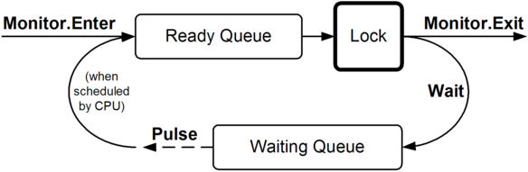

## 非阻塞同步

之前，我们描述了即使是很简单的[赋值或更新一个字段](https://blog.gkarch.com/threading/part2.html#when-to-lock)也需要同步。尽管[锁](https://blog.gkarch.com/threading/part2.html#locking)总能满足这个需求，一个存在竞争的锁意味着肯定有线程会被[阻塞](https://blog.gkarch.com/threading/part2.html#blocking)，就会导致由上下文切换和调度的延迟带来的开销，在高并发以及对性能要求很高的场景，这不符合需要。.NET Framework 的 非阻塞（nonblocking）同步构造能够在没有阻塞、暂停或等待的情况下完成简单的操作。

正确编写无阻塞或无锁的多线程代码是棘手的！特别是内存屏障容易用错（[`volatile` 关键字](https://blog.gkarch.com/threading/part4.html#the-volatile-keyword)更容易用错）。在放弃使用传统锁之前，请仔细思考是否真的需要非阻塞同步带来的性能优化。切记获得和释放一个无竞争的锁在一个 2010 时代的计算机上仅仅需要 20ns 而已。

无阻塞的方式也可以跨进程工作。一个例子就是它可以被用来读写进程间共享内存。

### 内存屏障和易失性

考虑下边这个例子：

```c#
class Foo
{
  int _answer;
  bool _complete;

  void A()
  {
    _answer = 123;
    _complete = true;
  }

  void B()
  {
    if (_complete) Console.WriteLine (_answer);
  }
}
```

如果方法`A`和`B`在不同的线程上并发运行，`B`可能会打印 “ 0 “ 吗？答案是会的，原因如下：

- 编译器、CLR 或 CPU 可能会重新排序（reorder）程序指令以提高效率。
- 编译器、CLR 或 CPU 可能会进行缓存优化，导致其它线程不能马上看到变量的赋值。

C# 和运行时会非常小心的保证这些优化不会破坏普通的单线程代码，和正确使用锁的多线程代码。除这些情况外，你必须通过显式的创建内存屏障（memory barrier，也称作内存栅栏 （memory fence））来对抗这些优化，限制指令重排和读写缓存产生的影响。

#### 全栅栏

最简单的内存屏障是完全内存屏障（full memory barrier，或全栅栏（full fence）），它可以阻止所有跨越栅栏的指令重排和缓存。调用`Thread.MemoryBarrier`生成一个全栅栏。我们可以使用 4 个全栅栏来修正之前的例子：

```c#
class Foo
{
  int _answer;
  bool _complete;

  void A()
  {
    _answer = 123;
    Thread.MemoryBarrier();    // 屏障 1
    _complete = true;
    Thread.MemoryBarrier();    // 屏障 2
  }

  void B()
  {
    Thread.MemoryBarrier();    // 屏障 3
    if (_complete)
    {
      Thread.MemoryBarrier();       // 屏障 4
      Console.WriteLine (_answer);
    }
  }
}
```

屏障 1 和 4 可以使这个例子不会打印 “ 0 “。屏障 2 和 3 提供了一个“最新（freshness）”保证：它们确保如果`B`在`A`后运行，读取`_complete`的值会是`true`。

在 2010 时代的桌面电脑上，一个全栅栏的开销大约是 10 纳秒。

下列方式都会隐式的使用全栅栏：

- C# 的[`lock`](https://blog.gkarch.com/threading/part2.html#locking)语句（`Monitor.Enter / Monitor.Exit`）
- [`Interlocked`](https://blog.gkarch.com/threading/part4.html#interlocked)类中的所有方法（马上会讲到）
- 使用线程池的异步回调，包括[异步委托](https://blog.gkarch.com/threading/part1.html#asynchronous-delegates)、APM 回调，以及[任务延续（task continuations）](https://blog.gkarch.com/threading/part5.html#continuations)
- 在[信号构造](https://blog.gkarch.com/threading/part2.html#signaling-with-event-wait-handles)上等待或对其设置（译者注：发信号、复位等等）
- 任何依赖于信号同步的情况，比如启动或等待[`Task`](https://blog.gkarch.com/threading/part5.html#task-parallelism)

因为最后一条的关系，下边的代码是线程安全的：

```c#
int x = 0;
Task t = Task.Factory.StartNew (() => x++);
t.Wait();
Console.WriteLine (x);    // 1
```

不需要对每一个读或写都使用全栅栏。如果有 3 个 *answer* 字段，我们的例子仍然只需要 4 个栅栏：

```c#
class Foo
{
  int _answer1, _answer2, _answer3;
  bool _complete;

  void A()
  {
    _answer1 = 1; _answer2 = 2; _answer3 = 3;
    Thread.MemoryBarrier();
    _complete = true;
    Thread.MemoryBarrier();
  }

  void B()
  {
    Thread.MemoryBarrier();
    if (_complete)
    {
      Thread.MemoryBarrier();
      Console.WriteLine (_answer1 + _answer2 + _answer3);
    }
  }
}
```

好的方式是：首先在每一个读写共享字段的指令前后都加上内存屏障，然后再剔除那些不需要的。如果你无法确认是否需要，那就保留它们。或者，更好的方式是：换回使用锁！

#### 真的需要锁和内存屏障吗？

如果在用共享可写字段（shared writable fields）时不加锁或栅栏是自找麻烦。关于这个话题有很多误导信息，包括 MSDN 文档中描述只有在弱内存排序的多处理器系统上`MemoryBarrier`才是必需的，例如，使用多个 Intel Itanium 处理器的系统。我们可以通过下边这个简短的程序证明：在普通的 Intel Core-2 和 Pentium 处理器上，内存屏障也是非常重要的。在开启优化以及非调试模式下运行下边的程序（在 Visual Studio 中，解决方案的配置管理里选择 Release 模式，然后非调试模式下启动 ）

```c#
static void Main()
{
  bool complete = false;
  var t = new Thread (() =>
  {
    bool toggle = false;
    while (!complete) toggle = !toggle;
  });
  t.Start();
  Thread.Sleep (1000);
  complete = true;
  t.Join();        // 无限阻塞
}
```

这个程序 *不会终止*，因为变量`complete`被缓存在 CPU 寄存器中。在`while`循环中加入一个`Thread.MemoryBarrier`的调用（或在读取`complete`的地方加[锁](https://blog.gkarch.com/threading/part2.html#locking)）可以修正这个错误。

#### volatile 关键字

另一个（更高级的）解决这个问题的方法是对`_complete`字段使用`volatile`关键字。

```c#
volatile bool _complete;
```

`volatile`关键字通知编译器在每个读这个字段的地方使用一个读栅栏（acquire-fence），并且在每个写这个字段的地方使用一个写栅栏（release-fence）。读栅栏防止其它读/写被移到栅栏之前，写栅栏防止其它读/写被移到栅栏之后。这种“半栅栏（half-fences）”比全栅栏更快，因为它给了运行时和硬件更大的优化空间。

巧的是，Intel 的 X86 和 X64 处理器总是在读时使用读栅栏，写时使用写栅栏，无论是否使用`volatile`关键字。所以在使用这些处理器的情况下，这个关键字对硬件来说是无效的。然而，`volatile`关键字对编译器和 CLR 进行的优化是有作用的，以及在 64 位 AMD 和 Itanium 处理器上也是有作用的。这意味着不能因为你的客户端运行在特定类型的 CPU 上而放松警惕。

（并且即使你使用了`volatile`，也仍然应当保持一种健康的担忧，我们稍后会看到原因！）

关于对字段使用`volatile`关键字的效果，总结如下：

| 第一条指令 | 第二条指令 | 是否会被交换                                                 |
| :--------- | :--------- | :----------------------------------------------------------- |
| 读         | 读         | 不会                                                         |
| 读         | 写         | 不会                                                         |
| 写         | 写         | 不会（CLR 确保写-写操作永远不会被交换，就算是没有`volatile`关键字） |
| 写         | 读         | **会！**                                                     |

注意：使用`volatile`不能阻止写-读被交换，这可能是一个难题。Joe Duffy 使用下面的例子很好的说明了这个问题：如果`Test1`和`Test2`同时运行在不同的线程上，可能`a`和`b`最后的值都是 0 （尽管在`x`和`y`上都使用了`volatile`）:

```c#
class IfYouThinkYouUnderstandVolatile
{
  volatile int x, y;

  void Test1()        // 运行在一个线程上
  {
    x = 1;            // Volatile 写 （写栅栏）
    int a = y;        // Volatile 读 （读栅栏）
    // ...
  }

  void Test2()        // 运行在另一线程上
  {
    y = 1;            // Volatile 写 （写栅栏）
    int b = x;        // Volatile 读 （读栅栏）
    // ...
  }
}
```

MSDN 文档描述：使用`volatile`关键字可以确保该字段在任何时间呈现的都是最新的值。这是错误的，就像我们刚才看到的，写-读操作可能被重新排序。（译者注：其实不能说 MSDN 的说法错误，使用`volatile`后`x`和`y`的值确实是最新的，只是因为指令重排，对它们的读可能在另一个线程上的写之前进行）

这给出了避免使用`volatile`关键字的理由：就算你能很好的理解这个例子，可是其它一起工作的开发者也理解么？在`Test1`和`Test2`的两次赋值之间使用全栅栏（或[锁](https://blog.gkarch.com/threading/part2.html#locking)）可以解决这个问题。

`volatile`关键字不支持引用类型的参数和捕获的局部变量：这些情况下你必须使用`VolatileRead`和`VolatileWrite`方法。

#### VolatileRead 和 VolatileWrite

使用`Thread`类上的静态方法`VolatileRead`和`VolatileWrite`读/写变量时，相当于`volatile`关键字产生的作用（技术上说，作用是其超集）。它们的实现相对低效，可是这是因为它们实际上使用了全栅栏。这是它们对于整型的实现：

```c#
public static void VolatileWrite (ref int address, int value)
{
  MemoryBarrier(); address = value;
}

public static int VolatileRead (ref int address)
{
  int num = address; MemoryBarrier(); return num;
}
```

可以看出来，如果调用`VolatileWrite`后紧接着调用`VolatileRead`，在它们中间是没有屏障的：这会产生和我们之前看到的同样的难题。

#### 内存屏障和锁

像前所述，`Monitor.Enter`和`Monitor.Exit`都使用了全栅栏。因此，如果我们忽略锁的互斥作用，可以这样说：

```c#
lock (someField) { ... }
```

相当于：

```c#
Thread.MemoryBarrier(); { ... } Thread.MemoryBarrier();
```

### Interlocked

无锁代码下，在读写字段时使用[内存屏障](https://blog.gkarch.com/threading/part4.html#memory-barriers-and-volatility)往往是不够的。在 64 位字段上进行加、减操作需要使用`Interlocked`工具类这样更加重型的方式。`Interlocked`也提供了`Exchange`和`CompareExchange`方法，后者能够进行无锁的读-改-写（read-modify-write）操作，只需要额外增加一点代码。

如果一条语句在底层处理器上被当作一个独立不可分割的指令，那么它本质上是原子的（atomic）。严格的原子性可以阻止任何抢占的可能。对于 32 位（或更低）的字段的简单读写总是原子的。而操作 64 位字段仅在 64 位运行时环境下是原子的，并且结合了多个读写操作的语句必然不是原子的：

```c#
class Atomicity
{
  static int _x, _y;
  static long _z;

  static void Test()
  {
    long myLocal;
    _x = 3;             // 原子的
    _z = 3;             // 32位环境下不是原子的（_z 是64位的）
    myLocal = _z;       // 32位环境下不是原子的（_z 是64位的）
    _y += _x;           // 不是原子的 (结合了读和写操作)
    _x++;               // 不是原子的 (结合了读和写操作)
  }
}
```

在 32 位环境下读写 64 位字段不是原子的，因为它需要两条独立的指令：每条用于对应的 32 位内存地址。所以，如果线程 X 在读一个 64 位的值，同时线程 Y 更新它，那么线程 X 最终可能得到新旧两个值按位组合后的结果（一个撕裂读（torn read））。

编译器实现`x++`这种一元运算，是通过先读一个变量，然后计算，最后写回去的方式。考虑如下类：

```c#
class ThreadUnsafe
{
  static int _x = 1000;
  static void Go() { for (int i = 0; i < 100; i++) _x--; }
}
```

抛开内存屏障的事情，你可能会认为如果 10 个线程并发运行`Go`，最终`_x`会为`0`。然而，这并不一定，因为可能存在竞态条件（race condition），在一个线程完成读取`x`的当前值，减少值，把值写回这个过程之间，被另一个线程抢占（导致一个过期的值被写回）。

当然，可以通过用[`lock`](https://blog.gkarch.com/threading/part2.html#locking)语句封装非原子的操作来解决这些问题。实际上，锁[如果一致的使用，可以模拟原子性](https://blog.gkarch.com/threading/part2.html#locking-and-atomicity)。然而，`Interlocked`类为这样简单的操作提供了一个更方便更快的方案：

```c#
class Program
{
  static long _sum;

  static void Main()
  {                                                             // _sum
    // 简单的自增/自减操作:
    Interlocked.Increment (ref _sum);                              // 1
    Interlocked.Decrement (ref _sum);                              // 0

    // 加/减一个值:
    Interlocked.Add (ref _sum, 3);                                 // 3

    // 读取64位字段:
    Console.WriteLine (Interlocked.Read (ref _sum));               // 3

    // 读取当前值并且写64位字段
    // (打印 "3"，并且将 _sum 更新为 10 )
    Console.WriteLine (Interlocked.Exchange (ref _sum, 10));       // 10

    // 仅当字段的当前值匹配特定的值（10）时才更新它：
    Console.WriteLine (Interlocked.CompareExchange (ref _sum,
                                                    123, 10);      // 123
  }
}
```

`Interlocked`上的所有方法都使用[全栅栏](https://blog.gkarch.com/threading/part4.html#full-fences)。因此，通过`Interlocked`访问字段不需要额外的栅栏，除非它们在程序其它地方没有通过`Interlocked`或`lock`来访问。

`Interlocked`的数学运算操作仅限于`Increment`、`Decrement`以及`Add`。如果你希望进行乘法或其它计算，在无锁方式下可以使用`CompareExchange`方法（通常与自旋等待一起使用）。我们会在[并行编程](https://blog.gkarch.com/threading/part5.html#spinlock-and-spinwait)中提供一个例子。

`Interlocked`类通过将原子性的需求传达给操作系统和虚拟机来进行实现其功能。

`Interlocked`类的方法通常产生 10ns 的开销，是无竞争锁的一半。此外，因为它们不会导致[阻塞](https://blog.gkarch.com/threading/part2.html#blocking)，所以不会带来上下文切换的开销。然而，如果在循环中多次迭代使用`Interlocked`，就可能比在循环外使用一个锁的效率低（不过`Interlocked`可以实现更高的并发度）。

## 使用 Wait 和 Pulse 进行信号同步

（译者注：`Pulse`翻译为脉冲，它和`Wait`都是作用在一个变量上：`Wait`等待一个变量上的脉冲，`Pulse`对一个变量发送脉冲。脉冲也是一种信号形式，相对于事件等待句柄那种锁存信号，脉冲顾名思义是一种非锁存或者说易失的信号）

之前我们讨论了[事件等待句柄](https://blog.gkarch.com/threading/part2.html#signaling-with-event-wait-handles)，这是一种简单的信号同步机制：一个线程阻塞直到收到另一个线程发来的通知。

还有个更强大的信号构造，由`Monitor`类通过两个静态方法`Wait`和`Pulse`（以及`PulseAll`）提供。原理是使用自定义的标识和字段（封装在[`lock`](https://blog.gkarch.com/threading/part2.html#locking)语句中）自行实现信号同步逻辑，然后引入`Wait`和`Pulse`控制防止[自旋](https://blog.gkarch.com/threading/part2.html#blocking-versus-spinning)。仅仅使用这些方法和[`lock`](https://blog.gkarch.com/threading/part2.html#locking)，你就可以实现[`AutoResetEvent`](https://blog.gkarch.com/threading/part2.html#autoresetevent)、[`ManualResetEvent`](https://blog.gkarch.com/threading/part2.html#manualresetevent)以及[`Semaphore`](https://blog.gkarch.com/threading/part2.html#semaphore)，还有`WaitHandle`的静态方法[`WaitAll`](https://blog.gkarch.com/threading/part2.html#waitany-waitall-signalandwait)和[`WaitAny`](https://blog.gkarch.com/threading/part2.html#waitany-waitall-signalandwait)的功能。此外，`Wait`和`Pulse`也可以用于所有等待句柄都不适用的情况。

但是，使用`Wait`和`Pulse`进行信号同步，对比事件等待句柄有以下缺点：

- `Wait / Pulse`不能跨越应用程序域和进程使用。
- 必须切记通过锁保护所有信号同步逻辑涉及的变量。
- 使用`Wait / Pulse`的程序可能会导致依赖微软文档的开发者困惑。

微软文档的问题的是就算你已经攻读了解了`Wait`和`Pulse`是如何工作的，也还是无法明白它们该如何使用。`Wait`和`Pulse`会让浅尝辄止的人感到特别恶心：它们会寻找你理解中的漏洞然后折磨你取乐！幸运的是，有一种简单的使用模式可以驯服`Wait`和`Pulse`。

性能方面，在 2010 时代的桌面电脑上，调用`Pulse`花费大概 100ns 左右， 约是在等待句柄上调用`Set`三分之一的时间。等待无竞争信号的开销完全取决于你，因为是你使用普通的字段和变量自行实现的逻辑。在实践中上，这非常简单，并且基本上相当于使用锁的代价。

### 如何使用 Wait 和 Pulse

下面是如何使用`Wait`和`Pulse`:

1.　定义一个字段，作为同步对象，例如：

```c#
readonly object _locker = new object();
```

2.　定义一个或多个字段，作为自定义的阻塞条件，例如：

```c#
bool _go; /* 或 */ int _semaphoreCount;
```

3.　当你希望阻塞的时候，使用下边的代码：

```c#
lock (_locker)
  while (/* <blocking-condition> */)
    Monitor.Wait (_locker);
```

4.　当改变（或隐式改变）一个阻塞条件的时候，使用下边的代码：

```c#
lock (_locker)
{
  // 修改会影响阻塞条件的字段或数据
  // ...
  Monitor.Pulse(_locker);  // 或: Monitor.PulseAll (_locker);
}
```

（如果想改变阻塞条件并等待，可以在一个`lock`内合并第 3 步和第 4 步）

这个模式允许任意线程在任意时间使用任意条件等待。下边这个简单的例子，一个线程等待直到`_go`字段被设置为`true`：

```c#
class SimpleWaitPulse
{
  static readonly object _locker = new object();
  static bool _go;

  static void Main()
  {                                // 新线程会阻塞
    new Thread (Work).Start();     // 因为 _go==false

    Console.ReadLine();            // 等待用户敲回车

    lock (_locker)                 // 现在唤醒线程
    {                              // 通过设置 _go=true 然后 Pulse
      _go = true;
      Monitor.Pulse (_locker);
    }
  }

  static void Work()
  {
    lock (_locker)
      while (!_go)
        Monitor.Wait (_locker);    // 当等待时锁会被释放

    Console.WriteLine ("Woken!!!");
  }
}
```

输出结果：

```
Woken!!!   (按下回车键之后)
```

为了[线程安全](https://blog.gkarch.com/threading/part2.html#thread-safety)，我们确保所有共享字段的访问都在锁内。因此，在读取和更新`_go`标识的地方都加上了`lock`语句。这很必要（除非你希望使用[非阻塞同步](https://blog.gkarch.com/threading/part4.html#nonblocking-synchronization)的方式）。

`Work`方法会一直阻塞，等待`_go`标识变为`true`。`Monitor.Wait`方法按顺序做了如下的操作：

1. 释放`_locker`上的锁。
2. 阻塞，直到收到`_locker`上的脉冲。
3. 重新获取`_locker`上的锁。如果锁已被占用，那么线程阻塞，直到锁变为可用为止。

这意味着当`Monitor.Wait`在等待脉冲时，同步对象上的锁没有被持有。这并不是像代码看上去那样。

```c#
lock (_locker)
{
  while (!_go)
    Monitor.Wait (_locker);  // 锁被释放
  // 锁重新获得
  // ...
}
```

然后继续执行下一条语句。`Monitor.Wait`被设计为在`lock`语句内使用，否则调用它会抛出一个异常。`Monitor.Pulse`也是一样。

在`Main`方法中，我们通过设置`_go`标识（在锁内）和调用`Pulse`来给工作线程发信号。我们一释放锁，工作线程就可以继续执行，继续它的`while`循环。

`Pulse`和`PulseAll`方法可以释放通过调用`Wait`阻塞的线程。`Pulse`最多释放一个线程，而`PulseAll`释放全部。在我们的例子中，只有一个线程被阻塞，所以它们在这个例子中效果是一样的。如果有多个线程在等待，以我们建议的这个模式来说，调用`PulseAll`通常最安全。

为了`Wait`能够和`Pulse`或`PulseAll`进行通信，必须使用同一个同步对象（我们的例子中的`_locker`）。

在我们的模式中，脉冲表示有些东西可能已经改变，等待线程应该重新检查它们的阻塞条件。在`Work`方法内，检查是通过`while`循环实现的。由等待方来决定是否要继续运行，而不是通知方。如果把脉冲直接当作通知继续的指令，那么`Wait`的构造就没有任何价值了，这样使用就相当于一个残疾版的[`AutoResetEvent`](https://blog.gkarch.com/threading/part2.html#autoresetevent)。

如果我们抛弃该模式，移除`while`循环、`_go`标识以及`ReadLine`，就获得了一个最基础的`Wait / Pulse`的例子：

```c#
static void Main()
{
  new Thread (Work).Start();
  lock (_locker) Monitor.Pulse (_locker);
}

static void Work()
{
  lock (_locker) Monitor.Wait (_locker);
  Console.WriteLine ("Woken!!!");
}
```

这可能不会有输出，因为它有不确定性！在主线程和工作线程之间存在竞争，如果`Wait`先执行，信号可以正常工作。如果`Pulse`先执行，它就会丢失，工作线程就永远卡在那里等待。这与[`AutoResetEvent`](https://blog.gkarch.com/threading/part2.html#autoresetevent)的行为不同，它的`Set`方法有一种记忆效果，或者说锁存（latching）效果，所以即使它在`WaitOne`之前调用，仍然有效。

但是`Pulse`没有锁存效果，它需要你自行实现，就像我们之前使用的 “ go “ 标识。这就是为什么`Wait`和`Pulse`是万能的原因：使用一个布尔标识，我们可以实现类似[`AutoResetEvent`](https://blog.gkarch.com/threading/part2.html#autoresetevent)的功能；使用一个整型字段，可以[实现 `CountdownEvent`](https://blog.gkarch.com/threading/part4.html#writing-a-countdownevent)或[`Semaphore`](https://blog.gkarch.com/threading/part2.html#semaphore)。通过更复杂的数据结构，可以进一步实现类似生产者 / 消费者队列这样的构造。

### 生产者 / 消费者队列

之前，我们描述了[生产者 / 消费者队列的概念](https://blog.gkarch.com/threading/part2.html#producer-consumer-queue)，以及如何通过[`AutoResetEvent`](https://blog.gkarch.com/threading/part2.html#autoresetevent)来实现它。现在，我们通过`Wait`和`Pulse`来实现一个更强大的版本。

这次，我们将允许多个消费者，各自拥有它们自己的线程。使用一个数组来存放这些线程：

```
Thread[] _workers;
```

这样可以让我们在关闭该队列的时候`Join`这些线程。

每个工作线程会执行一个名为`Consume`的方法。我们可以在一个循环中创建和启动线程，例如：

```c#
public PCQueue (int workerCount)
{
  _workers = new Thread [workerCount];

  // 为每个worker创建和启动一个独立的线程
  for (int i = 0; i < workerCount; i++)
    (_workers [i] = new Thread (Consume)).Start();
}
```

之前我们只是使用一个字符串来代表任务，这次使用一种更灵活的方式，即一个委托。我们使用 .NET Framework 中的`System.Action`委托，它定义如下：

```c#
public delegate void Action();
```

这个委托可以匹配任意无参方法，很像`ThreadStart`委托。当然我们也可以描述需要参数的任务，通过把调用封装在匿名委托或 lambda 表达式中。

```c#
Action myFirstTask = delegate
{
    Console.WriteLine ("foo");
};

Action mySecondTask = () => Console.WriteLine ("foo");
```

如之前一样，使用`Queue<T>`来表示任务的队列：

```c#
Queue<Action> _itemQ = new Queue<Action>();
```

在讨论`EnqueueItem`和`Consume`方法之前，先来看一下完整的代码：

```c#
using System;
using System.Threading;
using System.Collections.Generic;

public class PCQueue
{
  readonly object _locker = new object();
  Thread[] _workers;
  Queue<Action> _itemQ = new Queue<Action>();

  public PCQueue (int workerCount)
  {
    _workers = new Thread [workerCount];

    // 为每个worker创建和启动一个独立的线程
    for (int i = 0; i < workerCount; i++)
      (_workers [i] = new Thread (Consume)).Start();
  }

  public void Shutdown (bool waitForWorkers)
  {
    // 为每个线程加入一个 null 任务，使它们退出
    foreach (Thread worker in _workers)
      EnqueueItem (null);

    // 等待工作线程完成
    if (waitForWorkers)
      foreach (Thread worker in _workers)
        worker.Join();
  }

  public void EnqueueItem (Action item)
  {
    lock (_locker)
    {
      _itemQ.Enqueue (item);           // 因为改变了阻塞条件
      Monitor.Pulse (_locker);         // 所以发送脉冲通知
    }
  }

  void Consume()
  {
    while (true)                        // 继续消费直到
    {                                   // 收到通知
      Action item;
      lock (_locker)
      {
        while (_itemQ.Count == 0) Monitor.Wait (_locker);
        item = _itemQ.Dequeue();
      }
      if (item == null) return;         // 通知我们退出
      item();                           // 执行任务
    }
  }
}
```

我们的退出策略是：向队列中加入一个 null 项目来通知消费者在完成任何未完成的项目后退出。（如果我们希望更快退出，可以使用一个独立的 “ cancel “ 标识）。因为支持多个消费者，所以我们必须为每个消费者在队列中加入一个 null 项目来让队列完全关闭。

这里的`Main`方法，用来启动一个生产者 / 消费者队列。它指定了两个并发的消费者线程，然后向队列中加入 10 个委托，它们将在两个消费者之间共享。

```c#
static void Main()
{
  PCQueue q = new PCQueue (2);

  Console.WriteLine ("Enqueuing 10 items...");

  for (int i = 0; i < 10; i++)
  {
    int itemNumber = i;      // 为了避免被捕获的变量陷阱
    q.EnqueueItem (() =>
    {
      Thread.Sleep (1000);          // 模拟耗时任务
      Console.Write (" Task" + itemNumber);
    });
  }

  q.Shutdown (true);
  Console.WriteLine();
  Console.WriteLine ("Workers complete!");
}
```

输出结果：

```
Enqueuing 10 items...
 Task1 Task0 (pause...) Task2 Task3 (pause...) Task4 Task5 (pause...)
 Task6 Task7 (pause...) Task8 Task9 (pause...)
Workers complete!
```

现在我们来看一下`EnqueueItem`方法：

```c#
public void EnqueueItem (Action item)
 {
   lock (_locker)
   {
     _itemQ.Enqueue (item);           // 因为改变了阻塞条件
     Monitor.Pulse (_locker);         // 所以发送脉冲通知
   }
 }
```

因为这个队列是在多线程环境下使用，所以必须对所有的读写操作加锁。并且因为改变了阻塞条件（由于向队列中加入了一个任务，一个消费者可以开始动作），所以需要调用`Pulse`来送脉冲信号。

出于对效率的考虑，当加入一个项目时，我们调用`Pulse`而不是`PulseAll`。这是因为每个项目只需要唤醒（至多）一个消费者。如果你只有一个冰激凌，你不会把一个班 30 个正在睡觉的孩子都叫起来排队获取它。同样地，有 30 个消费者，把它们全部唤醒没有任何好处，那样仅仅是在它们重新回去睡觉前进行了一共 29 次毫无用处的`while`迭代。总之，在这里使用`Pulse`而不是`PulseAll`不会破坏任何功能。

现在，来看一下`Comsume`方法，一个工作线程从队列中取出并执行一个项目。我们希望工作线程没什么事情做的时候，或者说当队列中没有任何项目时，它们应该被阻塞。因此，我们的阻塞条件是`_itemQ.Count == 0`：

```c#
      Action item;
      lock (_locker)
      {
        while (_itemQ.Count == 0) Monitor.Wait (_locker);
        item = _itemQ.Dequeue();
      }
      if (item == null) return;         // 通知我们退出
      item();
```

当`_itemQ.Count`非 0 时，`while`循环退出，意味着（至少）有一个项目尚未完成。我们必须在释放锁之前取出这个项目，否则，当我们取它时，它可能已经不在队列里了（存在其它线程的情况下，事情可能在你眨眼的瞬间发生变化！）。特别的，如果我们没有持有锁，其它那些刚完成一个之前工作的消费者可以偷偷进来取走我们的项目，例如如果使用下边的代码：

```c#
      Action item;
      lock (_locker)
      {
        while (_itemQ.Count == 0) Monitor.Wait (_locker);
      }
      lock (_locker)    // 错！
      {
        item = _itemQ.Dequeue();    // 项目也许已经不在了！
      }
      ...
```

在项目被取出后，我们立即释放锁。如果我们在执行任务期间一直持有锁，就可能会造成其它消费者和生产者没有意义的阻塞。我们没有在取出项目之后发送脉冲，是因为此时如果队列中还有项目的话，其它线程都不可能解除阻塞。（译者注：此时如果队列已经为空，那么没有必要再唤醒其它线程；而如果队列不为空，意味着其它线程要么在执行任务，要么正在等待锁被释放，都没有必要再通知其它线程。）

当我们使用`Wait`和`Pulse`时（还有在一般情况下），锁定短暂些比较好，它避免了其它线程不必要的阻塞。可以锁定很多行代码，只要保证它们都执行的很快。记住，使用`Monitor.Wait`来等待脉冲时，它帮你释放了锁！

### 等待超时

调用`Wait`方法时，你可以设定一个超时时间，可以是毫秒或`TimeSpan`的形式。如果因为超时而放弃了等待，那么`Wait`方法就会返回`false`。超时时间仅适用于等待阶段（waiting phase），带有超时的`Wait`方法按下列步骤进行：

1. 释放锁
2. 阻塞，直到收到脉冲或超时
3. 重新获取锁

设置超时时间就像是让 CLR 在超时时间到达时给你一个“虚拟的脉冲（virtual pulse）”。超时的`Wait`仍会执行第 3 步，重新获取锁，就像收到脉冲后一样。

如果`Wait`在进行第 3 步（重新获取锁）的时候被阻塞，超时时间会被忽略。然而这是个很少见的情况，因为在有良好设计的`Wait / Pulse`应用中，其它线程仅会锁定很短的时间，所以重新获取锁应该是一个几乎立即完成的操作。

`Wait`的超时时间有一个有用的地方。有时，当阻塞条件改变时，可能无法使用`Pulse`。一个例子是阻塞条件涉及调用一个方法，它通过定期查询数据库来获取信息。如果延迟不是问题，解决方案就很简单：可以在调用`Wait`时设置一个超时时间。

```c#
lock (_locker)
  while (/* <blocking-condition> */)
    Monitor.Wait (_locker, /* <timeout> */);
```

这样可以强迫以指定的超时时间为间隔重新检查阻塞条件，和收到脉冲一样。阻塞条件越简单，超时时间可以越短，避免影响效率。这种情况下，我们可以不关心`Wait`是接收到了脉冲还是超时了，因此我们可以忽略它的返回值。

如果由于程序 bug 造成脉冲丢失，超时时间同样可以很好的工作。在同步很复杂的程序中可以给所有`Wait`指定超时时间，作为可能的脉冲丢失错误的备份。如果程序之后被其他人修改，但没能正确使用`Pulse`，这样也可以在一定程度上免疫 bug！

`Monitor.Wait`返回一个布尔值表示是否获得了一个“真实的”脉冲。如果返回`false`，代表超时了。如果超时并不是期待的行为，可以记录日志或抛出异常。

#### 等待队列

当多个线程使用`Wait`等待同一对象时，就会形成了一个“等待队列（waiting queue）”（和用于等待获得锁的“就绪队列（ready queue）”不同）。每次调用`Pulse`时，会释放排在等待队列最前面的那个线程，它会进入就绪队列，然后重新获取锁。可以把它想象成一个自动停车场，你首先在收费处前排队（等待队列）验票，然后再在闸门前排队（就绪队列）出去。



这个队列结构天生保证顺序，但是对于`Wait / Pulse`的应用来说通常不重要，在这种场景下，把它想象成一个等待线程的“池（pool）”更好理解，每次调用`Pulse`都会从池中释放一个等待线程。

`PulseAll`释放整个等待队列或者说等待池。接收到脉冲的线程不会在此时同时开始执行，而是顺序的执行，因为每个`Wait`语句都要试图重新获取同一个锁。效果就是，`PulseAll`将线程从等待队列移到就绪队列中，让它们可以按顺序继续执行。

### 双向信号和竞争

`Monitor.Pulse`的一个重要特性是异步执行，这意味着它不会阻塞或暂停当前线程。如果另一个线程在等待时收到脉冲，它会解除阻塞，否则，脉冲就没有任何效果或者说被忽略掉了。

`Pulse`提供了一种单向通信机制：发送脉冲的线程向等待的线程发送信号。它没有内在的确认机制：`Pulse`不会返回一个值来表示信号是否被收到。此外，当发送了信号并释放锁后，并不能保证一个符合要求的等待线程能立即开始工作。因为线程调度器的调度可能存在小小的延迟，在这期间并没有任何线程拥有锁。这意味着脉冲的发送方很难知道等待的线程是否或何时能继续运行，除非你的代码做了特别的处理（例如使用`Wait`和`Pulse`在另一个标识上做信号同步来通知）。

使用`Pulse`和`Wait`时，如果没有自定义的确认机制，却想依赖等待线程能够及时响应的话，可以认为是胡来。你会搞砸的！

为举例说明，假设我们希望连续向一个线程发 5 次信号：

```c#
class Race
{
  static readonly object _locker = new object();
  static bool _go;

  static void Main()
  {
    new Thread (SaySomething).Start();

    for (int i = 0; i < 5; i++)
      lock (_locker)
      {
        _go = true;
        Monitor.PulseAll (_locker);
      }
  }

  static void SaySomething()
  {
    for (int i = 0; i < 5; i++)
      lock (_locker)
      {
        while (!_go) Monitor.Wait (_locker);
        _go = false;
        Console.WriteLine ("Wassup?");
      }
  }
}
```

期待的结果：

```
Wassup?
Wassup?
Wassup?
Wassup?
Wassup?
```

实际的结果：

```
Wassup? (没啦)
```

这个程序是有缺陷的，它展示了一个竞争状态（race condition ，竞态条件）：主线程中的`for`循环可能在工作线程没有持有锁的时间内，就立即空转完成了 5 次迭代，甚至可能是在工作线程启动之前！[生产者 / 消费者队列的例子](https://blog.gkarch.com/threading/part4.html#producer-consumer-queue)中不会面临这个问题，因为如果主线程跑在了工作线程前面，请求都会加入队列。但在这里的例子中，如果工作线程仍然在处理之前的任务，就需要主线程在每次迭代时阻塞。

可以通过为这个类增加一个由工作线程控制的`_ready`标识来解决这个问题。主线程在设置`_go`标识之前等待工作线程就绪。

这类似于[一个之前的例子](https://blog.gkarch.com/threading/part2.html#two-way-signaling)，那是使用`AutoResetEvent`来实现相同的事情，只不过这个的扩展性更好。

代码如下：

```c#
class Solved
{
  static readonly object _locker = new object();
  static bool _ready, _go;

  static void Main()
  {
    new Thread (SaySomething).Start();

    for (int i = 0; i < 5; i++)
      lock (_locker)
      {
        while (!_ready) Monitor.Wait (_locker);
        _ready = false;
        _go = true;
        Monitor.PulseAll (_locker);
      }
  }

  static void SaySomething()
  {
    for (int i = 0; i < 5; i++)
      lock (_locker)
      {
        _ready = true;
        Monitor.PulseAll (_locker);           // 记得调用
        while (!_go) Monitor.Wait (_locker);  // Monitor.Wait 会释放
        go = false;                           // 并重新获取锁
        Console.WriteLine ("Wassup?");
      }
  }
}
```

结果：

```
Wassup? (重复 5 次)
```

在`Main`方法中，我们清除`_ready`标识，设置`_go`标识，然后发送脉冲，这些都在同一个`lock`语句中。好处是：如果我们之后引入第三个线程，这样做就提高了健壮性。想象一下另一个线程试图同时给工作线程发信号。在这种情况下，我们的逻辑也滴水不漏，在效果上，我们清除`_ready`和设置`_go`的操作是原子的。

### 模拟等待句柄

你可能注意到了之前例子中的一个模式：两个等待循环都有如下的结构：

```c#
lock (_locker)
{
  while (!_flag) Monitor.Wait (_locker);
  _flag = false;
  // ...
}
```

`_flag`会在另一线程中被设置为`true`。这段代码在效果上看，它模仿了一个`AutoResetEvent`。如果去掉`_flag=false`，就得到了[`ManualResetEvent`](https://blog.gkarch.com/threading/part2.html#manualresetevent)的基础功能。

让我们补完使用`Wait`和`Pulse`来实现[`ManualResetEvent`](https://blog.gkarch.com/threading/part2.html#manualresetevent)的完整代码：

```c#
readonly object _locker = new object();
bool _signal;

void WaitOne()
{
  lock (_locker)
  {
    while (!_signal) Monitor.Wait (_locker);
  }
}

void Set()
{
  lock (_locker) { _signal = true; Monitor.PulseAll (_locker); }
}

void Reset() { lock (_locker) _signal = false; }
```

使用`PulseAll`，是因为可能存在多个被阻塞的等待线程。

实现[`AutoResetEvent`](https://blog.gkarch.com/threading/part2.html#autoresetevent)非常简单，只需要将`WaitOne`方法内改为：

```c#
lock (_locker)
{
  while (!_signal) Monitor.Wait (_locker);
  _signal = false;
}
```

然后将`Set`方法内的`PulseAll`替换成`Pulse`：

```c#
 lock (_locker) { _signal = true; Monitor.Pulse (_locker); }
```

使用`PulseAll`会放弃等待队列的公平性，因为每次调用`PulseAll`都会导致队列被破坏并重建。

把`_signal`替换为一个整型字段可以得到[`Semaphore`](https://blog.gkarch.com/threading/part2.html#semaphore)的基础功能。

在简单的场景中，模拟跨多个等待句柄工作的静态方法也很容易。调用[`WaitAll`](https://blog.gkarch.com/threading/part2.html#waitany-waitall-signalandwait)只不过相当于使用一阻塞条件，它结合了所有等待句柄使用的标识：

```c#
lock (_locker)
  while (!_flag1 && !_flag2 && !_flag3...)
    Monitor.Wait (_locker);
```

这特别适用于`WaitAll`因为旧有的 COM 问题不可用的场景。模拟[`WaitAny`](https://blog.gkarch.com/threading/part2.html#waitany-waitall-signalandwait)也很容易，只要把 `&&`操作符替换成`||`就可以了。

如果有很多标识，这个方式就会变得低效。这是因为，为了保证信号同步的原子性，它们必须全部共享一个同步对象。在这个方面，等待句柄更有优势。

### 实现 CountdownEvent

使用`Wait`和`Pulse`，我们也可以实现[`CountdownEvent`](https://blog.gkarch.com/threading/part2.html#countdownevent)的基本功能：

```c#
public class Countdown
{
  object _locker = new object ();
  int _value;

  public Countdown() { }
  public Countdown (int initialCount) { _value = initialCount; }

  public void Signal() { AddCount (-1); }

  public void AddCount (int amount)
  {
    lock (_locker)
    {
      _value += amount;
      if (_value <= 0) Monitor.PulseAll (_locker);
    }
  }

  public void Wait()
  {
    lock (_locker)
      while (_value > 0)
        Monitor.Wait (_locker);
  }
}
```

这个模式和之前见到的很像，不同之处就是阻塞条件基于一个整型字段。

### 线程会合

可以使用刚刚写的`Countdown`类，来实现两个线程的会合。和之前的[` WaitHandle.SignalAndWait`](https://blog.gkarch.com/threading/part2.html#waitany-waitall-signalandwait)可以用于会合一对线程一样：

```c#
class Rendezvous
{
  static object _locker = new object();

  // 在 Framework 4.0 中, 我们可以改为使用内置的 CountdownEvent 类。
  static Countdown _countdown = new Countdown(2);

  public static void Main()
  {
    // 每个线程都睡眠一段随机时间
    Random r = new Random();
    new Thread (Mate).Start (r.Next (10000));
    Thread.Sleep (r.Next (10000));

    _countdown.Signal();
    _countdown.Wait();

    Console.Write ("Mate! ");
  }

  static void Mate (object delay)
  {
    Thread.Sleep ((int) delay);

    _countdown.Signal();
    _countdown.Wait();

    Console.Write ("Mate! ");
  }
}
```

在这个例子中，每个线程睡眠一段随机时间，然后等待其它线程，结果是在（几乎）相同的时间它们都打印了 “ Meta “。这被称为线程执行屏障（thread execution barrier），并且可以扩展到任意多个线程（通过调整计数器的初始值）。

当你想让多个线程执行一个系列任务，希望它们步调一致时，可以用到线程执行屏障。然而，我们现在的解决方案有一定限制：我们不能重用同一个`Countdown`对象来第二次会合线程，至少在没有额外信号构造的情况下不能。为解决这个问题，Framework 4.0 提供了一个新的类[`Barrier`](https://blog.gkarch.com/threading/part4.html#the-barrier-class)。

## Barrier 类

`Barrier`类是 Framework 4.0 加入的一个信号构造。它实现了线程执行屏障（thread execution barrier），允许多个线程在一个时间点会合。这个类非常快速和高效，它是建立在[`Wait / Pulse`](https://blog.gkarch.com/threading/part4.html#signaling-with-wait-and-pulse)和自旋锁基础上的。

使用这个类的步骤是：

1. 实例化它，指定有多少个线程参与会合（你可以在之后调用`AddParticipants / RemoveParticipants`来进行更改）。
2. 当希望会合时，在每个线程上都调用`SignalAndWait`。

实例化`Barrier`，参数为 3 ，意思是调用`SignalAndWait`会被[阻塞](https://blog.gkarch.com/threading/part2.html#blocking)直到该方法被调用 3 次。但与`CountdownEvent`不同，它会自动复位：再调用`SignalAndWait`仍会阻塞直到被调用 3 次。这允许你保持多个线程“步调一致”，让它们执行一个系列任务。


下边的例子中，三个线程每个都与其它线程步调一致地打印数字 0 到 4：

```c#
static Barrier _barrier = new Barrier (3);

static void Main()
{
  new Thread (Speak).Start();
  new Thread (Speak).Start();
  new Thread (Speak).Start();
}

static void Speak()
{
  for (int i = 0; i < 5; i++)
  {
    Console.Write (i + " ");
    _barrier.SignalAndWait();
  }
}
```

结果：

```
0 0 0 1 1 1 2 2 2 3 3 3 4 4 4
```

`Barrier`类的一个非常有用的功能是，构造它时你可以指定一个后期动作（post-phase action）。这是一个委托，在`SignalAndWait`被调用 *n* 次后，且在线程解除阻塞之前运行。在我们的例子中，如果像这样实例化`Barrier`：

```c#
static Barrier _barrier = new Barrier (3, barrier => Console.WriteLine());
```

结果会是：

```
0 0 0
1 1 1
2 2 2
3 3 3
4 4 4
```

后期动作可以用来合并来自每个工作线程的数据。不用担心抢占，因为当它被执行时，所有的工作线程都是被阻塞的。

## 读 / 写锁

通常，一个类型的实例对于并发读操作是线程安全的，但对并发的更新操作却不是（并发读然后更新也不是）。这对于像文件这种资源也是同样。尽管可以简单的对所有访问都使用[排它锁](https://blog.gkarch.com/threading/part2.html#locking)来确保这种类型的实例是线程安全的，但对于有很多读操作而只有少量更新操作的情况，它就会过度限制并发能力。举个栗子，在一个商业应用服务中，为了实现快速检索，数据通常会缓存在静态字段中。在这种情况下，`ReaderWriterLockSlim`类被设计用来提供高可用性的锁。

`ReaderWriterLockSlim`是 Framework 3.5 加入的，替代以前`ReaderWriterLock`这个“胖（fat）”版本。后者拥有类似的功能，但运行速度慢几倍，并且处理锁升级的机制也存在设计缺陷。

然而如果与普通的[`lock`](https://blog.gkarch.com/threading/part2.html#locking)（`Monitor.Enter / Exit`）对比，`ReaderWriterLockSlim`要比它慢一倍。

这两个类都有两种基本类型的锁，读锁和写锁：

- 写锁完全的排它。
- 读锁可以与其它的读锁相容。

所以，一个线程持有写锁会[阻塞](https://blog.gkarch.com/threading/part2.html#blocking)其它想要获取读锁或写锁的线程（反之亦然）。而如果没有线程持有写锁，任意数量的线程可以同时获取读锁。

`ReaderWriterLockSlim`定义了如下的方法来获取和释放读 / 写锁：

```c#
public void EnterReadLock();
public void ExitReadLock();
public void EnterWriteLock();
public void ExitWriteLock();
```

另外，对应所有`EnterXXX`的方法，都有相应的 “ Try “ 版本，可以接受一个超时参数，方式与`Monitor.TryEnter`类似（如果资源上存在大量竞争，超时会很容易产生）。`ReaderWriterLock`提供了类似的方法，名为`AcquireXXX`以及`ReleaseXXX`。如果出现超时的情况，它们会抛出`ApplicationException`异常，而不是返回`false`。

下边的程序演示了`ReaderWriterLockSlim`的用法。三个线程不停枚举一个列表，同时另外两个线程每秒向列表中加入一个随机数。读锁保护对列表的读，写锁保护对列表的写。

```c#
class SlimDemo
{
  static ReaderWriterLockSlim _rw = new ReaderWriterLockSlim();
  static List<int> _items = new List<int>();
  static Random _rand = new Random();

  static void Main()
  {
    new Thread (Read).Start();
    new Thread (Read).Start();
    new Thread (Read).Start();

    new Thread (Write).Start ("A");
    new Thread (Write).Start ("B");
  }

  static void Read()
  {
    while (true)
    {
      _rw.EnterReadLock();
      foreach (int i in _items) Thread.Sleep (10);
      _rw.ExitReadLock();
    }
  }

  static void Write (object threadID)
  {
    while (true)
    {
      int newNumber = GetRandNum (100);
      _rw.EnterWriteLock();
      _items.Add (newNumber);
      _rw.ExitWriteLock();
      Console.WriteLine ("Thread " + threadID + " added " + newNumber);
      Thread.Sleep (100);
    }
  }

  static int GetRandNum (int max) { lock (_rand) return _rand.Next(max); }
}
```

在用于生产环境的代码中，通常需要添加`try / finally`块来确保抛出异常时锁能够被释放。

结果：

```
Thread B added 61
Thread A added 83
Thread B added 55
Thread A added 33
...
```

相比简单的`lock`，`ReaderWriterLockSlim`允许更多的并发读操作。为说明这一点，可以在`Write`方法中`while`循环开始的位置插入如下代码：

```
Console.WriteLine (_rw.CurrentReadCount + " concurrent readers");
```

几乎总会打印 “ 3 concurrent readers “（`Read`方法花费绝大多数时间在`foreach`循环中）。像`CurrentReadCount`一样，`ReaderWriterLockSlim`提供了如下属性用来监视锁：

```c#
public bool IsReadLockHeld            { get; }
public bool IsUpgradeableReadLockHeld { get; }
public bool IsWriteLockHeld           { get; }

public int  WaitingReadCount          { get; }
public int  WaitingUpgradeCount       { get; }
public int  WaitingWriteCount         { get; }

public int  RecursiveReadCount        { get; }
public int  RecursiveUpgradeCount     { get; }
public int  RecursiveWriteCount       { get; }
```

### 可升级锁和递归

有时，需要在一个原子操作中将一个读锁升级为写锁。例如，假设你向列表中添加一个条目，希望当它不在列表中时才进行添加。理想状态下，你希望持有写（排它）锁的时间应尽可能短，所以可能进行下列步骤：

1. 获取一个读锁。
2. 检查条目是否已经在列表中存在，如果存在则释放锁并返回。
3. 释放读锁。
4. 获取一个写锁。
5. 添加条目。

问题是在第 3 步和第 4 步中间，另一个线程可以偷偷进入并修改了列表（例如，添加了一个相同的条目）。`ReaderWriterLockSlim`提供了第三种锁来解决这个问题，叫做可升级锁（upgradeable lock）。可升级锁很像读锁，除了它可以在一个原子操作中被升级为写锁。下面是用法：

1. 调用`EnterUpgradeableReadLock`.
2. 进行读操作（例如检查条目在列表中是否已经存在）。
3. 调用`EnterWriteLock`（将可升级锁转换为写锁）。
4. 进行写操作（例如向列表中添加条目）。
5. 调用`ExitWriteLock`（将写锁转换回可升级锁）。
6. 执行其它的读操作。
7. 调用`ExitUpgradeableReadLock`。

从调用方角度看，它很像一个嵌套或递归的锁。从功能上讲，在第 3 步，`ReaderWriterLockSlim`释放读锁，然后获取写锁的操作是原子的。

可升级锁和读锁的另一个重要的区别是：可升级锁可以与任意数量的读锁共存，但同时只能有一个可升级锁被获取。这是通过“串行化”锁的转换来防止转换时发生[死锁](https://blog.gkarch.com/threading/part2.html#deadlocks)，就像 SQL Server 中的更新锁一样。（译者注：可升级锁转换为写锁的时候，由于写锁排它，需要保证不存在其它的锁，或者说需要等待其它锁释放。如果可以同时存在两个可升级锁，其中一个想要转换为写锁，就必须等待另一个释放，而如果这时另一个可升级锁也想要转换为写锁，就造成了互相等待，死锁就产生了）

| SQL Server               | ReaderWriterLockSlim         |
| :----------------------- | :--------------------------- |
| 共享锁（Share lock）     | 读锁（Read lock）            |
| 排它锁（Exclusive lock） | 写锁（Write lock）           |
| 更新锁（Update lock）    | 可升级锁（Upgradeable lock） |

我们下面演示更新锁的用法，修改之前例子中的`Write`方法，仅当数字不在列表中的时候才添加它：

```c#
while (true)
{
  int newNumber = GetRandNum (100);
  _rw.EnterUpgradeableReadLock();
  if (!_items.Contains (newNumber))
  {
    _rw.EnterWriteLock();
    _items.Add (newNumber);
    _rw.ExitWriteLock();
    Console.WriteLine ("Thread " + threadID + " added " + newNumber);
  }
  _rw.ExitUpgradeableReadLock();
  Thread.Sleep (100);
}
```

`ReaderWriterLock`也可以进行锁的转换，但它不可靠，因为它不支持可升级锁这个概念。这就是为什么`ReaderWriterLockSlim`的设计者不得不使用一个新类来重新实现。

#### 锁的递归

通常，`ReaderWriterLockSlim`禁止嵌套或递归锁定。因此，如下的代码会抛出异常：

```
var rw = new ReaderWriterLockSlim();
rw.EnterReadLock();
rw.EnterReadLock();
rw.ExitReadLock();
rw.ExitReadLock();
```

然而，如果你使用下边的代码来构造`ReaderWriterLockSlim`，就可以正常运行：

```c#
var rw = new ReaderWriterLockSlim (LockRecursionPolicy.SupportsRecursion);
```

这确保了只有在你计划使用时，递归锁定才可以使用。递归锁定会产生额外的复杂度，因为可能会同时获取不只一种类型的锁：

```c#
rw.EnterWriteLock();
rw.EnterReadLock();
Console.WriteLine (rw.IsReadLockHeld);     // True
Console.WriteLine (rw.IsWriteLockHeld);    // True
rw.ExitReadLock();
rw.ExitWriteLock();
```

基本原则是，一旦你已经获取了一个锁，之后的递归锁定的级别可以更小但不能更大，级别顺序如下：`读锁，可升级锁，写锁`。

然而，把可升级锁提升为写锁总是合法的。

## 挂起和恢复

通过已过时的方法`Thread.Suspend`和`Thread.Resume`，线程可以显式的挂起和恢复。这个机制与[阻塞](https://blog.gkarch.com/threading/part2.html#blocking)是完全独立的。这两套机制可以独立且并行的作用。

一个线程可以挂起它自己或另一个线程，调用`Suspend`使线程暂时进入[`SuspendRequested`](https://blog.gkarch.com/threading/part2.html#threadstate)状态，然后在到达垃圾回收的一个安全点时，会进入`Suspended`状态。从这开始，它只能通过另一个线程调用`Resume`方法来恢复。`Resume`只对挂起的线程有用，而不是阻塞的线程。

从 .NET 2.0 开始，`Suspend`和`Resume`就已经被反对使用了，因为任意挂起另一个线程是危险的。如果一个持有重要资源上的锁的线程被挂起，整个程序（或计算机）都可能会产生死锁。这远比调用[`Abort`](https://blog.gkarch.com/threading/part3.html#abort)更危险，`Abort`还可以通过`finally`块中的代码来释放锁（至少理论上可以）。

然而，在当前线程上调用`Suspend`是安全的，并且这样做你可以实现一个简单的同步机制：工作线程在一个循环中执行完任务，然后调用`Suspend`，等待主线程在有新的任务时将其恢复（“唤醒”）。但是难点是判断工作线程是否被挂起了，考虑如下代码：

```c#
worker.NextTask = "MowTheLawn";

if ((worker.ThreadState & ThreadState.Suspended) > 0)
  worker.Resume;
else
  // 当线程正在运行时，我们不能调用Resume，
  // 而是用一个标识来通知工作线程：
  worker.AnotherTaskAwaits = true;
```

这完全不是线程安全的：在工作线程执行期间以及改变状态的时候，这 5 行代码的任意一点都可能被抢占。尽管也有修复的办法，但是比其它方案，比如使用[`AutoResetEvent`](https://blog.gkarch.com/threading/part2.html#autoresetevent)或[`Wait` 和 `Pulse`](https://blog.gkarch.com/threading/part4.html#signaling-with-wait-and-pulse)这样的同步构造更为复杂。这使得`Suspend`和`Resume`在所有情况下都毫无用处。

不建议使用的`Suspend`和`Resume`有两个特点：危险和无用！

## 中止线程

可以通过调用`Abort`方法来强制结束一个线程：

```c#
class Abort
{
  static void Main()
  {
    Thread t = new Thread (delegate() { while(true); } );   // 永久自旋
    t.Start();
    Thread.Sleep (1000);        // 让它运行一秒...
    t.Abort();                  // 然后中止它
  }
}
```

线程被中止时会立即进入[`AbortRequested`](https://blog.gkarch.com/threading/part2.html#threadstate)状态。如果它如预期一样中止了，就会进入`Stopped`状态。调用方可以调用`Join`来等待这个过程完成：

```c#
class Abort
{
  static void Main()
  {
    Thread t = new Thread (delegate() { while (true); } );

    Console.WriteLine (t.ThreadState);     // Unstarted 状态

    t.Start();
    Thread.Sleep (1000);
    Console.WriteLine (t.ThreadState);     // Running 状态

    t.Abort();
    Console.WriteLine (t.ThreadState);     // AbortRequested 状态

    t.Join();
    Console.WriteLine (t.ThreadState);     // Stopped 状态
  }
}
```

调用`Abort`会在目标线程上抛出`ThreadAbortException`异常，大多数情况下都会发生在线程正在执行的点。线程被中止时可以选择处理异常，但异常会在`catch`块的最后自动被重新抛出（用来确保线程能够如愿结束）。但是，可以通过在`catch`块中调用`Thread.ResetAbort`来阻止异常被自动重新抛出。之后，线程重新进入`Running`状态（从这开始，它可能被再次中止）。在下边的例子中，每当`Abort`试图中止的时候，工作线程都会起死回生：

```c#
class Terminator
{
  static void Main()
  {
    Thread t = new Thread (Work);
    t.Start();
    Thread.Sleep (1000); t.Abort();
    Thread.Sleep (1000); t.Abort();
    Thread.Sleep (1000); t.Abort();
  }

  static void Work()
  {
    while (true)
    {
      try { while (true); }
      catch (ThreadAbortException) { Thread.ResetAbort(); }
      Console.WriteLine ("I will not die!");
    }
  }
}
```

`ThreadAbortException`被运行时特殊对待，使它在没有被处理情况下，不会导致整个程序结束，这与其它类型的异常不同。

`Abort`几乎对处于任何状态的线程都有效：`Running`、`Blocked`、`Suspended`以及`Stopped`。然而，当挂起的线程被中止时，`ThreadStateException`异常会被抛出。这次是在调用方线程中，中止会直到线程之后恢复时才会起作用。下边是如何中止一个挂起的线程：

```c#
try { suspendedThread.Abort(); }
catch (ThreadStateException) { suspendedThread.Resume(); }
// 现在 suspendedThread 才会中止
```

### Thread.Abort 的复杂问题

假设一个被中止的线程没有调用`ResetAbort`，你也许会觉得它能快速结束。但如果碰巧这个线程有个“好律师”，它可能会继续在死亡线上逗留相当长一段时间！以下是可能使它保持`AbortRequested`状态的一些因素：

- 静态构造方法在执行中途永远不会被中止（以免破坏该类的状态，它在应用程序域之后的生命周期中还存在）
- 所有的`catch / finally`块都很重要，不会在中途中止。
- 如果线程正执行非托管的代码时被中止，会继续直到执行到托管代码时。

最后这个因素特别麻烦，.NET Framework 本身就经常调用非托管代码，有时还会持续很长一段时间。例如，使用网络或数据库类的时候，如果网络资源或数据库无法连接或响应很慢，就有可能使执行始终停留在非托管代码中，也许几分钟，这依赖于类的实现。在这些情况下，当然不能用`Join`来等待中止线程，至少在没有指定超时时间的情况下不能！

中止纯 .NET 代码没多大问题，只要使用`try / finally`块或`using`语句在`ThreadAbortException`被抛出时进行适当地清理。然而即使这样，还是可能碰到“惊喜”。例如，考虑下边的代码：

```c#
using (StreamWriter w = File.CreateText ("myfile.txt"))
  w.Write ("Abort-Safe?");
```

C# 的`using`语句是一个语法糖，它可以扩展为如下代码：

```c#
StreamWriter w;
w = File.CreateText ("myfile.txt");
try     { w.Write ("Abort-Safe"); }
finally { w.Dispose();            }  
```

`Abort`有可能发生在`StreamWriter`创建之后但是在`try`块之前。实际上，通过分析 IL，可以看出它也有可能发生在`StreamWriter`被创建和赋值给`w`之间：

```c#
IL_0001:  ldstr      "myfile.txt"
IL_0006:  call       class [mscorlib]System.IO.StreamWriter
                     [mscorlib]System.IO.File::CreateText(string)
IL_000b:  stloc.0
.try
{
  // ...
```

无论是哪种，`finally`块中的`Dispose`调用都会被绕开，导致打开文件的句柄被丢弃，在这之后就无法创建`myfile.txt`文件，直到进程结束。

在现实中，这个例子的情况可能更糟，因为`Abort`最可能发生在`File.CreateText`的实现中。这里是不透明的代码，我们没有它的源码。幸运的是，.NET 的代码不是真正不透明的：我们可以借助 ILDASM 或者更好用的 Reflector（译者注：还有微软的[reference source](http://referencesource.microsoft.com/#mscorlib/system/io/streamwriter.cs,180)），来了解`File.CreateText`是如何调用`StreamWriter`的构造方法的，逻辑如下：

```c#
public StreamWriter (string path, bool append, ...)
{
  ...
  ...
  Stream stream1 = StreamWriter.CreateFile (path, append);
  this.Init (stream1, ...);
}
```

在这个构造方法中，没有`try / catch`语句，意味着如果`Abort`发生在（复杂的）`Init`方法内，新创建的流将被丢弃，且无法关闭底层文件句柄。

这产生了如何编写“中止友好（abort-friendly）”方法的问题。最常用的办法就是根本不要中止其它线程，而是[如前所述](https://blog.gkarch.com/threading/part3.html#safe-cancellation)实现一个协作取消模式。

### 结束应用程序域

另一个实现友好中止工作线程的方式是：让工作线程在自己的应用程序域中运行。调用 `Abort`后，卸载并重建应用程序域。这样就无所谓因为部分或不正确的初始化造成的状态损坏（然而不幸的是，这样也无法应对上边描述的最坏情况，中止`StreamWriter`的构造方法还是可能导致非托管句柄泄露）。

严格来讲，上面第一步的中止线程是不必要的，因为当应用程序域卸载时，域内的所有线程都会被自动中止。不过，依赖这个行为的缺点是：如果被中止的线程没有及时结束（可能由于`finally`中的代码，或之前讨论的其它原因），应用程序域不会完成卸载，并且会在调用方抛出`CannotUnloadAppDomainException`异常。由于这个原因，在卸载应用程序域之前，最好还是显式中止线程，调用`Join`并指定一个超时时间（可以由你控制）。

对于线程活动的世界来说，创建和销毁一个应用程序域是相对耗时的操作（大约几毫秒），因此最好不要频繁使用。并且，因为应用程序域引入的隔离又产生了新的问题，它可能是好处也可能是坏处，这取决于该多线程程序是用来做什么。例如，在单元测试的场景下，将线程运行在单独的应用程序域中就是好处。

### 结束进程

另一个可以使线程结束的方式是结束其所在进程。举个栗子，当工作线程的`IsBackground`属性被设置为`true`，并且在工作线程还在运行的时候主线程结束了。这时后台线程不能保持应用程序存活，所以进程结束，后台线程也一起结束。

当线程由于其所在进程结束而结束时，`finally`块中的代码都不会被执行。

如果用户通过 Windows 任务管理器或以编程的方式通过`Process.Kill`来结束进程，也是相同的情况。